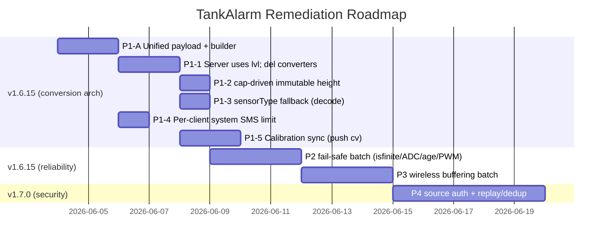

# TankAlarm Implementation Plan — Consolidated from 06/03/2026 Code Reviews

- **Date:** June 3, 2026
- **Current firmware:** v1.6.14 (`FIRMWARE_VERSION` in [TankAlarm-112025-Common/src/TankAlarm_Common.h](../TankAlarm-112025-Common/src/TankAlarm_Common.h#L19))
- **Target release:** v1.6.15 (maintenance) → v1.7.0 (security/architecture)
- **Author:** GitHub Copilot
- **Source reviews consolidated:**
  - [CODE_REVIEW_06032026_v1.6.14_COPILOT.md](CODE_REVIEW_06032026_v1.6.14_COPILOT.md)
  - [CODE_REVIEW_06032026_SERVER_CLIENT_v1.6.14_COPILOT.md](CODE_REVIEW_06032026_SERVER_CLIENT_v1.6.14_COPILOT.md)
  - [CODE_REVIEW_06032026_SERVER_CLIENT_WIRELESS_SENSOR_v1.0_COPILOT.md](CODE_REVIEW_06032026_SERVER_CLIENT_WIRELESS_SENSOR_v1.0_COPILOT.md)
  - [CODE_REVIEW_06032026_SERVER_CLIENT_WIRELESS_SENSOR_v1.1_COPILOT.md](CODE_REVIEW_06032026_SERVER_CLIENT_WIRELESS_SENSOR_v1.1_COPILOT.md)

---

## How this plan was built

The four reviews from today overlap heavily (each was a partly-independent pass over the same
subsystems). This plan **deduplicates** their findings into a single tracked backlog, and — importantly —
**re-verifies each top finding against the current source** before scheduling work, because some issues
flagged in the reviews have already been fixed in the tree.

### Verification results (what is already done vs. still open)

| Finding | Reviews | Verified current state | Action |
|---------|---------|------------------------|--------|
| I2C `Wire.read()==-1` → false 20 mA (C-1) | v1.6.14, SCWS | **Already fixed.** [TankAlarm_I2C.h](../TankAlarm-112025-Common/src/TankAlarm_I2C.h#L334) now guards `Wire.requestFrom()!=2` and `Wire.available()<2`, draining partial data and returning `-1.0f`. | Verify only — add regression note |
| `currentEpoch()` `millis()` rollover (S-1) | all | **Partially handled.** [Server L8973](../TankAlarm-112025-Server-BluesOpta/TankAlarm-112025-Server-BluesOpta.ino#L8973) uses `(uint32_t)(millis()-gLastSyncMillis)`, correct for the 49-day `millis()` wrap under regular 6 h syncs. Only the **>49.7-day sync-loss** edge remains. | Downgrade to Medium; add stale-sync guard |
| `convertVoltageToLevel()` mismatch (A2 / #1) | SCWS v1.0/v1.1 | **Still broken.** [Server L13379](../TankAlarm-112025-Server-BluesOpta/TankAlarm-112025-Server-BluesOpta.ino#L13379) only does `rangeMin + fraction*(rangeMax-rangeMin)+mountHeight`; no pressure-unit, no SG, no gas branch. | **Open — High** |
| `heightInches` corruption (A1 / B1 / #2) | all | **Still broken.** `handleAlarm` ([L12141](../TankAlarm-112025-Server-BluesOpta/TankAlarm-112025-Server-BluesOpta.ino#L12141)) and `handleDaily` ([L12508](../TankAlarm-112025-Server-BluesOpta/TankAlarm-112025-Server-BluesOpta.ino#L12508)) pass `rec->levelInches` as height; telemetry defaults missing `h` to 48.0. | **Open — High** |
| Global system-alarm SMS limiter (W-3 / S-2) | all | **Still broken.** `static double sLastSystemSmsSentEpoch` at [L12011](../TankAlarm-112025-Server-BluesOpta/TankAlarm-112025-Server-BluesOpta.ino#L12011) is one global across the whole fleet. | **Open — High** |

The remaining findings below were taken at face value from the reviews (line references preserved) and
should be spot-verified by the implementer at edit time.

---

## Architectural analysis: the conversion-duplication root cause

The reviews flag P1-1 (analog conversion), P1-2 (`heightInches`), P1-3 (self-describing payloads), B1,
and B2 as separate bugs. They are all **symptoms of one architecture**: the client computes the level
locally for alarm evaluation, throws it away, ships only the **raw** `ma`/`vt`, and the server **re-derives**
the level from a cached copy of the client's config. Two converters must be kept bit-identical by hand.

### How well are the two sides actually matched today?

I read both sides directly. They are **not** consistently matched:

| Path | Client (`readAnalogSensor`/`readCurrentLoopSensor`) | Server (`convertVoltageToLevel`/`convertMaToLevelWithTemp`) | Match |
|------|------|------|-------|
| Current-loop pressure→inches base math | `pressure·factor/SG + mount` | same | ✅ |
| Current-loop pressure factors | `getPressureConversionFactorByName()` | **hardcoded inline constants** (27.68 / 401.46 / 4.0146 / 0.40146 / 1.0) | ⚠️ duplicated, drift by hand |
| Current-loop SG resolution | `getEffectiveSpecificGravity(cfg)` | independent `fluidType`→SG map | ⚠️ two resolvers |
| **Ultrasonic unit conversion** | `distance · getDistanceConversionFactorByName(unit)` | distance treated as inches, **no unit factor** | ❌ diverges for cm/mm ranges |
| **Analog voltage→level** | full pressure-unit + SG + gas branch | **none** — stops at native range value + mount | ❌ server outright wrong |
| **Learned calibration** | not available on client | `slope·mA + offset + tempCoef·ΔT` from admin ground-truth | server-only by design |

So current-loop is "close enough to look right but quietly divergent," and analog is "broken on the
server." Both are structural, not typos.

### The decisive constraint: learned calibration

The server's **learned calibration** ([`SensorCalibration` L544](../TankAlarm-112025-Server-BluesOpta/TankAlarm-112025-Server-BluesOpta.ino#L544), `recalculateCalibration` L16170) is a genuine server-only
feature with real value: an admin enters ground-truth `(mA, measured level, temperature)` tuples through
the web UI, the server fits `level = slope·mA + offset + tempCoef·(T−70°F)` by linear regression, persists
it to LittleFS, and applies it in `convertMaToLevelWithTemp`. **It operates on raw mA**, so the raw value
**must keep flowing** — a pure "client sends only the computed level" model would silently destroy this
feature. Notes:
- Learned calibration is **current-loop only**; `convertVoltageToLevel` has no calibration branch at all, so
  analog sensors get *zero* calibration benefit **and** the broken theoretical conversion.
- Calibration is **never pushed back to the client**, so the client alarms on its uncalibrated value while
  the server displays the calibrated one — a pre-existing mismatch (resolved by the calibration-sync design
  below).

### Calibration sync: make both sides compute the *same* calibrated value

The admin enters calibration data on the **server** (web UI), so the server must remain the calibration
**authority**. To get *matching* calibration on both sides, the reliable approach is **compute the fit once,
share the result** — not mirror the raw entries and re-fit independently:

| | **Push fitted coefficients** (recommended) | Mirror raw entries, recompute on each side |
|---|------|------|
| Syncs | 3 floats `slope`/`offset`/`tempCoef` + version | N `(mA, level, tempF)` tuples |
| Match guarantee | bit-identical by construction (applied, not refit) | float regression differs across toolchains/opt → **silent divergence** |
| Client code | trivial `slope·mA + offset + tempCoef·ΔT` | duplicate the whole regression solver + a LittleFS log |
| Payload | ~12 B/sensor | grows with entry count |

**Design:**
1. Server fits the regression (unchanged), then pushes `slope`/`offset`/`tempCoef`/`hasCal` plus a
   **calibration version** `cv` (epoch or counter) into client config via `sendConfigViaNotecard()`. The
   client already has a hook for server-pushed calibration (the SG-override at [client L2140](../TankAlarm-112025-Client-BluesOpta/TankAlarm-112025-Client-BluesOpta.ino#L2140)).
2. Client **applies** those coefficients locally, so its computed `lvl` is calibrated and its **alarm
   thresholds finally match the server's display**.
3. Client tags each note with the `cv` it used. Server reconciliation (in `resolveLevel`, P1-1):
   - client `cv == server cv` → **trust the client's `lvl`** (already calibrated; no re-apply, no double count).
   - client `cv` stale (push not yet received) → server **re-applies its own coefficients to raw `mA`** as the
     override until the client catches up. Raw `mA` is always present, so the server can always recompute.
4. *(Optional, for redundancy)* mirror the raw entry log to the client purely as a **backup/audit copy** so
   the dataset is not single-homed — but the **server remains the only fitter**; the client never re-fits.

This honors "keep calibration on both sides," guarantees they match, and fixes the client-vs-server alarm
mismatch. It is scheduled as **P1-5** below (promoted from the old P4-5).

### Recommended target architecture (hybrid, not "client-only")


Send **both** the raw value (for calibration) **and** the client's computed level (as the canonical
fallback), and let the server **stop re-deriving theoretically**:

1. **Client** emits a single unified sensor object in telemetry / alarm / daily:
   - `raw` family (`ma`/`vt`/`fl`/`rm`) — kept **solely** as input to learned calibration + diagnostics.
   - `lvl` — the client's computed level in display units (it already computes this for alarms).
   - `cap` — capacity/full-scale from `getMonitorHeight(cfg)` (already exists, currently unused).
   - `st`, `ot`, `mu` — interface type, object type, unit.
2. **Server** decision per sensor:
   - **If** a learned calibration exists for `(clientUid, sensorIndex)` → apply it to `raw mA` (current-loop
     only). This is the whole point of calibration; server value wins.
   - **Else** → use the client-supplied `lvl` directly. **No theoretical reconversion.**
3. **Delete** `convertVoltageToLevel()` entirely (≈70 lines; it is the broken path and analog has no
   calibration to preserve).
4. **Reduce** `convertMaToLevelWithTemp()` to just the learned-calibration branch + a trivial guard; delete
   its ~80-line theoretical PSI/SG/unit/gas reconstruction, since client `lvl` is now the fallback.

**What this eliminates outright:** P1-1 (no second analog converter), the ultrasonic unit divergence, the
duplicated pressure-constant/SG resolvers, P1-2/B1 (`cap` travels per-reading and is stored on the snapshot,
not a shared mutable scalar), and B2 (every note carries `lvl`/`cap`/`st`, so alarms decode with zero
registry state). The server's config snapshot is no longer needed for *display* conversion at all (it is
still used for calibration metadata and the dashboard calibration screens), which also defuses most of
P3-4's 1536-vs-8192 cache mismatch.

Phase 1 below is rewritten around this target. P1-4 (per-client SMS limiter) is independent and unchanged.

---

## Severity-ranked backlog

### Phase 1 — Conversion architecture & data integrity (ship in v1.6.15, highest operator-visible impact)

These are the issues that make the dashboard, SMS text, and history **show wrong numbers** today. Because
we are **not** keeping backwards compatibility, Phase 1 fixes the root cause (duplicated conversion) rather
than patching each converter. Implement P1-A first; P1-1/P1-2/P1-3 then collapse into it.

#### P1-A · Unified client sensor payload (`raw` + `lvl` + `cap`) and one builder — **High** (architecture)
- **Where (client):** `sendTelemetry` [L5191](../TankAlarm-112025-Client-BluesOpta/TankAlarm-112025-Client-BluesOpta.ino#L5191), `sendAlarm` [L5493](../TankAlarm-112025-Client-BluesOpta/TankAlarm-112025-Client-BluesOpta.ino#L5493), `appendDailyMonitor` [L6966](../TankAlarm-112025-Client-BluesOpta/TankAlarm-112025-Client-BluesOpta.ino#L6966) — three near-identical object-type + raw-field switches.
- **Fix:**
  1. Add one helper `buildSensorObject(JsonObject &o, uint8_t idx)` that writes `st`, `ot`, `mu`, the raw
     field (`ma`/`vt`/`fl`/`rm`), **plus** `lvl = roundTo(state.currentInches, 1)` (the client's computed
     level), `cap = roundTo(getMonitorHeight(cfg), 1)` (capacity; helper at [client L2104](../TankAlarm-112025-Client-BluesOpta/TankAlarm-112025-Client-BluesOpta.ino#L2104) already exists,
     currently unused), and `cv` (the calibration version the client applied to produce `lvl`; see P1-5).
  2. Call it from all three send paths. Removes ~3× drift risk and shrinks each call site to a few lines.
- **Rationale:** `raw` stays as the input to server learned calibration + diagnostics; `lvl`/`cap`/`cv` make
  every note self-describing and let the server trust the client's level when calibration versions agree.
- **Schema:** bump `NOTEFILE_SCHEMA_VERSION` (no compat required); stamp `_sv` centrally in `publishNote()`
  before serialization so buffered/flushed notes carry it too (folds in B4 / P3-3).

#### P1-1 · Server stops theoretical reconversion; delete `convertVoltageToLevel()` — **High**
- **Where:** `convertVoltageToLevel` [L13379](../TankAlarm-112025-Server-BluesOpta/TankAlarm-112025-Server-BluesOpta.ino#L13379); `convertMaToLevelWithTemp` [L13259](../TankAlarm-112025-Server-BluesOpta/TankAlarm-112025-Server-BluesOpta.ino#L13259); call sites in `handleTelemetry` [L11938/L11941](../TankAlarm-112025-Server-BluesOpta/TankAlarm-112025-Server-BluesOpta.ino#L11938), `handleAlarm` [L12092/L12094](../TankAlarm-112025-Server-BluesOpta/TankAlarm-112025-Server-BluesOpta.ino#L12092), `handleDaily` [L12478/L12480](../TankAlarm-112025-Server-BluesOpta/TankAlarm-112025-Server-BluesOpta.ino#L12478).
- **Fix:**
  - Introduce `resolveLevel(clientUid, sensorIndex, st, raw_mA, raw_vt, clientLvl, clientCv, tempF)`:
    - client `cv == server cv` (calibration in sync) **or** no server calibration → **return the
      client-supplied `lvl`** (already calibrated, or no calibration to apply). **No reconstruction.**
    - client `cv` stale and a current-loop learned calibration exists → server re-applies
      `slope·mA + offset (+ tempCoef·ΔT)` to raw `mA` as the override until the client catches up.
  - **Delete** `convertVoltageToLevel()` and the theoretical fallback body inside `convertMaToLevelWithTemp()`
    (keep only the learned-calibration branch, now used solely for the stale-`cv` override). Route all three
    handlers through `resolveLevel`.
- **Net:** eliminates the broken analog path, the ultrasonic unit-factor divergence, and the duplicated
  pressure-constant/SG resolvers in one move. Learned calibration is preserved unchanged.
- **Validate:** for a sensor with no calibration, server display == client `lvl` exactly (PSI, inH₂O,
  bar/kPa, gas, non-water SG, ultrasonic cm). For a calibrated sensor, server applies slope/offset/temp.

#### P1-2 · `heightInches`/capacity from per-reading `cap`, stored immutably on the snapshot — **High**
- **Where:** `handleAlarm` [L12141](../TankAlarm-112025-Server-BluesOpta/TankAlarm-112025-Server-BluesOpta.ino#L12141), `handleDaily` [L12508](../TankAlarm-112025-Server-BluesOpta/TankAlarm-112025-Server-BluesOpta.ino#L12508) (both pass `rec->levelInches` as height today); `handleTelemetry` default-48 [L11973](../TankAlarm-112025-Server-BluesOpta/TankAlarm-112025-Server-BluesOpta.ino#L11973); `recordTelemetrySnapshot` [L7856](../TankAlarm-112025-Server-BluesOpta/TankAlarm-112025-Server-BluesOpta.ino#L7856).
- **Fix:**
  1. Use the payload `cap` (from P1-A) as the height argument in **all three** handlers — never
     `rec->levelInches`, never a hardcoded 48.0.
  2. When a calibration exists, derive `cap` as the calibrated level at full-scale mA (`slope·20 + offset`)
     so percent-full matches the calibrated level; otherwise use the client `cap`.
  3. Store capacity **on each snapshot** and treat `hist->heightInches` per sensor as immutable from config —
     so historical percent-full never shifts retroactively when a later note carries a different height (B1).

#### P1-3 · Self-describing alarm/daily decode + `sensorType` fallback — **Medium** (folded into P1-A)
- P1-A already adds `st`, `lvl`, `cap` to alarm and daily entries, so the "missing `st`/`h`" findings (B2,
  v1.0 #5) are resolved by construction.
- **Remaining server fix:** in `handleAlarm`/`handleDaily`, when `rec->sensorType` is empty (registry
  evicted/rebooted), populate it from the note's `st` before calling `resolveLevel`, mirroring the
  telemetry path's `objectType` fallback. With `lvl` present, the level is correct even with no registry
  state at all.

#### P1-4 · Per-client system-alarm SMS rate limiting — **High**
- **Where:** `static double sLastSystemSmsSentEpoch` [L12011](../TankAlarm-112025-Server-BluesOpta/TankAlarm-112025-Server-BluesOpta.ino#L12011).
- **Fix:** move the timestamp into `ClientMetadata`, keyed per `(clientUid, alarmType)`, so one client's solar/battery/power alert no longer suppresses every other client's system SMS for `MIN_SMS_ALERT_INTERVAL_SECONDS`.
- **Related (W-4):** in the same block, check the `snprintf(... message ...)` return; if `>= sizeof(message)` fall back to a pre-truncated compact site label so the alarm text is never silently lost.

#### P1-5 · Calibration sync: server pushes coefficients, client applies + tags `cv` — **High** (promoted from P4-5)
- **Goal:** both sides compute the *same* calibrated level so the client's alarm thresholds match the
  server's display, and calibration data effectively lives on both sides.
- **Server fit stays authoritative** — admin enters entries, `recalculateCalibration()` [L16170](../TankAlarm-112025-Server-BluesOpta/TankAlarm-112025-Server-BluesOpta.ino#L16170) fits and
  persists (unchanged). After a recalculation, bump a per-sensor **calibration version** `cv` (epoch/counter)
  and include `slope`/`offset`/`tempCoef`/`hasCal`/`cv` in the config pushed by `sendConfigViaNotecard()`
  [L11462](../TankAlarm-112025-Server-BluesOpta/TankAlarm-112025-Server-BluesOpta.ino#L11462).
- **Client** stores the coefficients in `MonitorConfig` (new fields beside `fluidSpecificGravity`), applies
  `level = slope·mA + offset + tempCoef·(T−70°F)` for current-loop sensors when `hasCal`, and stamps the
  applied `cv` into every note via `buildSensorObject` (P1-A). The existing server-pushed-SG hook
  ([client L2140](../TankAlarm-112025-Client-BluesOpta/TankAlarm-112025-Client-BluesOpta.ino#L2140)) is the
  precedent for accepting server-pushed calibration.
- **Decision needed:** push **fitted coefficients** (recommended — guarantees match, ~12 B/sensor) vs. also
  mirroring the raw entry log to the client as a backup-only copy (redundancy, but client must *never* re-fit).
  Do **not** have the client run its own regression — independent float fits diverge.
- **Temperature:** client needs the current temperature to apply `tempCoef`. Either reuse the value the
  server already caches per client (NWS 6 h average) and push it alongside `cv`, or skip temp compensation on
  the client and let the server apply only the temp term when `cv` is stale. Document which.
- **Validate:** after a push, client `lvl` for a calibrated sensor equals the server's `slope·mA+offset`
  within rounding; in-flight notes with the old `cv` are corrected by the server until the new `cv` arrives.

---

### Phase 2 — Reliability & fail-safe (v1.6.15)

#### P2-1 · `isfinite()` gate on derived levels — **Medium** (C-6)
Reject `!isfinite(value)` early in `validateSensorReading()` [client L4571](../TankAlarm-112025-Client-BluesOpta/TankAlarm-112025-Client-BluesOpta.ino#L4571) so a NaN (e.g. SG=0, mismapped config) never serializes into telemetry as invalid JSON that fails server parsing.

#### P2-2 · Enforce ADC resolution — **Medium** (C-2 / C-4)
Call `analogReadResolution(12)` in `setup()` and log the actual resolution, so the `/4095.0f` assumption at [client L4743](../TankAlarm-112025-Client-BluesOpta/TankAlarm-112025-Client-BluesOpta.ino#L4743) and [L1372](../TankAlarm-112025-Client-BluesOpta/TankAlarm-112025-Client-BluesOpta.ino#L1372) can't silently read 4× low on a 10-bit core default. *(Verify whether already present in `setup()` before adding.)*

#### P2-3 · Track age of last valid reading; escalate sensor-fault — **Medium** (C-3 / improvement)
In `sampleMonitors()` [client L4945](../TankAlarm-112025-Client-BluesOpta/TankAlarm-112025-Client-BluesOpta.ino#L4945): when `validateSensorReading` fails and the last valid reading is older than a threshold (e.g. 5 min), stop reusing `currentInches`, mark the channel failed, and emit a `sensor-fault` event instead of silently reporting hours-old data.

#### P2-4 · PWM gate-on failure must fail the sample — **Medium** (#6)
In `readCurrentLoopSensor()` [client L4811](../TankAlarm-112025-Client-BluesOpta/TankAlarm-112025-Client-BluesOpta.ino#L4811): if `pwmGatingEnabled` and the power-on command fails, skip sampling, mark `sampleReused`, increment a power-gate failure counter, and force the sample invalid — still attempt PWM-OFF cleanup.

#### P2-5 · `linearMap` should fault, not silently clamp to min — **Medium** (C-5)
[client L4562](../TankAlarm-112025-Client-BluesOpta/TankAlarm-112025-Client-BluesOpta.ino#L4562): return `NAN` for degenerate ranges and let `validateSensorReading()` (P2-1) flag the fault rather than reporting a confident "always min".

#### P2-6 · Solar Modbus timeout floor — **Medium** (C-7)
[TankAlarm_Solar.cpp L96](../TankAlarm-112025-Common/src/TankAlarm_Solar.cpp#L96): allow a 250 ms minimum (SunSaver-over-MRC-1 responds 300–600 ms) to stop intermittent timeouts from raising false LOW_BATTERY on stale data; document empirical timings.

#### P2-7 · Cooldown on `clear`/recovery SMS — **Medium** (S-3)
[Server L12173](../TankAlarm-112025-Server-BluesOpta/TankAlarm-112025-Server-BluesOpta.ino#L12173): impose a modest cooldown (e.g. 60 s) on clear events so a sensor sloshing at the threshold can't flood unrated clear SMS and drain the cellular budget.

#### P2-8 · Long sync-loss epoch guard — **Medium** (S-1 residual)
[Server `currentEpoch` L8973](../TankAlarm-112025-Server-BluesOpta/TankAlarm-112025-Server-BluesOpta.ino#L8973): when `(millis()-gLastSyncMillis)` implies >24 h since sync, log a critical warning and force a Notecard re-sync rather than trusting a delta that could wrap past 49.7 days.

---

### Phase 3 — Wireless robustness & buffering (v1.6.15)

#### P3-1 · Offline buffer flush can drop large daily reports — **Medium-High** (#4)
`publishNote()` can buffer >1024-byte notes but `flushBufferedNotes()` reads into `char lineBuffer[1024]` and skips truncated lines ([client L7303](../TankAlarm-112025-Client-BluesOpta/TankAlarm-112025-Client-BluesOpta.ino#L7303)). Store pending notes as **length-prefixed records** (or size the flush buffer to the max accepted payload), and on an over-length line **preserve + log an error** instead of silently dropping.

#### P3-2 · Daily report can permanently drop a monitor — **Medium** (B3)
`sendDailyReport()` [client L6810](../TankAlarm-112025-Client-BluesOpta/TankAlarm-112025-Client-BluesOpta.ino#L6810): if the part-0 metadata header + one verbose monitor exceeds the limit, the cursor advances without emitting that monitor. Fix: retry the monitor on a fresh header-less part, or only attach part-0 metadata after at least one monitor is placed.

#### P3-3 · Re-stamp `_sv` on flushed notes — **Low-Medium** (B4)
Stamp `_sv = NOTEFILE_SCHEMA_VERSION` **before serialization** so buffered copies carry it; add it in both `flushBufferedNotes()` branches ([L7368](../TankAlarm-112025-Client-BluesOpta/TankAlarm-112025-Client-BluesOpta.ino#L7368), [L7482](../TankAlarm-112025-Client-BluesOpta/TankAlarm-112025-Client-BluesOpta.ino#L7482)). Prerequisite for any future `_sv` gating.

#### P3-4 · Config snapshot cache vs dispatch buffer mismatch — **Medium** (#7)
`ClientConfigSnapshot.payload` is 1536 B [Server L978](../TankAlarm-112025-Server-BluesOpta/TankAlarm-112025-Server-BluesOpta.ino#L978) but dispatch serializes up to 8192 B [L11535](../TankAlarm-112025-Server-BluesOpta/TankAlarm-112025-Server-BluesOpta.ino#L11535), rejecting large multi-monitor configs before send. Increase snapshot capacity to match dispatch (or store config per-client in LittleFS, keep metadata in RAM); add a size estimate/warning in the config UI/API.

#### P3-5 · Receiver-side command validation + peek-then-delete — **Medium-High** (#3)
Add a shared client `validateInboundCommand(doc, expectedType)` that checks `_sv` supported, `_type == expected`, and `_target`/`target == gDeviceUID`; read **both** `_target` and `target` in relay processing. Apply peek-then-delete (config's safer pattern) to relay/serial/location/sync handlers so a wrong-type or wrong-device note isn't consumed+deleted before validation ([config L3853](../TankAlarm-112025-Client-BluesOpta/TankAlarm-112025-Client-BluesOpta.ino#L3853), [relay L7781](../TankAlarm-112025-Client-BluesOpta/TankAlarm-112025-Client-BluesOpta.ino#L7781)).

---

### Phase 4 — Security hardening (v1.7.0)

#### P4-1 · Source authentication on inbound notes — **High** (W-2)
The server upserts records keyed on the body-supplied `"c"` with no cross-check ([L11806](../TankAlarm-112025-Server-BluesOpta/TankAlarm-112025-Server-BluesOpta.ino#L11806)). Add **HMAC-SHA256** of the canonical body using a per-project shared secret, **or** compare the routed Notecard `device` envelope header against `"c"` before trusting it. Enforce `isValidClientUid()` at the top of every handler.

#### P4-2 · Client relay soft-ID spoofing — **Medium-High** (W-5 / W-1)
`processRelayCommand()` [L7818](../TankAlarm-112025-Client-BluesOpta/TankAlarm-112025-Client-BluesOpta.ino#L7818): require `strncmp(gDeviceUID, "dev:", 4) == 0` before processing any relay command, so a note targeting the soft fallback label (e.g. `"Tank01"`) before hub-sync is rejected.

#### P4-3 · Replay/dedup + age guard — **Medium**
Add a per-message `_seq` (persisted in client config) and a server `(clientUid,_seq)` dedup set to stop Notehub retries double-firing SMS/daily rows/relay commands. Reject notes whose `time` is >24 h behind `currentEpoch()` in `processNotefile()`.

#### P4-4 · Bound inbound payload size — **Medium**
Cap payload (`MAX_NOTE_PAYLOAD_BYTES`, e.g. 32 KB) before `deserializeJson()` to bound parser cost from a malicious/runaway client.

> **Note:** the former P4-5 (push learned calibration back to the client) has been **promoted into Phase 1 as
> P1-5** in response to the calibration-sync requirement, since it is a prerequisite for client/server level
> agreement rather than a security item.


---

### Phase 5 — Low-priority / robustness polish (backlog)

| ID | Item | Where |
|----|------|-------|
| P5-1 | LRU eviction can drop a client with an active system alarm; pin active-alarm clients or persist to LittleFS (S-2/#2 LRU) | [L12207](../TankAlarm-112025-Server-BluesOpta/TankAlarm-112025-Server-BluesOpta.ino#L12207) |
| P5-2 | Poison-note handling is per-file not per-note; raise count + backoff or attach counter to note ID (W-6) | [L11765](../TankAlarm-112025-Server-BluesOpta/TankAlarm-112025-Server-BluesOpta.ino#L11765) |
| P5-3 | Pre-time-sync (`timestamp==0.0`) snapshots break `pruneHotTierIfNeeded` monotonic assumption; skip recording until time is valid (B6) | [L7858](../TankAlarm-112025-Server-BluesOpta/TankAlarm-112025-Server-BluesOpta.ino#L7858) |
| P5-4 | Optional max-interval telemetry heartbeat when `minLevelChangeInches==0` (B5) | [client L4980](../TankAlarm-112025-Client-BluesOpta/TankAlarm-112025-Client-BluesOpta.ino#L4980) |
| P5-5 | Gas validation allows negative pressure by construction; set `minValid` from configured range (#8) | [client L4587](../TankAlarm-112025-Client-BluesOpta/TankAlarm-112025-Client-BluesOpta.ino#L4587) |
| P5-6 | `static_assert` battery threshold ordering (`critical<low<normal<high`) | [TankAlarm_Battery.h](../TankAlarm-112025-Common/src/TankAlarm_Battery.h#L600) |
| P5-7 | Median-of-5 filter for current-loop/analog instead of mean | client read paths |
| P5-8 | Cache `effectiveSpecificGravity` on `MonitorRuntime` | [client L2065](../TankAlarm-112025-Client-BluesOpta/TankAlarm-112025-Client-BluesOpta.ino#L2065) |
| P5-9 | Software-debounce digital float switches (3–5 reads ~1 ms apart) | [client L4713](../TankAlarm-112025-Client-BluesOpta/TankAlarm-112025-Client-BluesOpta.ino#L4713) |
| P5-10 | Bound cumulative sampling time; kick watchdog between sensors | `sampleMonitors()` |
| P5-11 | Document `.qo`↔`.qi` mapping + per-notefile field schema at top of `TankAlarm_Common.h` | [L119](../TankAlarm-112025-Common/src/TankAlarm_Common.h#L119) |
| P5-12 | Verify-only: add regression note that I2C `Wire.read()==-1` (C-1) is fixed | [TankAlarm_I2C.h L334](../TankAlarm-112025-Common/src/TankAlarm_I2C.h#L334) |

---

## Recommended release grouping



**v1.6.15** — Phases 1–3. **P1-A is the keystone** — it removes the duplicated-conversion architecture, so
P1-1/P1-2/P1-3 collapse into it. Bump `NOTEFILE_SCHEMA_VERSION` when P1-A lands (no compat required).
Operator-visible correctness; the schema change is deliberate, not backwards-compatible.

**v1.7.0** — Phase 4 security hardening (requires a shared-secret/key-distribution decision and a Notehub
route review) plus P4-5 calibration push-back, plus Phase 5 polish as capacity allows.

---

## Cross-cutting validation checklist

- [ ] **No-calibration sensor:** server display level == client `lvl` exactly across PSI, inH₂O, bar/kPa, gas, non-water SG, and ultrasonic (cm/mm) — confirming the deleted converters changed nothing for the happy path.
- [ ] **Calibrated sensor:** server applies `slope·mA + offset (+ tempCoef·ΔT)` and overrides `lvl`; raw `ma` still transmitted in every note type.
- [ ] **Calibration sync (P1-5):** after a server push, client `lvl` for a calibrated sensor matches server `slope·mA+offset` within rounding; client alarm thresholds and server display agree; stale-`cv` in-flight notes are corrected server-side until the new `cv` arrives.
- [ ] One `buildSensorObject` feeds telemetry, alarm, and daily identically (no per-path drift).
- [ ] Alarm/daily decode correctly with an **empty registry** (post-reboot/eviction) using `lvl`/`cap`/`st`.
- [ ] History percent-full stable across telemetry / alarm / daily ingest of the same sensor.
- [ ] Two simultaneous client system alarms both produce SMS (per-client limiter).
- [ ] Sensor disconnect → `sensor-fault` event within threshold, not stale value forever.
- [ ] Daily report with max monitors + full part-0 metadata loses no monitor.
- [ ] Offline buffer flush after outage preserves a >1 KB daily note.
- [ ] Schema-version bump round-trips through buffered/flushed notes.
- [ ] Full compile of Client, Server, and Common via `arduino-cli` after each phase.

---

## Notes for the implementer

- Several reviews were written partly in parallel and **predate fixes already in the tree** (notably the
  I2C `-1` guard). Always re-read the cited line before editing — line numbers drift.
- Keep changes minimal and localized; each item above is a targeted correctness fix, not a refactor.
- The Common library is header-heavy (`static inline`); preserve ODR-safety when adding helpers.
- Update the relevant `CODE REVIEW/` history and `/memories/repo/` notes as items close.

---

## AI Review Findings (06/04/2026) — Verification and Gaps

Following a thorough review of the Phase 1 implementation (Client and Server v1.6.15) and full compilation verification, here are the detailed findings, critical bugs, and design observations.

### 1. Offline Note Buffer Drops Schema Version (`_sv` Stamping Gap)
In the client [TankAlarm-112025-Client-BluesOpta/TankAlarm-112025-Client-BluesOpta.ino](TankAlarm-112025-Client-BluesOpta/TankAlarm-112025-Client-BluesOpta.ino#L7175), `publishNote()` serializes the JSON `doc` into `buffer` first:
```cpp
size_t len = serializeJson(doc, buffer, bufSize);
```
If the Notecard is offline, the client buffers this serialized string directly via `bufferNoteForRetry()`. Only *after* serialization (and only for direct, live transmissions) does it parse `buffer` as a CJSON object `body` and stamp `_sv`:
```cpp
JAddNumberToObject(body, "_sv", NOTEFILE_SCHEMA_VERSION);
```
Furthermore, `flushBufferedNotes()` does not stamp `_sv` when deserializing and sending.
*   **Impact:** Any telemetry, alarm, or daily note that goes through the offline flash buffer will completely lack the `_sv` metadata. If the server starts strict schema version gating in the future, these notes will fail validation.
*   **Resolution:** Add the schema version directly into `buildSensorObject()` or within the original JSON builders before calling `publishNote()`, so it is natively part of the serialized payload and properly preserved in offline buffers. Alternatively, call `JAddNumberToObject(body, "_sv", NOTEFILE_SCHEMA_VERSION);` in both branches of `flushBufferedNotes()`.

### 2. Disconnected Current-Loop Sensors Fail Silently Under Learned Calibration
In the client's current-loop reader [TankAlarm-112025-Client-BluesOpta/TankAlarm-112025-Client-BluesOpta.ino](TankAlarm-112025-Client-BluesOpta/TankAlarm-112025-Client-BluesOpta.ino#L4846), when `hasLearnedCalibration` is active, it immediately calculates the calibrated level on whatever `milliamps` value is read:
```cpp
float level = cfg.calSlope * milliamps + cfg.calOffset;
```
If a current-loop sensor is physically disconnected, the physical signal loops drop to `0.0 mA`.
*   **Theoretical Math (No Calibration):** Extrapolates well below 4.0 mA, resulting in a large negative depth that fails `validateSensorReading()` and successfully triggers a `sensor-fault` alarm.
*   **Learned Calibration Math:** Evaluates to `cfg.calOffset` (e.g., `2.5 inches`). Since this is a valid positive depth, `validateSensorReading()` marks it as legal, and the client reports a healthy static level forever.
*   **Impact:** A broken or disconnected physical sensor under active calibration fails silently.
*   **Resolution:** Pre-validate `milliamps` before applying learned calibration in `readCurrentLoopSensor()`. If `milliamps < 3.6f` (or similar fault threshold), mark it failed and return early to allow normal sensor-fault escalation to occur.

### 3. Temperature Compensation Freeze During In-Sync Operation
In the server config injection [TankAlarm-112025-Server-BluesOpta/TankAlarm-112025-Server-BluesOpta.ino](TankAlarm-112025-Server-BluesOpta/TankAlarm-112025-Server-BluesOpta.ino#L11531), the server caches and pushes down the ambient cell-matched temperature at config-sync time, which is stored in `calTempF`. The client then applies temperature compensation statically:
```cpp
level += cfg.calTempCoef * (cfg.calTempF - 70.0f);
```
Since config syncs only occur every 6 hours or upon specific manual re-dispatch, `calTempF` remains frozen.
*   **Impact:** Because the server trusts the client's `lvl` when `cv == serverCv`, real-time temperature fluctuations occurring throughout the day will not be compensated dynamically for long periods.
*   **Observation:** This is an acceptable operational trade-off given client hardware limitations (no ambient temperature sensor), but the static freezing of temperature compensation should be documented for operators.
