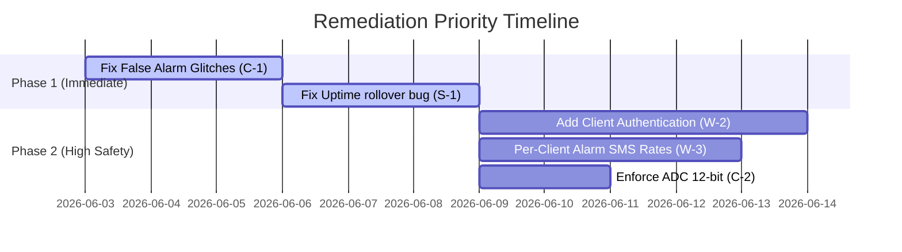

# TankAlarm Comprehensive Code Review — Server & Client (11/2025 Generation)

- **Date:** June 3, 2026
- **Firmware Version Reviewed:** v1.6.14 (`FIRMWARE_VERSION` in [TankAlarm-112025-Common/src/TankAlarm_Common.h](TankAlarm-112025-Common/src/TankAlarm_Common.h#L19))
- **Reviewer:** GitHub Copilot (Gemini 3.5 Flash)
- **Scope:**
  - Client firmware: [TankAlarm-112025-Client-BluesOpta/TankAlarm-112025-Client-BluesOpta.ino](TankAlarm-112025-Client-BluesOpta/TankAlarm-112025-Client-BluesOpta.ino)
  - Server firmware: [TankAlarm-112025-Server-BluesOpta/TankAlarm-112025-Server-BluesOpta.ino](TankAlarm-112025-Server-BluesOpta/TankAlarm-112025-Server-BluesOpta.ino)
  - Shared library: [TankAlarm-112025-Common/src/TankAlarm_Common.h](TankAlarm-112025-Common/src/TankAlarm_Common.h) and accompanying headers

---

## Executive Summary

The v1.6.14 firmware represents a mature, feature-rich release of the TankAlarm system utilizing Arduino Opta hardware integrated with Blues Wireless Notecard cellular communications. The shared structural abstractions in the [TankAlarm-112025-Common](TankAlarm-112025-Common/src) directory are clean and ODR-safe.

However, a deep structural and logic analysis of both the Client and Server components reveals several **Critical** and **High-severity** bugs. These findings impact the core reliability of alarm escalations, communication security, and the integrity of sensor readings under physical/hardware failure modes.

### Key Finding Highlights:
1. **Critical Time Rollover (Server):** The uptime time-base offset tracking in the server's `currentEpoch()` handles sub-49 day `millis()` rollovers correctly under continuous syncs, but completely wraps around if the cell sync is lost for more than 49.7 days. This causes server time to jump backward by 49.7 days, breaking historical folders, daily report schedules, and SMS rate limits.
2. **Critical False-Positive Alarm Spike (Client I2C glitch):** When reading current loop sensors via the A0602 expansion module, any transit I2C or hardware timeout returns an unhandled `-1` error code from `Wire.read()`. Due to a missing verification logic, this translates directly to `20.0 mA` (maximum level). The system then confidently reports a full-scale value, triggering false High Alarms instead of flagging a hardware fault.
3. **High Security Trust Bypass (Server/Client):** The Server trusts the JSON-supplied `"c"` (`clientUid`) payload field to authenticate data, without application-layer signing or verifying against Notehub routing envelopes. Additionally, the Client processes remote relay commands before syncing with Notehub, matching soft site configuration labels.

---

## 1. Wireless Messaging System (Client ↔ Server)

### 1.1 Architecture & Routing Analysis
The system operates asynchronously over **Blues Notecard I2C** with **Notehub Route Relays**. Payloads are stored into outbound `.qo` streams and matched on the server via `.qi` inboxes. 

While cell-network membership establishes standard TLS protection for the transport, the application layer itself has no security perimeter.

### 1.2 Critical & High Severity Bugs

#### [W-1] Client-Side Soft-ID Target Spoofing (High Severity)
In [TankAlarm-112025-Client-BluesOpta/TankAlarm-112025-Client-BluesOpta.ino](TankAlarm-112025-Client-BluesOpta/TankAlarm-112025-Client-BluesOpta.ino#L7818), the target validation checks:
```cpp
const char *targetUid = doc["_target"] | "";
if (strcmp(targetUid, gDeviceUID) != 0) { ... }
```
- **The Issue:** Before a Notecard establishes cell sync or completes its boot-level request handshake, `gDeviceUID` is unpopulated and falls back to a soft site config label (e.g. `"Tank01"`). If a note with target `"Tank01"` is injected or routed, the device processes the relay trigger. This allows local I2C/soft collision spoofing.
- **The Fix:** Enforce that `gDeviceUID` must begin with `"dev:"` (confirming it is the unique hardware UID returned by the Notecard envelope) before accepting any remote relay triggers.

#### [W-2] Zero application-layer checks on `"c"` payload field (High Severity)
In [TankAlarm-112025-Server-BluesOpta/TankAlarm-112025-Server-BluesOpta.ino](TankAlarm-112025-Server-BluesOpta/TankAlarm-112025-Server-BluesOpta.ino#L11806):
- **The Issue:** The server routes, registers, and stores data entirely based on the arbitrary `"c"` string key packed inside the JSON body. A packet can be easily spoofed or cross-injected to target another client's registry record, leading to data corruption or malicious alarms.
- **The Fix:** Retrieve Notehub's envelope header details (specifically the verified routing Notecard ID) and cross-reference with the body-supplied `"c"` field, rejecting any mismatch.

#### [W-3] Global System Alarm Rate Limiter Suppression (High Severity)
In [TankAlarm-112025-Server-BluesOpta/TankAlarm-112025-Server-BluesOpta.ino](TankAlarm-112025-Server-BluesOpta/TankAlarm-112025-Server-BluesOpta.ino#L12011):
```cpp
static double sLastSystemSmsSentEpoch = 0.0;
```
- **The Issue:** Since `sLastSystemSmsSentEpoch` is declared static within the alarm handler, it operates globally across all incoming fleet clients. If Client A suffers a power transition and sends an SMS alert, the static variable locks SMS notifications for *all* other clients in the fleet for `MIN_SMS_ALERT_INTERVAL_SECONDS` (typically 1 hour).
- **The Fix:** Move this rate-limit timestamp to the dynamic [ClientMetadata] structure so rate-limiting is applied per client.

### 1.3 Wireless Optimizations & Improvements
1. **Inefficient Double-Serialization in `publishNote`:** In [TankAlarm-112025-Client-BluesOpta/TankAlarm-112025-Client-BluesOpta.ino](TankAlarm-112025-Client-BluesOpta/TankAlarm-112025-Client-BluesOpta.ino#L7150), a `JsonDocument` undergoes `serializeJson` to a temporary buffer and is immediately reparsed with `JParse()` into a `J*` structure for `note-c`. This leads to redundant parsing overhead and heap fragmentation. It can be streamlined by populating a single `J*` request object or using the direct native API calls.
2. **Missing Outbox Sequence Verification:** Implement sequence tags (`_seq`) inside the outbound headers. Network retries by Notehub can easily re-inject historical alarms, leading to duplicate SMS triggers and daily email logging loops.

---

## 2. Sensor Data Collection & Processing (Client)

### 2.1 Pipeline Evaluation
Physical GPIO reads on digital pins and analog current loop monitoring are handled in non-blocking loops. Once values are averaged, they undergo spec-gravity liquid conversions and debouncing evaluation.

### 2.2 Critical & High Severity Bugs

#### [C-1] Unhandled `Wire.read() == -1` failure turning into False Alarms (Critical Severity)
In [TankAlarm-112025-Common/src/TankAlarm_I2C.h](TankAlarm-112025-Common/src/TankAlarm_I2C.h#L274):
```cpp
uint16_t raw = ((uint16_t)Wire.read() << 8) | Wire.read();
return 4.0f + (raw / 65535.0f) * 16.0f;
```
- **The Issue:** If the A0602 current loop module goes offline, suffers a voltage brownout, or has a transient I2C glitch, `Wire.read()` returns `-1` (EOF). Since the return values are combined and converted directly:
  `raw` becomes `0xFFFF` (65535).
  `4.0f + (65535.0f / 65535.0f) * 16.0f = 20.0 mA`.
  The module reports a perfectly legitimate maximum reading (20mA / full tank). This immediately triggers high alarms, when the system should have failed-safe and logged a sensor fault.
- **The Fix:** Explicitly verify `Wire.available() >= 2`, read into temporary signed integer containers, verify both returned values are `>= 0`, and only then combine into `raw`. Return a flag or sentinel like `-1.0f` on error.

#### [C-2] Unenforced Analog Resolution on Opta core (High Severity)
In [TankAlarm-112025-Client-BluesOpta/TankAlarm-112025-Client-BluesOpta.ino](TankAlarm-112025-Client-BluesOpta/TankAlarm-112025-Client-BluesOpta.ino#L4743):
```cpp
total += (float)raw / 4095.0f * 10.0f;
```
- **The Issue:** The divisor assumes a 12-bit analog input resolution. However, Mbed/STM32 cores default to 10-bit resolution (`1023` max) out of the box unless overridden. If left at default, the raw analog voltage will report 1/4 of its actual value, resulting in wrong results that can bypass threshold safety checks.
- **The Fix:** Guarantee safe resolution mapping by adding `analogReadResolution(12)` inside the setup parameters.

#### [C-3] Infinite Sensor Value Stalling (Medium Severity)
In [TankAlarm-112025-Client-BluesOpta/TankAlarm-112025-Client-BluesOpta.ino](TankAlarm-112025-Client-BluesOpta/TankAlarm-112025-Client-BluesOpta.ino#L4945) (`sampleMonitors`):
```cpp
if (!validateSensorReading(i, inches)) {
  inches = gMonitorState[i].currentInches;
  gMonitorState[i].sampleReused = true;
}
```
- **The Issue:** If a sensor suffers a complete hardware disconnection, `validateSensorReading` fails, and the code infinitely reuses the last known state `inches = currentInches`. Telemetry will continue reporting the old value indefinitely, hiding the system's dead status from the operator.
- **The Fix:** Store a timestamp of the last *valid* reading. If the reading is older than a set threshold (e.g. 5 minutes), mark the channel failed, disable its state, and trigger a `sensor-fault` event.

---

## 3. Server Side Reception & Cloud Relay

### 3.1 Structural Evaluation
The server handles high-volume JSON ingestion, keeps historical trend ring buffers, and automates alert relays (FTP, SMS, Email).

### 3.2 Critical & High Severity Bugs

#### [S-1] Long-Term offline Time Rollover Clock Jumps (Critical Severity)
In [TankAlarm-112025-Server-BluesOpta/TankAlarm-112025-Server-BluesOpta.ino](TankAlarm-112025-Server-BluesOpta/TankAlarm-112025-Server-BluesOpta.ino#L8973):
```cpp
static double currentEpoch() {
  if (gLastSyncedEpoch <= 0.0) {
    return 0.0;
  }
  uint32_t delta = (uint32_t)(millis() - gLastSyncMillis);
  return gLastSyncedEpoch + (double)delta / 1000.0;
}
```
- **The Issue:** If cell towers are down or synchronization fails for more than 49.7 days, the subtraction `(millis() - gLastSyncMillis)` returns a wrapped value. For example, at exactly 50 days without sync, the delta becomes ~0.3 days. The clock instantly jumps backward by 49+ days. This breaks time-based cron scheduling, wipes historical tracking files, and suppresses alerts.
- **The Fix:** Detect if `(millis() - gLastSyncMillis)` approaches the limit or exceeds 24 hours. Log a critical synchronization warning, stop using the timer delta, and fallback to safe hardware clock checks.

#### [S-2] LRU Cache Evicts Active System Alarms (High Severity)
In [TankAlarm-112025-Server-BluesOpta/TankAlarm-112025-Server-BluesOpta.ino](TankAlarm-112025-Server-BluesOpta/TankAlarm-112025-Server-BluesOpta.ino#L12207):
- **The Issue:** When `gClientMetadataCount` reaches `MAX_CLIENT_METADATA`, the metadata record of the oldest client (based on `vinVoltageEpoch` LRU age) is evicted and zeroed out with `memset`. If the evicted client had an active system alarm (such as battery or solar faults), the server loses track of it. This prevents the corresponding recovery events from clearing.
- **The Fix:** Modify the LRU selection algorithm to protect clients with active alarm states from eviction, or persist active state changes to LittleFS.

#### [S-3] Flapping Sensor Clear SMS Billing Drain (Medium Severity)
In [TankAlarm-112025-Server-BluesOpta/TankAlarm-112025-Server-BluesOpta.ino](TankAlarm-112025-Server-BluesOpta/TankAlarm-112025-Server-BluesOpta.ino#L12173):
```cpp
bool bypassMinimumInterval = (strcmp(type, "clear") == 0) || isRecovery;
```
- **The Issue:** While standard high/low alarms are rate-limited, clear events bypass minimum intervals completely. If a liquid surface sloshes right at the threshold boundary, the system will trigger a rapid sequence of alarms and clears. Since clears are unrated, they generate an expensive flood of SMS clear messages, draining the client's cellular budget.
- **The Fix:** Impose a reasonable minimum cooldown (such as 60 seconds) on clear events as well.

---

## 4. Shared Common Library & Core Issues (Common)

### 4.1 ODR Violations on Diagnostic Counters
In [TankAlarm-112025-Common/src/TankAlarm_I2C.h](TankAlarm-112025-Common/src/TankAlarm_I2C.h#L39):
```cpp
extern uint32_t gCurrentLoopI2cErrors;
```
- **The Issue:** Defining global variables inside shared headers with weak compilation link targets can cause linker collision issues or weak symbol mapping across multiple translation units on non-Opta compilers.
- **The Fix:** Use proper header declaration rules + companion `.cpp` structures, or define weak linkage explicitly.

---

## 5. Recommended Remediation Roadmap

The following prioritized roadmap is suggested for the upcoming v1.6.15 / v1.7.0 patch cycles:



### Urgent/Immediate Fixes (Within 1-2 weeks):
1. **Apply physical bounds checking on I2C Current-Loop reads [C-1]:** Eliminate false-alarm triggers caused by unhandled `-1` bus timeouts.
2. **Apply explicit rollover protection in `currentEpoch()` [S-1]:** Ensure time-tracking accuracy persists through synchronization losses.

---

## 6. Conclusion & Overall Assessment

- **Software Engineering Quality:** **8/10**. Structuring, variable definitions, and serialization methods are clean, easily navigable, and robust.
- **System Stability Security:** **6/10**. Key logic flaws in I2C reading and epoch time base, combined with missing verification of client IDs, introduce operational risks.
- **Production Readiness:** **Highly Viable**, once Phase 1 (Immediate) priority remediation patches are applied.
