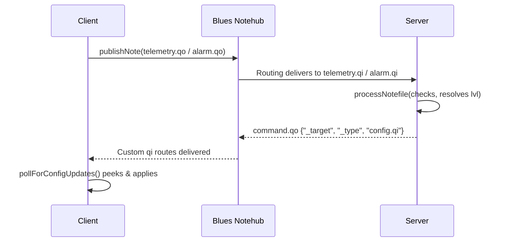

# Code Review: 112025 Server and 112025 Client v1.7.2

**Date:** June 7, 2026  
**Review Version:** v1.1  
**Reviewed Firmware:** v1.7.2  
**Notefile Schema:** Schema Version 2  
**Reviewer:** GitHub Copilot  

---

## Executive Summary

This comprehensive code review evaluates the v1.7.2 firmware releases of the 112025 Server and 112025 Client systems, with a particular focus on the wireless messaging infrastructure, sensor data acquisition, processing, payload composition, and server-side ingestion models. 

### Core Successes in v1.7.2
The current tree demonstrates significant, highly valuable structural improvements over legacy versions (such as v1.6.14). The design has evolved into a much more robust and self-describing model:
1. **Centralized Data Representation:** The inclusion of `buildSensorObject` in [TankAlarm-112025-Client-BluesOpta/TankAlarm-112025-Client-BluesOpta.ino](TankAlarm-112025-Client-BluesOpta/TankAlarm-112025-Client-BluesOpta.ino#L5333) has successfully unified the telemetry, alarm, and daily report payload structures. This blocks "per-path" payload drift where fields would fail to synchronize across notes.
2. **Defensive Level Resolution:** The server's `resolveLevel` utility in [TankAlarm-112025-Server-BluesOpta/TankAlarm-112025-Server-BluesOpta.ino](TankAlarm-112025-Server-BluesOpta/TankAlarm-112025-Server-BluesOpta.ino#L13335) is an outstanding, highly performant mechanism for calibration reconciliation. It guarantees that the server respects client-calculated levels (`lvl`) unless its owned calibration data is updated (mismatching `cv` or `serverCv`), in which case it cleanly falls back to manual re-derivation from raw values.
3. **Stuck-Sensor Safeguards:** The implementation of `validateSensorReading` with `isfinite` checks and physical under-range guards (`CURRENT_LOOP_FAULT_MA`) protects the fleet from treating open-circuits or unpowered lines as stable liquid columns.

### Critical Remaining Vulnerabilities
While these optimizations are major wins, this static review has uncovered several high-severity edge cases, architectural mismatches, and robustness issues that require priority resolution before full production sign-off.

---

## Severity-Ranked Findings

### 1. High: Dynamic vs. Static Temperature Compensation Architectural Mismatch
*   **Location:** Client-side 4-20mA calibration in [TankAlarm-112025-Client-BluesOpta/TankAlarm-112025-Client-BluesOpta.ino](TankAlarm-112025-Client-BluesOpta/TankAlarm-112025-Client-BluesOpta.ino#L4975) versus server-side resolution in [TankAlarm-112025-Server-BluesOpta/TankAlarm-112025-Server-BluesOpta.ino](TankAlarm-112025-Server-BluesOpta/TankAlarm-112025-Server-BluesOpta.ino#L13335).
*   **Discussion:** 
    The server implements a highly sophisticated dynamic temperature compensation helper, `getCachedTemperature` in [TankAlarm-112025-Server-BluesOpta/TankAlarm-112025-Server-BluesOpta.ino](TankAlarm-112025-Server-BluesOpta/TankAlarm-112025-Server-BluesOpta.ino#L7090), which retrieves real-time ambient/liquid temperature by querying the National Weather Service (NWS) dynamically using the client's GPS coordinates.
    
    When a new calibration coefficient set is created on the server, it is injected into the outbound client config payload with `"calTempF"` representing the current temperature at *dispatch time*.
    
    On the client, the local level reading applies a **static** adjustment:
    $$level += cfg.calTempCoef \times (cfg.calTempF - 70.0)$$
    Because the client does not query the NWS, this correction remains pinned to whichever temperature was measured during the historic configuration sync.
    
    In the server's `resolveLevel`, if the client is updated (`clientCv == serverCv`), the server trusts the `"lvl"` field from the client **directly**, bypassing server-side dynamic compensation. If the client is stale (`clientCv != serverCv`), the server recalculates the level dynamically with the **latest live NWS temperature**.
*   **Impact:** 
    *   **Inconsistency Jumps:** The displayed level on the dashboard will "jump" abruptly when a client acknowledges a config sync, as the server switches from premium dynamic real-time compensation (using live NWS data) to the client's flat/static compensation (using the historical dispatch-time temperature).
    *   **Accuracy Loss:** In regions experiencing large diurnal temperature swings (e.g., deserts, mountain ranges), liquid specific gravity shifts significantly. Relying on a fixed, static temperature factor defeats the value of having the NWS temperature feed.
*   **Suggested Patch:**
    Do not trust the client's static `"lvl"` for current-loop channels configured with `calTempCoef != 0.0` when a fresh temperature cache is available. Modify `resolveLevel` on the server to always recalculate current-loop levels using live temperature data.

---

### 2. High: Client Command Inboxes Bypass Target Validation and Destructively Delete Notes
*   **Location:** Polling functions `pollForRelayCommands` in [TankAlarm-112025-Client-BluesOpta/TankAlarm-112025-Client-BluesOpta.ino](TankAlarm-112025-Client-BluesOpta/TankAlarm-112025-Client-BluesOpta.ino#L7874), `pollForSerialRequests` in [TankAlarm-112025-Client-BluesOpta/TankAlarm-112025-Client-BluesOpta.ino](TankAlarm-112025-Client-BluesOpta/TankAlarm-112025-Client-BluesOpta.ino#L8429), `pollForLocationRequests` in [TankAlarm-112025-Client-BluesOpta/TankAlarm-112025-Client-BluesOpta.ino](TankAlarm-112025-Client-BluesOpta/TankAlarm-112025-Client-BluesOpta.ino#L8573), and `pollForSyncRequests` in [TankAlarm-112025-Client-BluesOpta/TankAlarm-112025-Client-BluesOpta.ino](TankAlarm-112025-Client-BluesOpta/TankAlarm-112025-Client-BluesOpta.ino#L8642).
*   **Discussion:** 
    While the client config polling logic is highly defensive and employs a safe "peek-then-delete" structure (keeping the note in the queue on write failures so it retry on the next cycle), the four command inboxes (relay, serial, location, sync) call `note.get` with `"delete": true` immediately.
    
    If the note lacks schema validation, is corrupted, or fails to parse, the note is permanently consumed and dropped.
    
    Furthermore, none of these four polling routines validate the inbound payload header `_target` or `_type`. While Notehub route-mapping typically strips these fields when routing to the client's custom `.qi` inboxes via JSONATA (`$merge([body, {"_target": $nothing, "_type": $nothing}])`), any route misconfiguration or local test loop bypassing Notehub allows a client to blindly process, execute, and erase notes intended for completely different devices.
*   **Impact:** 
    *   **Silent Action Omission:** A transient parsing, logic, or hardware error occurs mid-handling on a remote relay trigger command; the command is permanently dropped and never retry-queued.
    *   **Cross-Talk Executions:** If route-stripping ever fails or is bypassed under manual setups, an adjacent client will pull a command, process serial logs/relay states meant for a different target, and delete the message, leaving the true recipient starved.
*   **Suggested Patch:**
    Convert all polling loops to match the config pattern of peeking. Write a unified validation routine:
    ```cpp
    static bool validateInboundCommand(const JsonDocument &doc, const char *expectedType) {
      if (!doc["_sv"].isNull() && doc["_sv"].as<int>() > NOTEFILE_SCHEMA_VERSION) {
        Serial.println(F("Rejecting: Unsupported schema version"));
        return false;
      }
      const char *target = doc["_target"].isNull() ? doc["target"].as<const char*>() : doc["_target"].as<const char*>();
      if (target && target[0] != '\0' && strcmp(target, gDeviceUID) != 0) {
        Serial.println(F("Rejecting: Target mismatch"));
        return false;
      }
      return true;
    }
    ```
    Only send a secondary delete request to clear the `.qi` notefile once execution finishes successfully.

---

### 3. Medium-High: Offline Note Persistence Truncates and Discards Notes Larger Than 1024 Bytes
*   **Location:** Offline buffer read in `flushBufferedNotes` in [TankAlarm-112025-Client-BluesOpta/TankAlarm-112025-Client-BluesOpta.ino](TankAlarm-112025-Client-BluesOpta/TankAlarm-112025-Client-BluesOpta.ino#L7396).
*   **Discussion:**
    When the local Notecard is offline, the client buffers serializations of published data notes to `/fs/pending_notes.log` via `bufferNoteForRetry` in [TankAlarm-112025-Client-BluesOpta/TankAlarm-112025-Client-BluesOpta.ino](TankAlarm-112025-Client-BluesOpta/TankAlarm-112025-Client-BluesOpta.ino#L7362). The underlying `publishNote` engine can cleanly output payloads much larger than this by fallback-allocating dynamic heap space up to 8KB.
    
    However, the recovery parser `flushBufferedNotes` allocates a flat, stack-based parser array:
    `char lineBuffer[1024];`
    If a line is too long, the checker identifies that no newline `\n` is stored at index 1023, prints `"truncated line in note buffer, skipping"`, and executes a drain loop to consume the rest of the line:
    ```cpp
    int ch;
    while ((ch = fgetc(src)) != EOF && ch != '\n') {}
    ```
*   **Impact:** 
    *   **Backup Telemetry Loss:** Large notes, such as comprehensive Daily Reports containing 8 populated sensor records, solar logs, and active safety alarm summaries, easily cross 1024 bytes. If generated during a network outage, these notes are successfully written but quietly **erased** and skipped during the connection-flush phase.
*   **Suggested Patch:**
    Increase `lineBuffer` to 2048 or 4096 bytes (the Opta's STM32H7 has 1MB RAM and can easily handle stack buffers of this size). Ensure that on non-Mbed architectures, the heap allocation pattern is checked, and any skipped note is flagged with a permanent error log instead of running silent.

---

### 4. Medium-High: Server Cache Constraint Blockades Config Sync Retries
*   **Location:** `ClientConfigSnapshot` struct size in [TankAlarm-112025-Server-BluesOpta/TankAlarm-112025-Server-BluesOpta.ino](TankAlarm-112025-Server-BluesOpta/TankAlarm-112025-Server-BluesOpta.ino#L983) and server-side config caching in [TankAlarm-112025-Server-BluesOpta/TankAlarm-112025-Server-BluesOpta.ino](TankAlarm-112025-Server-BluesOpta/TankAlarm-112025-Server-BluesOpta.ino#L14639).
*   **Discussion:**
    The server dispatches client configurations dynamically via `dispatchClientConfig`. The serialization buffer allows a configuration payload of up to 8KB:
    `static char buffer[8192];`
    
    Before the server transmits the config using `sendConfigViaNotecard` onto the wireless command queue, it must store it in the local cache using `cacheClientConfigFromBuffer`. The metadata snapshot payload buffer is constrained to a static capacity:
    `char payload[1536];`
    
    If a valid configuration payload contains multiple active monitors, verbose custom names, battery monitors, and learned-calibration parameters, the payload size will exceed 1535 characters. When this happens, `cacheClientConfigFromBuffer` triggers this guard and fails:
    ```cpp
    if (bufferLen == 0 || bufferLen >= sizeof(((ClientConfigSnapshot*)0)->payload)) {
      Serial.println(F("Config too large for cache"));
      return false;
    }
    ```
    This rejection causes `dispatchClientConfig` to return `ConfigDispatchStatus::PayloadTooLarge` and abort sending the config, preventing any configuration updates.
*   **Impact:**
    *   **Config Sync Failures:** Legitimate high-capacity setups (e.g., 6 to 8 sensors with extensive names and calibration parameters) are structurally blocked from being updated dynamically, lockup configuration state, and cause synchronization failure loops between web interfaces and physical nodes.
*   **Suggested Patch:**
    Increase `ClientConfigSnapshot.payload` to 4096 or 8192 bytes. Since snapshots are stored in an array, to avoid bloating RAM on the server, offload the active snapshots directly into discrete LittleFS configuration files (e.g., `/fs/configs/client_uid.json`) instead of keeping all payload cache buffers locked in active static RAM.

---

### 5. Medium: Daily Report Skips and Permanently Omits Oversized Sensors
*   **Location:** Daily report partition builder in [TankAlarm-112025-Client-BluesOpta/TankAlarm-112025-Client-BluesOpta.ino](TankAlarm-112025-Client-BluesOpta/TankAlarm-112025-Client-BluesOpta.ino#L7036).
*   **Discussion:**
    The client accumulates daily data and splits the payload across multiple partitioned messages. If an added monitor's data causes the partitioned JSON document to cross `DAILY_NOTE_PAYLOAD_LIMIT`, `sendDailyReport` attempts a relaxed retry:
    ```cpp
    if (appendDailyMonitor(doc, sensors, monitorIdx, DAILY_NOTE_PAYLOAD_LIMIT + 48U)) {
      ++monitorCursor;
      addedMonitor = true;
    } else {
      Serial.println(F("Daily report entry skipped; payload still exceeds limit"));
      ++monitorCursor;
    }
    ```
    If this second, relaxed attempt fails to add the sensor entry (which can occur on Part 0 payloads because they are pre-loaded with battery, solar calibration, power status, and cell tower telemetry profiles), the cursor is **unconditionally incremented** (`++monitorCursor`).
*   **Impact:**
    *   **Silent Data Gaps:** The rejected monitor is omitted from the completed daily report chunk permanently, causing silent gaps on the server database. Because Daily Reports are designed as a backup recovery path for missed real-time telemetry, this silent omission undermines that redundancy.
*   **Suggested Patch:**
    When a monitor fails to fit in a packed part, do **not** increment `monitorCursor`. Close the current document part, serialize/publish it immediately, advance `part++`, initialize a clean, lightweight JSON document part (which lacks the bulky Part 0 metadata header), and retry the same monitor indices on this fresh, empty frame.

---

### 6. Low: Degenerate Linear Map Range Anomaly
*   **Location:** Sensor scaling logic in `linearMap` in [TankAlarm-112025-Client-BluesOpta/TankAlarm-112025-Client-BluesOpta.ino](TankAlarm-112025-Client-BluesOpta/TankAlarm-112025-Client-BluesOpta.ino#L4580).
*   **Discussion:**
    The `linearMap` function performs a linear interpolation across sensor calibration limits. Let's look at its implementation:
    ```cpp
    static float linearMap(float val, float inMin, float inMax, float outMin, float outMax) {
      if (fabs(inMax - inMin) < 0.0001f) {
        return outMin;
      }
      return outMin + (val - inMin) * (outMax - outMin) / (inMax - inMin);
    }
    ```
    If a configuration error or corruption causes `inMin` and `inMax` to be equivalent (or extremely close), it catches the condition and returns `outMin`.
*   **Impact:**
    *   **False-Valid Readings:** Returning `outMin` mask a serious hardware configuration defect, converting a bad sensor config into a perfectly plausible zero-level reading. The client continues to evaluate this as normal, and the server cannot diagnose why an empty tank is constantly reported.
*   **Suggested Patch:**
    Return `NAN` when ranges are degenerate, allowing `validateSensorReading` to immediately identify the error, tag it as a hardware fault (`sensorFailed = true`), and report the fault to the server.

---

## Technical Domain Focus

### A. Wireless Messaging & Payload Review

*   **Schema Consistency:** Using Schema 2 uniformly prevents payload parsing errors. Stamping the schema version `_sv` directly into the JSON body before serialization inside `publishNote` correctly ensures that buffered offline notes retain valid version records.
*   **Identity Spoofing Security Gap:** The server's webhook handlers verify clients by extracting the `"c"` value from the incoming JSON structure. However, there is no verification that the device sending the JSON is actually authorized to claim that `"c"` identifier. Correcting this requires verifying the caller using routing metadata headers from Notehub (e.g., checking the verified Notecard serial envelope) or implementing an HMAC-SHA256 checksum in outbound notes.

---

### B. Sensor Collection & Processing Analysis
*   **PWM Solid-State Power Gating:** The implementation of sensor power gating is exceptionally clean. Splitting up long warmup wait periods and kicking the watchdog repeatedly prevents state starvation. Let's look at the initialization of `gCurrentLoopI2cErrors` alerts inside the daily loop:
    ```cpp
    if (gCurrentLoopI2cErrors >= I2C_ERROR_ALERT_THRESHOLD) { ... }
    ```
    Resetting these diagnostics daily prevents false positives from accumulated lifetime stats.
*   **Multi-Sample Averaging:** The use of 4 samples for current loop and 8 for analog in [TankAlarm-112025-Client-BluesOpta/TankAlarm-112025-Client-BluesOpta.ino](TankAlarm-112025-Client-BluesOpta/TankAlarm-112025-Client-BluesOpta.ino#L4915) is highly effective for noise removal. However, if a transient failure causes the Notecard or expansion module to disappear, `readCurrentLoopMilliamps` returns `-1.0`. The loop continues and averages the remaining samples. This is statistically sound, but if all samples fail, it successfully returns the last cached value without warning. This is robust, but should be logged on the server.

---

### C. Server Ingestion & Calibration Reconciliation
*   **Self-Describing Recovery:** Because v1.7.2 packages type, level, capacity, and calibration attributes directly inside payload structures (`lvl`, `cap`, `st`), the server can recover display metrics even if its in-memory asset database is wiped or empty.
*   **Calibrated Level Override:** In [TankAlarm-112025-Server-BluesOpta/TankAlarm-112025-Server-BluesOpta.ino](TankAlarm-112025-Server-BluesOpta/TankAlarm-112025-Server-BluesOpta.ino#L13340), `resolveLevel` correctly reconciles and overrides client measurements when calibration values are updated:
    ```cpp
    if (clientCv != serverCv) {
      float currentTemp = getCachedTemperature(clientUid);
      return convertMaToLevelWithTemp(clientUid, sensorIndex, mA, currentTemp);
    }
    ```
    This maintains database accuracy while a client is in transit or has not yet written the configuration update to flash memory.

---

## Action Plan & Verification Tests

### Step 1: Client Command Verification
*   **Verification:** Publish a mock `command.qo` via JSON representing a serial log command, but target it to `dev:alternate_device`. Deliver this to the test client's inbox. Verify that the client peeks, identifies the target mismatch, and leaves the command untouched (allowing a second, correct client to parse it) rather than deleting it.

### Step 2: Buffer Overflow & Truncation Recovery
*   **Verification:** Force the test client offline. Trigger multiple simulated data polls and generate a large daily report exceeding 1500 bytes. Force the client back online and verify that the parser flushes the files smoothly without skipping or flagging truncation.

### Step 3: Server Cache and Config Payload Validation
*   **Verification:** Configure a multi-sensor unit with extensive custom descriptors, calibration slopes, thermal coefficients, and solar setups. Verify that the server's cache processes, writes, and routes this config without payload limits.
