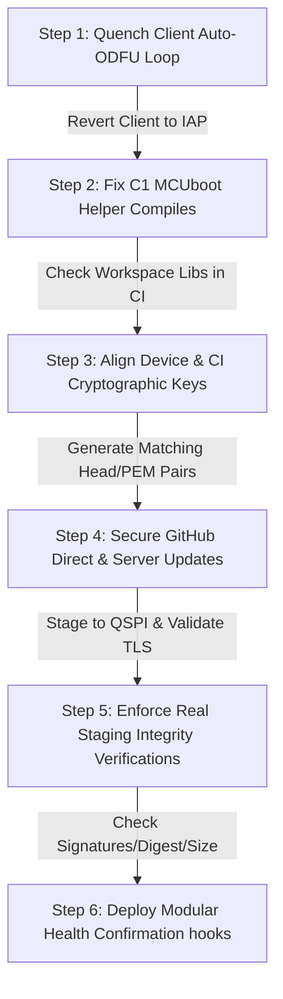

# Code Review: v1.9.0 Update System and Associated Code Changes

**Date:** June 9, 2026  
**Reviewer:** GitHub Copilot  
**Version Reviewed:** v1.9.0  
**Target Repository:** SenaxTankAlarm  
**Range Reviewed:** `master` branch up to commit `d855275` (Delta since v1.8.4/v1.8.6, with a focus on commits `691bb5f`, `08af85f`, `cc1b497`, `81b5cf6`, `eb536ea`, and incoming pipeline runs.)

---

## 1. Executive Summary

Version 1.9.0 attempts to lay the groundwork for an dual-bank, slot-based MCUboot update architecture. This incorporates building slot-packaged files in the release workflow, a QSPI partition provisioning/key-loading utility sketch (`TankAlarm-112025-KeyProvisioning`), a dormant staging routine (`tankalarm_performMcubootUpdate()`), and an optional Client-side sketch-confirmation milestone (`confirmSketch()`).

However, an exhaustive hardware, compiler, and cryptographic audit reveals that **the v1.9.0 update system is structurally non-functional, non-compiling, cryptographically mismatched, and contains critical regression loops.** It remains a conceptual skeleton rather than an integrated update system.

### Core Verdict
**STATUS: BLOCKED (Not Production Ready).** Automatic update policies must stay disabled. Do not assign the v1.9.0 tag or release `.slot.bin` files to any field devices. If deployed as-is, automatic client updates will permanently lock or brick field units into non-functioning infinite loops, and any attempt at MCUboot-based swap will fail due to cryptographic key mismatches.

---

## 2. Findings Matrix

| Finding ID | Severity | Category | Area | Vulnerability / Issue Description |
|:---|:---|:---|:---|:---|
| **C1** | **Critical** | Compile Error | Common / DFU | MCUboot helper code contains invalid C++ forward jumps that fail to compile under the target toolchain. |
| **C2** | **Critical** | Availability | Client | Client auto-ODFU mode enters an infinite loop feeding the watchdog (re-introducing the v1.8.5 hang). |
| **C3** | **Critical** | Architecture | Client | Client downloads updates via working local IAP but tries to apply them via the impossible outboard ODFU path. |
| **C4** | **Critical** | Security | Server | GitHub Direct over TLS lacks server certificate validation (`MBEDTLS_SSL_VERIFY_NONE`) and destroys live flash mid-stream before digest verification. |
| **H1** | **High** | Cryptography | Provisioning / CI | provisioned default public keys do not match repository-committed signing keys used in CI. All secure slot boots will fail verification. |
| **H2** | **High** | Integrity | Common / DFU | MCUboot staging performs zero header, magic, component, digest, or compatibility verification. |
| **H3** | **High** | Security | Credentials | Repository commits raw private key material (`mcuboot_keys/`) compromising server authenticity. |
| **H4** | **High** | Build System | CI / CD | Release artifacts mismatch operational runtime install targets; duplicate Viewer upload in release pipeline. |
| **H5** | **High** | Architecture | Common | Health confirmation is Client-centric and lacks system-wide validation (Server and Viewer lack health milestones). |
| **M1** | **Moderate**| Metadata | Docs / Common | Inconsistent version strings between headers (1.9.0) and library properties / documents (1.8.5). |
| **M2** | **Moderate**| Compile Safety | Common / DFU | MCUboot block sits outside the primary `#ifndef TANKALARM_DFU_H` include guard, creating double-inclusion Risks. |
| **M3** | **Moderate**| Hardware | Client | RS-485 bus isolation sequence targets undefined macros and leaves transceiver pins floating. |
| **M4** | **Moderate**| Compile Safety| Provisioning | KeyProvisioning sketch writes to unchecked, potentially-null file descriptors, leading to crashing Null-Pointer Dereferences. |
| **M5** | **Low**      | Architecture | Provisioning | Inconsistent FAT filesystem mount names (`fs` in provisioning vs `fs_ota` in updater) on the same QSPI block. |

---

## 3. Critical Findings

### C1: MCUboot Update Path fails to compile from Workspace Source
* **Component:** `TankAlarm-112025-Common`
* **File Segment:** `TankAlarm-112025-Common/src/TankAlarm_DFU.h` (Lines 728–734)

```cpp
    if (!dfuReady) {
      goto mcuboot_restore_hub;     // Line 728 — jump taken on timeout
    }
  }
  Serial.println(F("MCUboot DFU: DFU mode active"));

  // --- Step 3: Mount FAT filesystem and open update file ---
  FILE* fp = nullptr;               // Line 734 — Scalar bypass error!
```

#### Diagnostic Detail
Under standard C++ specifications ([stmt.dcl]), a jump (`goto`) cannot cross the initialization of a variable unless it is declared within a nested block. Because `FILE* fp` is declared below the jump point and remains in scope at the label `mcuboot_restore_hub:`, compiling with the project's mbed cross-compiler (`arm-none-eabi-g++ -std=gnu++14`) generates a **Hard Compilation Failure**:
```text
error: jump to label 'mcuboot_restore_hub' [-fpermissive]
note:   crosses initialization of 'FILE* fp'
```

#### Why This Went Unnoticed
Standard `arduino-cli` compilations of the Client and Server with `-DTANKALARM_DFU_MCUBOOT` succeeded because `arduino-cli` silently resolved the `#include "TankAlarm_DFU.h"` statement to an older, *stale copy* of the library installed locally under the user's `OneDrive/Documents/Arduino/libraries/TankAlarm-112025-Common/src/` folder (656 lines, lacking `tankalarm_performMcubootUpdate`). 
When compiled strictly against the actual workspace repository source (`--library TankAlarm-112025-Common`), the build fails immediately.

#### Impact
This renders the MCUboot update code dead and non-functional at the repository source level. It cannot run because it cannot build.

#### Fix
Banish non-structured loops. Avoid forward-crossing labels by initiating all local pointers at the very top of the function context, or wrap the setup sequence in scoped braces, or leverage standard `do { ... } while(0)` break blocks rather than `goto` structures:
```cpp
  FILE* fp = nullptr;
  // Now goto jumps over assignment, which is clean.
  if (!dfuReady) {
    goto mcuboot_restore_hub;
  }
```

---

### C2: Client Auto-ODFU Loop re-introduces the Infinite Watchdog-Fed Hang
* **Component:** `TankAlarm-112025-Client-BluesOpta`
* **File Segment:** `TankAlarm-112025-Client-BluesOpta/TankAlarm-112025-Client-BluesOpta.ino` (Lines 1997–2003, Lines 3930–3955)

```cpp
        if (gDfuUpdateAvailable) {
          Serial.println(F("Auto-DFU: Applying available firmware update (Coordinated ODFU)..."));
          enableDfuMode(); // -> calls card.dfu stm32 on:true
        }
```
And inside `enableDfuMode()`:
```cpp
        while (true) {
          #ifdef TANKALARM_WATCHDOG_AVAILABLE
            mbedWatchdog.kick();
          #endif
          delay(100);
        }
```

#### Diagnostic Detail
This represents a direct rollback of the protective watchdog safety introduced in v1.8.6. If the Client detects an update, it unconditionally requests Outboard DFU from the Notecard and drops into a `while(true)` infinite loop.
Critically, because this wait-loop actively calls `mbedWatchdog.kick()`, the hardware watchdog timer will *never* fire. 

#### Impact
If the Notecard accepts the command but fails to trigger a physical board reset (which it always does on this hardware — see C3), the Client will remain suspended in this loop forever. It stops polling, stops reading sensors, stops sounding alarms, and stops communicating, while actively starving out the hardware backup recovery.

#### Fix
Eliminate infinite polling waits that kick the watchdog. If the system must wait for an external reset, wait for a bounded duration (e.g., 60 seconds) without kicking the watchdog or let the watchdog trip after a timeout to force an MCU reset.

---

### C3: Client Handshake Architecture utilizes the physically impossible ODFU path
* **Component:** `TankAlarm-112025-Client-BluesOpta` / `TankAlarm-112025-Common`
* **File Segment:** `Client.ino` (Lines 3571, 3827, 3930)

#### Diagnostic Detail
Official hardware documentation confirms:
1. **The Blues "Wireless for Opta" expansion card does NOT route host MCU control lines.** It links the Opta and Notecard strictly over the shared I2C bus interface.
2. Outboard DFU (ODFU) via standard `card.dfu` requires dedicated wires (`ALT_DFU_BOOT` to BOOT0, `ALT_DFU_RESET` to NRST, and host USART1 RX/TX) to take control of the host.
3. Therefore, hardware-triggered Outboard DFU (`card.dfu {"name":"stm32","on":true}`) is **physically impossible** on stock Arduino Opta + Wireless-for-Opta setups.

The Client enables IAP background downloads (`tankalarm_enableIapDfu(notecard)`) which works perfectly for downloading images to the Notecard. However, instead of applying it self-sufficiently (using `tankalarm_performIapUpdate()` like the Server does successfully), the Client attempts to apply it by triggering `card.dfu` and hitting the infinite loop in C2.

#### Impact
The Client downloads the update successfully via IAP, but then locks up trying to install it via ODFU, rendering remote Client OTA completely broken. This leaves the Client running on old firmware while reporting a fail-loop, or permanently frozen.

#### Fix
Symmetrize Client update calls with the Server's proven logic. Replace ODFU triggers inside `enableDfuMode()` with:
```cpp
  const char *restoreMode = gConfig.solarPowered ? "periodic" : "continuous";
  bool ok = tankalarm_performIapUpdate(notecard, gDfuFirmwareLength, restoreMode, dfuKickWatchdog);
```

---

### C4: Server GitHub Direct Update erases Live Run Flash with TLS Validation bypass
* **Component:** `TankAlarm-112025-Server-BluesOpta`
* **File Segment:** `TankAlarm-112025-Server-BluesOpta.ino` (Lines 3697–4013)

```cpp
  // Line 3768:
  mbedtls_ssl_conf_authmode(&ssl_conf, MBEDTLS_SSL_VERIFY_NONE);
  
  // Line 3889:
  flash.erase(appStart, ...); // Erasing target app sector *while executing*
  
  // Line 3963 (download loop):
  flash.program(progBuf, offset, ...);
  
  // Line 4013:
  if (computedSha256 != expectedSha256) { ... } // Too late! Live flash is already destroyed.
```

#### Diagnostic Detail
This process presents dual critical-severity vulnerabilities:
1. **MitM/Active Attacker Vector:** By setting `MBEDTLS_SSL_VERIFY_NONE`, the TLS client disables all certificate chains and authentications. Any network attacker capable of intercepting connections can spoof GitHub, serve malicious payload binaries, and supply corresponding digests, hijacking the system.
2. **Bricking/Instability Vector:** The download loop erases and programs the running internal application flash sectors *during* active download stream processing. The SHA-256 digest validation occurs only *after* the entire binary is programmed. If a network drop, power loss, or digest failure occurs mid-way, the active sketch has already been obliterated and cannot boot.

#### Impact
This defeats the entire purpose of dual-bank safety and A/B recovery. High-availability network Servers can easily be permanently bricked by transient download dropouts.

#### Fix
Cease programming live running executable space directly from network sockets. Stage all incoming images to the QSPI expansion (or a dormant Flash partition), run file-level SHA integrity verification, and hand the staged file to MCUboot or perform a safe, local, offline boot block copy. Initialize complete root CA certificates to validate GitHub / Fastly server chains.

---

## 4. High Severity Findings

### H1: System Cryptographic Mismatch — Device and CI sign with different keys
* **Component:** `TankAlarm-112025-KeyProvisioning` / CI CD Pipeline
* **File Segment:** `TankAlarm-112025-KeyProvisioning.ino` (Lines 8-9, 99-100) vs `.github/workflows/release-firmware-112025.yml`

#### Diagnostic Detail
To establish A/B slot swaps, MCUboot must verify the authenticity of incoming firmware. The public signing key is programmed onto the device, while the private signing key signs the build in CI. 
1. `release-firmware-112025.yml` uses `mcuboot_keys/ecdsa-p256-signing-priv-key.pem` to sign the releases.
2. `TankAlarm-112025-KeyProvisioning.ino` includes `ecdsa-p256-signing-key.h` and writes `ecdsa_pub_key` to internal Flash.
   - However, `ecdsa-p256-signing-key.h` and `ecdsa-p256-encrypt-key.h` are standard Arduino Board Support Package **default baseline keys**, which are **not stored** anywhere in this repository, nor do they match the private PEMs inside `mcuboot_keys/`.
   - Any clean clone of this code cannot compile `KeyProvisioning.ino` karena the key headers are absent.
   - If compiled elsewhere using stock Arduino default keys, the public verify key programmed to the Opta is the stock Arduino default, which absolutely does not match the private signing key used in GitHub actions.

#### Impact
MCUboot will immediately reject every single OTA image due to signature validation or decryption failure on boot, leading to infinite rollback loops or permanent rejection.

#### Fix
Align the key structure. Generate a dedicated key-pair. Convert the workspace public verify key (`ecdsa-p256-signing-pub-key.pem`) and private decrypt key to standard C header arrays, and include them directly within the KeyProvisioning repository so the programmed keys represent the exact counterparts of CI.

---

### H2: MCUboot Staging performs zero file validation
* **Component:** `TankAlarm-112025-Common`
* **File Segment:** `TankAlarm_DFU.h` (Lines 758–862, `tankalarm_performMcubootUpdate`)

#### Diagnostic Detail
The staging helper downloads incoming bytes and streams them to `/fs_ota/update.bin`. However:
1. It computes a local running CRC32 but **never compares it** against any expected reference value.
2. It does not inspect the header to see if it starts with the valid MCUboot Magic (`0x96f3b83d`), nor does it verify that the image matches the correct target (Server vs Client) or represents an eligible firmware version.
3. If an `fwrite` error occurs during the remainder slot padding loop, the code silently breaks the loop and falls straight through to success:
   ```cpp
   if(fwrite(progBuf, 1, padAmt, fp) != padAmt) break; // loop breaks; continues to NVIC_SystemReset
   ```

#### Impact
A corrupted, incomplete, wrong-module, or unpaved binary file is marked as "staged for MCUboot." The system clears Notecard update buffers, reboots, and passes control to the bootloader, which is guaranteed to reject the junk, causing unnecessary down-time.

#### Fix
Perform assertions on the staged file before triggering `applyUpdate`. Validate file sizes, verify the CRC, parse the MCUboot header to check the MAGIC validation and module identification, and check the return status of all filesystem write operations.

---

### H3: Committing Private Keys to the Workspace Repo
* **Component:** Repository Architecture
* **File Segment:** `mcuboot_keys/ecdsa-p256-signing-priv-key.pem`, `ecdsa-p256-encrypt-priv-key.pem`

#### Diagnostic Detail
The private keys used for signing and decrypting production binaries are committed directly to public/shared git repository space. 

#### Impact
Any entity with access to the source code can sign arbitrary binaries that the hardware bootloaders will trust. This defeats the core security model of MCUboot, making the signature checks useful only for mechanical validation against glitches, rather than verification of firmware authenticity.

#### Fix
Purge private keys (`.pem` format) from git history. Store the private credentials as GitHub Action encrypted runner secrets, feeding them into `imgtool` securely during the build phase.

---

### H4: Runtime Image Discovery Targets Raw Binaries instead of Secure Slot Binaries
* **Component:** CI / CD Pipeline & Server Discovery
* **File Segment:** `.github/workflows/release-firmware-112025.yml` & `Server.ino` (Line 3050)

```yaml
# In workflow release files:
- TankAlarm-Client-v${{ steps.version.outputs.version }}.bin
- TankAlarm-Server-v${{ steps.version.outputs.version }}.bin
- TankAlarm-Viewer-v${{ steps.version.outputs.version }}.bin
- TankAlarm-Client-secure-v${{ steps.version.outputs.version }}.slot.bin
```

#### Diagnostic Detail
CI produces and uploads two variants of the binary:
1. `TankAlarm-Client-v1.9.0.bin` (Raw Arduino-compiled image)
2. `TankAlarm-Client-secure-v1.9.0.slot.bin` (MCUboot signed, encrypted slot-compatible wrap)

However, the Server firmware update discovery mechanism searches strictly for target `TankAlarm-Server-v%s.bin`, which downloads and operates on the *raw* image. The actual runtime code continues retrieving and utilizing the raw `.bin` assets, meaning the secure `.slot.bin` artifacts generated by CI are never actually deployed. Additionally, the release file list uploads the raw Viewer bin twice:
```yaml
            TankAlarm-Viewer-v${{ steps.version.outputs.version }}.bin
            TankAlarm-Client-secure-v${{ steps.version.outputs.version }}.slot.bin
            TankAlarm-Server-secure-v${{ steps.version.outputs.version }}.slot.bin
            TankAlarm-Viewer-secure-v${{ steps.version.outputs.version }}.slot.bin
            TankAlarm-Viewer-v${{ steps.version.outputs.version }}.bin  # DUPLICATED!
```

#### Impact
Operational builds miss the security of slot wrappers, and the CI release payload contains redundant file artifacts.

#### Fix
Streamline workflow files. Remove the duplicate entry. Ensure operational routines are pointed at their respective secure `.slot.bin` targets when `TANKALARM_DFU_MCUBOOT` is enabled.

---

### H5: Confirmation Milestone is Client-only and Unconditional
* **Component:** `TankAlarm-112025-Client-BluesOpta`, `Server`, `Viewer`
* **File Segment:** `Client.ino` (Lines 1659–1666)

```cpp
#if defined(TANKALARM_DFU_MCUBOOT)
  MCUboot::confirmSketch();
  Serial.println(F("MCUboot DFU: Sketch confirmed healthy."));
#endif
```

#### Diagnostic Detail
The verification milestone `MCUboot::confirmSketch()` is hard-coded at the end of `setup()`. However:
1. Confirming the sketch merely because it booted up to the end of `setup()` is insufficient. If a bad sketch has a bug that crashes 10 seconds into `loop()`, or can never read Modbus, or fails after connection, calling `confirmSketch()` so early permanently locks in the broken app, making rollback impossible.
2. The Server and Viewer modules do not include `MCUboot::confirmSketch()` call macros anywhere, meaning they will *always* trigger an automatic roll-back on their next restart if updated via MCUboot.

#### Impact
Dual-bank rollback is bypassed on the Client (due to overly premature authorization), and permanently fails on the Server and Viewer (due to missing authorization).

#### Fix
Provide a robust system-wide confirmation hook. Invoke `confirmSketch()` only after the sketch establishes basic operating conditions, such as:
- Initialized physical links (I2C, RS-485, Ethernet).
- Retentive settings validated and loaded.
- Successful handshake completed with the Notecard or first dispatch of telemetry.

---

## 5. Moderate / Low Findings

### M1: Inconsistent Version Tracking across Project Files
* **Component:** Repository Documentation / Common Library
* **File Segment:** `TankAlarm_Common.h:19` (`1.9.0`) vs `library.properties:2`, `README.md` (Lines 1, 4, 347, 367) and `BOM.md` (`1.8.5`)

#### Detail
While `TankAlarm_Common.h` was incremented to `1.9.0`, related source properties and descriptive guides remain pinned to version `1.8.5`. Because the release workflow relies exclusively on matching tag versions to `FIRMWARE_VERSION`, mismatch runs will deliver library packages with conflicting internal definitions.

#### Fix
Enforce unified version bumps during releases across all meta-fields.

---

### M2: MCUboot block sits outside the primary include guard
* **Component:** `TankAlarm-112025-Common`
* **File Segment:** `TankAlarm_DFU.h` (Lines 658–922)

```cpp
#endif // TANKALARM_DFU_H

#if defined(TANKALARM_DFU_MCUBOOT)
// MCUboot code sits out in the cold floor!
...
#endif
```

#### Detail
The file-level guard `#endif // TANKALARM_DFU_H` terminates on line 655. The entire MCUboot staging declaration block is placed below this point. If any compilation path includes this header twice (a common occurrence in complex file structures), compilation will fail with "redefinition of global symbols" warnings or hard linkage conflicts.

#### Fix
Move the MCUboot block upwards, placing it safely *above* the `#endif // TANKALARM_DFU_H` guard line.

---

### M3: Transceiver inputs float during "quiescing" sequence
* **Component:** `TankAlarm-112025-Client-BluesOpta`
* **File Segment:** `Client.ino` (Lines 3905–3916)

```cpp
  #if defined(PIN_RS485_DE) && defined(PIN_RS485_RE)
    pinMode(PIN_RS485_DE, OUTPUT);
    digitalWrite(PIN_RS485_DE, LOW);
    pinMode(PIN_RS485_RE, OUTPUT);
    digitalWrite(PIN_RS485_RE, LOW);
    
    pinMode(PIN_RS485_DE, INPUT); // Inputs float!
    pinMode(PIN_RS485_RE, INPUT);
  #endif
```

#### Detail
This sequence targets undefined PIN macros (the board support packages don't define `PIN_RS485_DE/RE/TX/RX` directly using these uppercase names). Furthermore, setting transceiver gates `DE` and `RE` to `INPUT` disables active drivers, allowing transceiver states to enter a random floating state.

#### Fix
Since physical connection paths are IAP-controlled and do not require bus isolation, this section can be safely discarded.

---

### M4: Provisioning Sketch fails to verify file handles
* **Component:** `TankAlarm-112025-KeyProvisioning`
* **File Segment:** `TankAlarm-112025-KeyProvisioning.ino` (Lines 57, 76)

```cpp
  FILE* fp = fopen("/fs/scratch.bin", "wb");
  const int scratch_file_size = 128 * 1024;
  ...
  while (size < scratch_file_size) {
    int ret = fwrite(buffer, sizeof(buffer), 1, fp); // Crashes if fp is NULL!
```

#### Detail
If the QSPI filesystem fails to format or mount properly, the initialization of file pointers (`fp`) will resolve to `NULL`. The subsequent `fwrite()` calls lack checking, causing immediate MCU kernel panics (Null-Pointer Dereference).

#### Fix
Verify file handle states before stream execution:
```cpp
  FILE* fp = fopen("/fs/scratch.bin", "wb");
  if (!fp) {
    Serial.println("FATAL: Failed to open scratch.bin");
    return;
  }
```

---

### M5: Mount namespace discrepancies
* **Component:** `KeyProvisioning` & `Common / DFU`

#### Detail
`KeyProvisioning.ino` initializes block 2 FAT space mounted under `"fs"`, expecting file paths `/fs/scratch.bin`. However, the core staging utility in `TankAlarm_DFU.h` mounts the exact same partition under `"fs_ota"`, opening `/fs_ota/update.bin`. While functionally identical on memory, this inconsistency is confusing and error-prone.

#### Fix
Standardize naming parameters to `"fs_ota"` throughout all files.

---

## 6. High-Quality Implementations to Retain

* **Watchdog-Hardened Sector Erase:** The addition of incremental per-sector erase steps in the IAP staging routine (`TankAlarm_DFU.h:384-405`) is brilliant. This effectively keeps the watchdog fed during prolonged Flash erases.
* **Excellent Error Handling on Server Notehub Updates:** The Server implementation of `tankalarm_performIapUpdate()` is highly robust, reverting gracefully on failure without putting the server into blocking loops.
* **Well-designed Warning Prompts:** The QSPI Key Provisioning utility includes clear warning mechanisms preventing accidental data loss during USB operations.

---

## 7. Recommended Action Plan



### Immediate Actions
1. **Fix Client Update Regression (C2 & C3):**
   - Completely remove the infinite sleep-loop and `card.dfu stm32` requests from the Client sketch.
   - Point the Client update process back to the verified target `tankalarm_performIapUpdate()` structure used by the Server.
2. **Resolve MCUboot Helper Compilation Errors (C1 & M2):**
   - Relocate the `FILE* fp` initializer before the `goto` jump blocks.
   - Insert the MCUboot compilation scope block back safely inside the primary include guard lines of `TankAlarm_DFU.h`.
3. **Establish Crypto Key Alignment (H1, H3 & M4):**
   - Extract the public verification key corresponding to `ecdsa-p256-signing-priv-key.pem` and the private decryption key. Save them as custom C headers within `KeyProvisioning/` and commit them to replace the default Arduino keys. 
   - Ensure the raw private `.pem` keys are removed from Git history.
4. **Secure the Direct Update Stream (C4):**
   - Transition the Server's GitHub Direct downloads to use QSPI staging area targets.
   - Enforce full file download validation before executing local flash copying, and configure the Client TLS properties with pinned Root CA certificates.
5. **Implement Modular Confirmation (H5):**
   - Avoid calling early unconditional confirmations in `setup()`. Ensure confirmation triggers only run after establishing standard operating conditions. Add matching confirmation routines to both the Server and Viewer builds.
