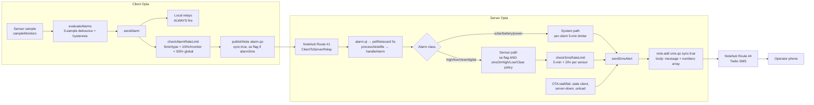

# Code Review — SMS Pipeline End-to-End (Client Alarm → Server → Notehub → Twilio)

**Date:** July 6, 2026
**Status:** ✅ **ALL P0/P1 FIXES + FEATURES IMPLEMENTED 2026-07-06** on the v2.1.5 base → **v2.1.6, seq 286** (client 384876 B / server 952188 B, both compile clean). Implemented: SMS-1–5, SMS-6 (clear exempt from hourly bucket), SMS-7 (bounded note.add retry), CONTACT-1–5 incl. **CONTACT-2a per-recipient `sms.qo` notes with `alarmAssociations` filtering**, `POST /api/sms/test` + settings-page button, and **6-hour re-notification for still-active alarms** (`smsReminderHours`, default 6, 0 disables). Deliberately skipped: fleet daily SMS budget. Remaining: settings-UI input for `smsReminderHours` (config/API only), Notehub Route #4 must be reconfigured to `To=[body.to]` when this firmware deploys, phantom sensor-0 cleanup on the live server.
**Scope:** Full SMS alert path: client alarm detection/trigger (`TankAlarm-112025-Client-BluesOpta.ino`), Notehub relay routes, server alarm ingestion + SMS dispatch (`TankAlarm-112025-Server-BluesOpta.ino`), and the Notehub route documentation (`Tutorials/Tutorials-112025/NOTEHUB_ROUTES_SETUP.md`).
**Method:** Static source review of current `master` + verification against the official Blues Twilio route documentation (dev.blues.io, fetched 2026-07-06). No hardware testing performed.

---

## 1. Executive Summary

**Overall verdict: the pipeline is well-architected and mostly in working order.** Rate limiting already exists at **four independent layers** (client debounce → client alarm-note limiter → server per-sensor SMS limiter → server per-client system-SMS limiter) — you do **not** need to add basic rate limiting.

However, the review found **2 real code bugs**, **1 deployment-critical documentation gap**, and several smaller inconsistencies:

| # | Severity | Finding |
|---|----------|---------|
| SMS-1 | **HIGH** | `sendAlarm()` skips the offline note buffer — an alarm raised while the Notecard is flagged unavailable is silently lost forever (no SMS, no server record, and the rate-limit budget is still consumed) |
| SMS-2 | **HIGH** | `battery_failure`, `solar_sunset`, and `i2c-error-rate` alarm types are missing from the server's system-alarm list — they latch **phantom alarms on sensor #0**, and the client's `se:true` SMS-escalation request for battery failure is **silently dropped** (no SMS ever sent) |
| SMS-3 | **MEDIUM** | Tutorial Route #4 (Twilio) is incomplete/unworkable as written: the required **To Number** and **Message** fields are not documented, and the firmware's multi-recipient `numbers[]` array is **not consumable by a Notehub Twilio route** — the dashboard's "SMS Recipients" contact list is silently non-functional for delivery targeting |
| SMS-4 | MEDIUM | The default placeholder `+15555555555` counts as a configured recipient — `sms.qo` events are emitted (consuming Notehub credits) even when nothing real is configured |
| SMS-5 | LOW | Unload SMS gate checks only legacy `smsPrimary/smsSecondary`, ignoring the contacts system |
| SMS-6 | LOW | The 2-SMS/hour/sensor cap **includes clear notifications** — one high+clear cycle exhausts the budget, so a re-alarm in the same hour sends no SMS |
| SMS-7 | LOW | Server `sendSmsAlert()` has no retry/buffer — a transient Notecard I2C failure drops the SMS with only a log entry |
| SMS-8 | DOC | `DASHBOARD_GUIDE.md` documents a per-client "Custom SMS Number" override and a "Send test notification" checkbox that **do not exist** in the firmware |

Recommended features (Section 7): fix the two bugs, document the Twilio route properly, add a test-SMS endpoint, and consider a re-notification interval for still-active alarms plus a fleet-wide daily SMS budget for cost control.

---

## 2. Pipeline Map (as implemented)



**Layered rate limiting (verified in source):**

| Layer | Location | Mechanism | Values |
|-------|----------|-----------|--------|
| 1. Debounce | Client `evaluateAlarms` (~L6181) | N consecutive samples to latch/clear | `ALARM_DEBOUNCE_COUNT` = 3 (L280) |
| 2. Alarm-note limiter | Client `checkAlarmRateLimit` (~L6530) | Min interval per alarm type per monitor; hourly per-monitor cap; hourly global cap | 300 s (L363) / 10/hr (L338) / 30/hr (L342). `clear`, `sensor-recovered`, `relay_timeout` exempt from min-interval |
| 3. Sensor SMS limiter | Server `checkSmsRateLimit` (~L13415) | Min interval + hourly cap per sensor record; fail-closed when clock unsynced | 300 s (L139) / **2/hr** (L135); clear/recovery bypass min-interval only |
| 4. System SMS limiter | Server `handleAlarm` system path (~L12590) | Per-client min interval on `ClientMetadata.lastSystemSmsEpoch` (restored v1.9.6) | 300 s |

Additional single-shot guards: stale-client SMS (`staleAlertSent` flag, once per stale episode + one recovery SMS), server-down SMS (once per boot, `gServerDownChecked`, gated by `serverDownSmsEnabled`), OTA-stalled SMS (state-transition gated), OTA-failure SMS (per report note; client dedupes via `ota_reported.json`).

**This is a sound, defense-in-depth design. The answer to "do we need rate limiting?" is: it already exists — see Section 6 for tuning notes.**

---

## 3. What Works Well (verified)

1. **Relay safety ordering** — local + remote relay actuation happens *before* rate limiting in `sendAlarm()` (CRITICAL-2/3 fixes intact), so suppressed notifications never block physical safety response.
2. **Immediate alarm sync** — alarm notes publish with `sync:true`, so even solar clients in `periodic` hub mode push alarms immediately rather than waiting up to 6 h for the outbound window.
3. **Server inbound is near-real-time** — `hub.set sync:true` + 5-s inbox polling + 10-min forced-sync safety net (v1.9.17) means an alarm reaches `handleAlarm` within seconds of hitting Notehub.
4. **Dual-gate SMS policy** — SMS requires BOTH the client's per-monitor `alarmSms` flag (`se:true` in the note, default **off** until explicitly configured) AND the server-side policy (`smsOnHigh`/`smsOnLow` default on, `smsOnClear` default off). Diagnostic alarms (sensor-fault/stuck) are deliberately SMS-suppressed; recovery notes ride the `smsOnClear` policy.
5. **Fail-closed clock guard** — `checkSmsRateLimit` denies SMS when `currentEpoch() <= 0` (no time sync), preventing unlimited SMS before the first sync.
6. **Message hygiene** — 160-byte buffers, `snprintf` everywhere, site-name pre-truncation (M-16), and a truncation fallback for system alarms (W-4).
7. **Poison-note protection** — malformed alarm notes are deleted after 3 failed parses instead of wedging the inbox; future-schema notes are rejected safely.
8. **Contacts-first recipient resolution** — `sendSmsAlert()` resolves numbers from the contacts config (`smsAlertRecipients`), falling back to legacy `smsPrimary/smsSecondary`.
9. **Offline note buffer exists** — `publishNote()` → `bufferNoteForRetry()` (flash-backed) → `flushBufferedNotes()` on Notecard recovery... *except the alarm path bypasses it — see SMS-1.*
10. **Tutorial Route #1–#3 documentation is accurate** — including the `[filebase]` placeholder fix and the recommendation to enable automatic reroute-on-failure (5 s/1 min/5 min retries), which protects alarm delivery through transient route failures.

---

## 4. Bugs Found

### SMS-1 (HIGH): Alarms raised while the Notecard is flagged unavailable are lost forever

`sendAlarm()` (client ~L6755) gates note transmission on `gNotecardAvailable`:

```cpp
// Try to send via network if available
if (gNotecardAvailable) {
    JsonDocument doc;
    ...
    publishNote(ALARM_FILE, doc, true);
    ...
} else {
    Serial.print(F("Network offline - local alarm only for monitor "));
    ...
}
```

The `else` branch **discards the alarm**. This defeats the offline resilience that already exists one call deeper — `publishNote()` (L8500) explicitly handles the unavailable case by buffering to flash:

```cpp
if (!gNotecardAvailable) {
    Serial.println(F("publishNote: Notecard unavailable — buffering"));
    bufferNoteForRetry(fileName, buffer, syncNow);   // ← never reached for alarms
    ...
}
```

**Why this matters:** alarms are edge-triggered (sent only on latch transitions). If the Notecard health-check has flagged the card unavailable when the tank crosses its threshold, the alarm note is never queued and never re-sent after recovery — the server and the operator never learn about it. Telemetry, dailies, and even the *power-state* alarm path share the same anti-pattern (`sendPowerStateChange` L7510 also early-returns on `!gNotecardAvailable`).

Compounding details:

- `checkAlarmRateLimit()` runs (and **commits budget timestamps**) *before* the availability gate, so the discarded alarm still consumes the 10/hr + 30/hr budgets.
- The same `if (gNotecardAvailable)` guard wraps the sensor-fault/stuck/recovered publishes (~L5385–5510) and the battery-failure note (L8135).

**Fix (minimal):** remove the `gNotecardAvailable` gates around `publishNote(ALARM_FILE, ...)` call sites and let `publishNote()`'s internal buffering handle the offline case. Move the rate-limit commit after a successful queue, or accept the small budget-burn as-is. The buffered note retains its original `t` epoch, so the server timeline stays correct on flush.

### SMS-2 (HIGH): Three alarm types fall through to the sensor path — phantom sensor-0 alarms + dropped SMS escalation

Server `handleAlarm()` (~L12568) classifies system alarms with an explicit allow-list:

```cpp
bool isSystemAlarm = (strcmp(type, "solar") == 0) ||
                     (strcmp(type, "battery") == 0) ||
                     (strcmp(type, "power") == 0);
```

But the client also publishes to `alarm.qo`:

| Type | Client source | `se` flag | Server result today |
|------|---------------|-----------|---------------------|
| `battery_failure` | Battery-failure fallback detect (L8137) | **`true` — always** | Falls into sensor path → phantom record → `smsAllowedByServer` stays `false` → **SMS request silently dropped** |
| `solar_sunset` | Solar-only sunset protocol (L7887) | not set | Falls into sensor path → phantom record latches `alarmActive=true` |
| `i2c-error-rate` | Daily I2C error-rate alert (L8318) | not set | Same — phantom latched alarm |

Because these notes carry no `"k"` key, `doc["k"].as<uint8_t>()` yields **0**, so `upsertSensorRecord(clientUid, 0)` creates (or pollutes) a sensor-index-0 record, sets `rec->alarmActive = true` with `alarmType = "battery_failure"` (etc.), and logs a bogus alarm event. Real sensors are 1-based (`"number"` from the config generator), so this shows up on the dashboard as a **stuck alarm on a sensor that doesn't exist** — and nothing ever clears it (no matching `clear` note is ever sent for these types). This is the same stale-latch failure family previously diagnosed for sensor-stuck (2026-06-14).

**Fix:** extend the classification, e.g.:

```cpp
bool isSystemAlarm = (strcmp(type, "solar") == 0) ||
                     (strcmp(type, "battery") == 0) ||
                     (strcmp(type, "power") == 0) ||
                     (strcmp(type, "battery_failure") == 0) ||
                     (strcmp(type, "solar_sunset") == 0) ||
                     (strcmp(type, "i2c-error-rate") == 0);
```

and add message formatting for the three new types in the system-SMS composer (battery_failure should produce an SMS since the client asks for escalation; sunset/i2c-error-rate are informational — store + log only, matching their `se`-less intent). This also gives `battery_failure` the per-client system-SMS rate limiter for free.

### SMS-7 (LOW): Server-side SMS has no retry

`sendSmsAlert()` (L13469) issues one `note.add` for `sms.qo`. If the Notecard returns an error or no response (I2C contention, card busy), the failure is logged (`logTransmission("sms","error",...)`) and the message is **dropped**. There is no equivalent of the client's `bufferNoteForRetry`. Given the server's Notecard has a history of transient sessions, a single bounded retry (e.g., one re-attempt after 250 ms) or a small RAM outbox drained from `loop()` would close this gap cheaply. (Note: if the Notecard is healthy but *cellular* is down, `note.add` succeeds and the note syncs later — that case is already safe.)

---

## 5. Notehub / Tutorial Findings (Route #4)

### SMS-3 (MEDIUM): The documented Twilio route cannot deliver to the firmware's recipient list

The firmware emits `sms.qo` bodies like:

```json
{ "message": "Silas #1 high alarm 43.8 psi", "numbers": ["+15551234567", "+15559876543"], "_sv": 1 }
```

Verified against the current Blues documentation ("Configuring a Twilio Route"):

1. A Notehub Twilio route sends **one SMS per event to one To Number** — required fields are Account SID, Auth Token, From Number, **To Number**, and **Message**. The tutorial's table (NOTEHUB_ROUTES_SETUP.md §Step 6) lists only SID/token/from/notefiles — **as written, the route cannot be created**; the reader must invent the two required fields.
2. There is **no fan-out over an array**. A placeholder can pull a scalar (e.g., `[body.customTo]`), and JSONata can select `numbers[0]`, but no route configuration will text *every* number in `numbers[]`. **Consequence: the dashboard's Contacts → "SMS Alert Recipients" list controls only which numbers appear inside the JSON body — actual delivery goes wherever the route's To Number points.** Operators who add a second recipient in the UI will believe both get texts; only the route's single To (or `numbers[0]` with JSONata) ever will.
3. The "Blues SMS (Notehub built-in)" alternative mentioned in the tutorial is vague and, per current Blues docs, not an actual route type — Twilio is the supported SMS route. Recommend removing or replacing that subsection.

**Recommended documentation fix (no firmware change required):** document two workable patterns —

- **Pattern A (1 recipient):** To Number = static E.164 number (or `[body.numbers[0]]` via JSONata transform), Message = `[body.message]`.
- **Pattern B (N recipients):** create **one Twilio route per recipient**, each filtered on `sms.qo` with a static To Number. Every route fires on every event — this is the only pure-Notehub fan-out. Update the dashboard/UI docs to say the contacts list must be mirrored manually in Notehub routes.

**Optional firmware alternative:** emit one `sms.qo` note *per recipient* with a scalar `to` field (`{"message": ..., "to": "+1555..."}`) so a single route with To = `[body.to]` fans out correctly and the contacts UI becomes authoritative. This is the cleanest long-term fix — one route, no manual mirroring — at the cost of N notes per alert (bounded: recipients are few and alerts are rate-limited).

### SMS-4 (MEDIUM): Placeholder number `+15555555555` is treated as a real recipient

`createDefaultConfig` seeds `smsPrimary = smsSecondary = "+15555555555"` (server L4900-4901), and `sendSmsAlert()`'s legacy fallback only checks `strlen(...) > 0`. On a fresh server with no contacts configured, every alert **emits a real `sms.qo` event** carrying the placeholder — consuming Notehub credits (the org has had low-balance warnings) and, if the route uses body placeholders, producing Twilio errors. Recommend treating `+15555555555` as unconfigured:

```cpp
static bool isRealPhoneNumber(const char *p) {
  return p && p[0] != '\0' && strcmp(p, "+15555555555") != 0;
}
```

and using it in both `sendSmsAlert()` (L13503-13507) and the unload gate (L13268). Consider also skipping the `note.add` entirely when `numbers` resolves empty (already done — the early return at "No recipients configured" is correct once the placeholder is excluded).

### SMS-5 (LOW): Unload SMS gate ignores the contacts system

`handleUnload` (L13268) gates on legacy fields only:

```cpp
if (wantsSms && (strlen(gConfig.smsPrimary) > 0 || strlen(gConfig.smsSecondary) > 0)) {
    sendUnloadSms(entry);
}
```

An operator who blanks the legacy fields and uses contacts exclusively loses unload SMS even though `sendSmsAlert()` would have resolved recipients fine. (Today this is masked by SMS-4 — the placeholder keeps the gate open.) Fix: drop the legacy check and let `sendSmsAlert()`'s own "no recipients" early-return decide, i.e. `if (wantsSms) sendUnloadSms(entry);`.

### SMS-8 (DOC): Dashboard guide documents unimplemented SMS features

DASHBOARD_GUIDE.md (~L395-409) shows a per-client "Custom SMS Number: (Blank = use server default)" field and a "Send test notification" checkbox. Neither exists anywhere in the server or client firmware (no `customNumber`/test-SMS code). Either remove from the guide or implement (the test button is genuinely useful — see Section 7).

---

## 6. Rate-Limiting Assessment (direct answer to the review question)

**You do not need to add rate limiting — it exists and is layered.** Tuning observations:

1. **SMS-6 (LOW): the 2/hr/sensor cap counts clear SMS.** `checkSmsRateLimit` commits every sent SMS (including `clear`, which bypasses only the min-interval) to the hourly bucket, and clear also refreshes `lastSmsAlertEpoch`. Sequence within one hour: high alarm SMS (1) → clear SMS (2) → level rises again → **re-alarm SMS suppressed**. The dashboard still shows it, but the operator's phone stays silent for a genuine second excursion. Options: (a) exempt `clear` from the hourly bucket (keep it in min-interval bookkeeping), (b) raise `MAX_SMS_ALERTS_PER_HOUR` to 3–4, or (c) document the behavior as intended. Option (a) is the best signal-preserving change.
2. **System alarms have min-interval but no hourly cap** — worst case 12 SMS/hr/client sustained (oscillating power states already get debounce + hysteresis upstream, so this is acceptable; noting for completeness).
3. **No fleet-wide SMS budget.** Per-sensor and per-client caps bound each source, but N clients × M sensors can still multiply during a site-wide event (e.g., shared power failure). A simple global daily counter (e.g., 50 SMS/day, alert once when tripped) would cap worst-case Twilio/Notehub spend. Low priority at current fleet size (1 client), but cheap insurance before fleet growth.
4. **OTA-failure SMS** is per received report note — bounded by the client's `ota_reported.json` dedupe, and stall SMS is state-transition gated. Fine as is.
5. Client-side budgets (10/hr/monitor, 30/hr global) and the boot-time seeding of the rolling window (L1785-1801) are correct, including the v1.6.2 unsigned-underflow guards. No changes needed.

---

## 7. Recommended Features (prioritized)

| Priority | Feature | Rationale | Effort |
|----------|---------|-----------|--------|
| **P0** | Fix SMS-1 (always `publishNote`, let it buffer) | Restores alarm delivery through Notecard flaps — the single biggest reliability hole in the pipeline | ~6 line-deletions on the client |
| **P0** | Fix SMS-2 (classify the 3 orphan alarm types) | Stops phantom sensor-0 alarms; makes battery-failure escalation actually text someone | ~20 server lines |
| **P0** | Rewrite Tutorial Route #4 (SMS-3) | Without To/Message documentation the route can't be built; multi-recipient expectation is silently wrong | Doc only |
| **P1** | Test-SMS endpoint (`POST /api/sms/test`, session-auth) + dashboard button | Verifies the whole server→Notehub→Twilio leg after setup without waiting for a real alarm; the dashboard guide already promises it (SMS-8) | ~30 server lines |
| **P1** | Placeholder-number guard (SMS-4) + unload gate unification (SMS-5) | Stops credit waste; makes contacts authoritative | ~10 server lines |
| **P2** | Exempt `clear` from the hourly SMS bucket (SMS-6a) | Preserves re-alarm SMS within the hour | ~5 server lines |
| **P2** | Re-notification for still-active alarms | Alarms are edge-triggered: one SMS per excursion. If the operator misses it, the tank can sit in alarm for days silently. A configurable reminder (e.g., re-SMS every 6/12/24 h while `alarmActive`, off by default) matches industry alarm-management practice | ~40 server lines (server already tracks `alarmActive` + `lastSmsAlertEpoch`) |
| **P2** | Server-side SMS retry/outbox (SMS-7) | Survives transient Notecard comm failures | ~25 server lines |
| **P3** | Per-recipient `sms.qo` notes (`to` scalar) | Makes contacts UI authoritative with a single Notehub route; removes manual route mirroring | ~15 server lines + route doc update |
| **P3** | Fleet-wide daily SMS budget + dashboard counter | Cost ceiling before fleet growth | ~30 server lines |
| P4 | Quiet hours / severity tiers (SMS only for high/low, email for the rest) | Already mostly achievable via `smsOnClear=false` default; revisit if operators report alert fatigue | design first |

**Deliberately NOT recommended:** acknowledgment-based escalation chains (SMS reply handling requires an inbound Twilio webhook → Notehub inbound route → server parsing; heavy for the current fleet size), and moving SMS composition to the client (the server-central design is correct — it has the contacts, the policy flags, and the rate limiters).

---

## 8. Verification Checklist (for whoever implements the fixes)

- [ ] SMS-1: with the Notecard health-check forced to "unavailable", trigger a threshold crossing → verify the alarm note lands in the flash buffer and is flushed (with original epoch `t`) after recovery; verify SMS then arrives.
- [ ] SMS-2: publish a synthetic `battery_failure` note (se:true) → verify per-client rate-limited SMS arrives, no sensor-0 record is created, and dashboard shows a system alarm (not a sensor alarm). Repeat for `solar_sunset` / `i2c-error-rate` (no SMS, no phantom record).
- [ ] SMS-2 cleanup: check the live registry for existing phantom sensor-0 records with `alarmType` of `battery_failure`/`solar_sunset`/`i2c-error-rate` and clear them (one-shot, or extend the existing self-clear paths).
- [ ] SMS-3: rebuild Route #4 per the new doc (Message = `[body.message]`); send a test SMS end-to-end; with 2 recipients configured verify **each** documented pattern behaves as documented.
- [ ] SMS-4/5: fresh-default server + no contacts → trigger alarm → verify NO `sms.qo` event is emitted; add one contact → verify emission resumes; verify unload SMS works with contacts-only config.
- [ ] SMS-6: high → clear → high within an hour → verify the third SMS now arrives (if 6a implemented).
- [ ] Rate-limit regression: 4 rapid same-type alarms → exactly 1 SMS in 5 min, ≤2 (or new cap) per hour, client relays actuate every time.

---

## 9. File/Line Reference Index

| Item | File | Location |
|------|------|----------|
| Alarm evaluation (debounce/hysteresis) | Client .ino | `evaluateAlarms` ~L6181 |
| Client alarm limiter | Client .ino | `checkAlarmRateLimit` ~L6530; defines L280/L338/L342/L363 |
| Alarm send + availability gate (SMS-1) | Client .ino | `sendAlarm` ~L6682; gate ~L6755 |
| Offline buffer | Client .ino | `publishNote` L8500, `bufferNoteForRetry` L8616, `flushBufferedNotes` L8656 (flush call L4256) |
| `se` escalation flag sites | Client .ino | sensor L6768; solar L7100; battery L7400; power L7533; battery_failure L8141 |
| Orphan alarm types (SMS-2) | Client .ino | `solar_sunset` L7887, `battery_failure` L8137, `i2c-error-rate` L8318 |
| Alarm inbox polling | Server .ino | `processNotefile(ALARM_INBOX_FILE, handleAlarm)` L11934 |
| System-alarm classification (SMS-2) | Server .ino | `handleAlarm` ~L12568; system SMS limiter ~L12590 |
| Sensor SMS policy + dispatch | Server .ino | ~L12745–12783; policy defaults L4908–4910 |
| Server SMS limiter | Server .ino | `checkSmsRateLimit` L13415; defines L135/L139 |
| SMS dispatch (SMS-7) | Server .ino | `sendSmsAlert` L13469; legacy fallback L13503; `note.add sms.qo` L13527 |
| Unload SMS gate (SMS-5) | Server .ino | L13228 (`doc["sms"]`), L13268 (legacy-only gate) |
| Placeholder default (SMS-4) | Server .ino | L4900–4901 |
| Stale/recovery SMS | Server .ino | ~L14610/L14643 |
| Server-down SMS | Server .ino | ~L4619 (`serverDownSmsEnabled`) |
| OTA stall/failure SMS | Server .ino | L12154 / L12222 |
| Route #4 tutorial (SMS-3) | NOTEHUB_ROUTES_SETUP.md | §Step 6 (~L342–360); flow diagram L112; verification L403 |
| Unimplemented UI features (SMS-8) | DASHBOARD_GUIDE.md | ~L395–409 |

---

## 10. Addendum (2026-07-06): Contacts Directory & Alarm→Contact Matching

Follow-up review of the server's contact system (storage, `/api/contacts`, both UIs, and recipient resolution). Infrastructure verdict: **sound** — atomic writes to `/fs/contacts_config.json` with a RAM-cache fallback, inclusion in the FTPS backup manifest, session middleware covering ALL `/api/*` routes (the old "PII — add auth" comment was stale), and sensible POST validation (max 100 contacts, name + phone-or-email required).

| # | Severity | Finding | Status |
|---|----------|---------|--------|
| CONTACT-1 | **HIGH (data loss)** | The `/contacts` manager page POSTs only `{contacts, dailyReportRecipients}`; `handleContactsPost` replaced the whole stored file with the request body (missing arrays → empty), so **any save/edit/delete on `/contacts` wiped the SMS recipient list** configured on the settings page. Its `deleteContact` also never purged `smsAlertRecipients`. | ✅ FIXED: merge-on-save (arrays absent from the POST are preserved from the stored config; explicitly-empty arrays still clear) + dangling recipient-ID pruning against the final contacts array |
| CONTACT-2 | **Design gap** | Per-contact `alarmAssociations` are stored, validated, and rendered ("Select which alarms should trigger notifications to this contact") but **never read in `handleAlarm`/`sendSmsAlert`** — SMS delivery is a flat broadcast to all `smsAlertRecipients`. Also the association picker only lists sensors that have alarmed at least once, and with a static-To Twilio route even `numbers[]` is advisory (see §5/SMS-3). | ⏸ DECISION REQUIRED (see below) |
| CONTACT-3 | MED | `sendDailyEmail()` legacy fallback treated the factory placeholder `reports@example.com` as a real recipient → bogus `email.qo` events on unconfigured servers. | ✅ FIXED: `isRealEmailAddress()` guard |
| CONTACT-4 | LOW | `sendSmsAlert()` serialized `{message, numbers[]}` into a stack `char[512]`; overflow (~15+ recipients) **silently dropped the SMS** with no log. | ✅ FIXED: static 1 KB buffer + serial log + `logTransmission` on overflow |
| CONTACT-5 | LOW | `POST /api/contacts` route cap was 8 KB while validation allows 100 contacts (~15 KB with associations). | ✅ FIXED: cap raised to `MAX_HTTP_BODY_BYTES` (16 KB, the global reader cap) |

**CONTACT-2 decision needed:** either (a) wire `alarmAssociations` into dispatch — requires per-recipient `sms.qo` notes (scalar `to`) + a `[body.to]` Twilio route so per-contact delivery is actually possible, then filter recipients by association in `handleAlarm`; or (b) remove the associations UI from the `/contacts` page to stop promising unimplemented behavior. Option (a) is the feature; option (b) is honesty. Interim reality: all SMS recipients receive all alerts.

---

## 11. Addendum 2 (2026-07-06, same day): Option (a) + remaining recommendations IMPLEMENTED

- **CONTACT-2a SHIPPED:** `sendSmsAlert(message, alarmId=nullptr)` now emits **one `sms.qo` note per recipient** with a scalar `to`. A single Twilio route (`To=[body.to]`, `Message=[body.message]`) fans out to every recipient — the dashboard contact list is authoritative. Sensor alerts (alarms + unload) pass `alarmId="clientUid_sensorIndex"`; contacts with a **non-empty** `alarmAssociations` array receive only their alarms, contacts with none receive everything (backward compatible). Fleet-wide alerts (system/OTA/stale/server-down/test) broadcast. Numbers are de-duplicated; sends capped at `MAX_SMS_RECIPIENTS_PER_ALERT` (10) per alert as a cost guard; WDT kicked per Notecard transaction.
- **SMS-6 SHIPPED:** clear/recovery SMS bypass the per-sensor limiter entirely (no hourly-bucket consumption, no `lastSmsAlertEpoch` refresh) — a high+clear cycle no longer silences a re-alarm in the same hour.
- **SMS-7 SHIPPED:** one bounded retry (250 ms) per recipient note on Notecard `note.add` failure.
- **Test SMS SHIPPED:** `POST /api/sms/test` (session-auth) + **Send Test SMS** button beside the settings-page recipient list; responds with the queued-recipient count.
- **Re-notification SHIPPED (#5):** `checkAlarmReminders()` sweeps ~1/min from `loop()`; while a sensor alarm stays active it re-sends the alarm SMS every `smsReminderHours` (**ServerConfig field, default 6 h, 0 disables**; persisted; settable via `/api/server-settings` `server.smsReminderHours`; exposed as `srh` in `/api/clients`). Anchored on `lastSmsAlertEpoch` (only alarm SMS update it now), so reminders never fire for alarms that never texted, honor `smsOnHigh`/`smsOnLow` policy, skip diagnostic types, respect alarm associations, and survive reboots via the persisted registry.
- **Deliberately skipped:** fleet-wide daily SMS budget (revisit at fleet growth).
- **Deployment notes:** Notehub Route #4 must be updated to `To=[body.to]` when v2.1.6 deploys (old firmware's `numbers[]` format and new route config are incompatible in both directions — update both together); `smsReminderHours` currently has no settings-page input (API/config only).
