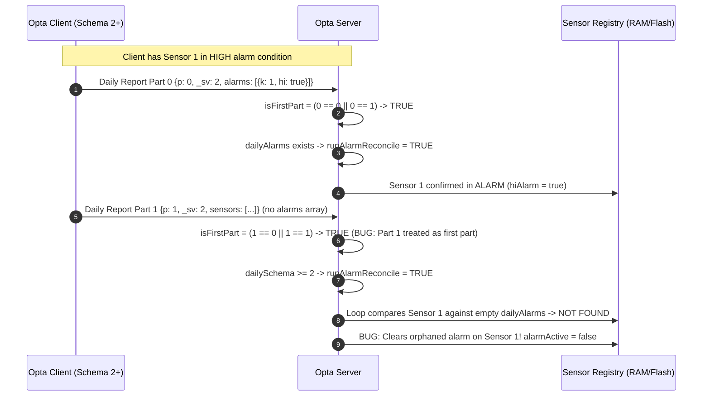

# Repository Full Review & Architecture Analysis - 2026-09-08 (Copilot)

## Executive Summary & Findings at a Glance

**Recommendation: do not deploy the current dirty client/Common working tree until its removed functionality is reconciled.** All four primary sketches compile, but compilation does not detect the confirmed alarm, calibration, persistence, and interface defects below. This is a review, not a firmware repair or release.

| Priority | ID | Finding |
| --- | --- | --- |
| High | W-01 | Local changes remove the DAC loop-power schema and implementation |
| High | W-02 | Local changes restore offline alarm-discard gates |
| High | F-01 | Multipart daily report part 1 can clear active alarms |
| High | F-02 | Dashboard Clear Relay can address the wrong monitor |
| High | F-03 | Calibration splits real device UIDs incorrectly and submits the wrong identity |
| High | F-04 | Analog alarm debounce accepts nonconsecutive trigger/clear samples |
| High | F-05 | Alarm latching can suppress the only notification of an episode |
| High | F-06 | Pulse sampler is not serviced throughout its acquisition window |
| High | F-07 | Late clock synchronization leaves scheduled work permanently unarmed |
| High | F-08 | Deleting the last client is not durable; failed saves lose retry state |
| High | F-09 | Snooze is broadcast before saving; save failure still returns success |
| High | F-10 | Failed config ACK clears pending delivery; same-second revisions collide |
| High | F-11 | Delayed/backlogged notes can overwrite newer values and alarm state |
| High | F-12 | Fault validity is inconsistent across telemetry, daily, persistence, and viewer paths |
| High | F-13 | Restore cannot round-trip normal backup sizes or coherently reload runtime state |
| Medium | W-03 | Local changes defeat sensor recovery backoff and restore repeated setpoint probes |
| Medium | W-04 | Local changes remove on-demand telemetry, acquisition timestamps, and the OTA build guard |
| Medium | F-14 | Shared save timestamp can indefinitely starve metadata persistence |
| Medium | F-15 | Relay timeout overwrites the active alarm type and stops reminders |
| Medium | F-16 | Oversized buffered notes are silently discarded on replay |
| Medium | F-17 | FTP backup blocks normal server work for at least 8m40s in a complete FTPS pass |
| Medium | F-18 | Unknown battery voltage bypasses power-state transition side effects |
| Medium | F-19 | Historical sensor selection resets immediately; custom dates lack change handling |
| Medium | F-20 | History mixes physical quantities and labels all readings as inches |
| Medium | F-21 | Several website pages overflow phone viewports substantially |
| Medium | F-22 | Chart CDN failure discards usable history data and throws again in error handling |
| Medium | F-23 | Dashboard stale label disagrees with its 49-hour threshold |
| Medium | F-24 | Post-handler note deletion has no delivery deduplication; poison tracker is undersized |
| Medium | F-25 | Provisioning can report keys programmed without checking flash results |
| Medium | F-26 | OptaView accepts insufficiently validated Modbus responses and mis-scales signed current |
| Medium | F-27 | HTML editing and screenshot tooling do not validate the shipped web experience |
| Medium | F-28 | Invalid settings requests can mutate runtime configuration before returning 400 |
| Medium | F-29 | Dashboard's 24-hour delta can retain an arbitrarily old baseline |

High means plausible missed alarms, incorrect control/calibration, or loss of durable operational state under an identified trigger. Medium means a bounded correctness, reliability, usability, or efficiency defect. Findings are source-confirmed unless an executable reproduction is explicitly stated. No hardware failure rate or exploitability is inferred from source alone.

## Baseline and Coverage

- Repository: `SenaxInc/SenaxTankAlarm`, `master`, firmware v2.2.14, build sequence 301.
- Initial HEAD: `9c750a8`. Fetched and fast-forwarded to `939fa91`; the six upstream commits changed generated binaries, the Common archive, and preview timestamps, not the reviewed source behavior.
- Seven tracked files were already modified: the CI workflow, two older OTA review documents, the client sketch, and three Common source files. Three July review documents and two compile logs were already untracked. Those changes were preserved and are excluded from this review commit.
- W-series findings concern the pre-existing uncommitted code changes. F-series findings concern code present in the reviewed current sources and, except where explicitly noted, are not introduced by those local changes. Client line references refer to the current working copy; reconcile their positions when reading pristine `master`.
- Detailed review: production server/client/viewer sketches; Common storage, time, I2C, solar, battery, and OTA paths; server's 14 page routes; build/release/preview workflows; HTML editing utility; FTPS test helper; provisioning; OptaView.
- Diagnostic and historical material was sampled for consistency and maintenance hazards. Generated binaries, every archived review, and every bench sketch were not reverse-engineered or exhaustively line-reviewed. The StorageMigration directory is empty. A repository-wide review is not proof that no further defects exist.
- No deployed website was exercised, no board was flashed, no relay/partition/provisioning operation was executed, and no live SMS/email/Notehub request was sent. Browser writes terminated at a loopback fixture server with synthetic data.

## Existing Local Changes

### W-01 - DAC Loop Power Has Been Replaced by an Older PWM-Only Contract

High. [Client monitor configuration](TankAlarm-112025-Client-BluesOpta/TankAlarm-112025-Client-BluesOpta.ino#L699), [current-loop reader](TankAlarm-112025-Client-BluesOpta/TankAlarm-112025-Client-BluesOpta.ino#L5440), [Common I2C implementation](TankAlarm-112025-Common/src/TankAlarm_I2C.h).

The existing diff removes `loopPowerEnabled`, `loopPowerMode`, `sensorMinVoltage`, DAC initialization, bipolar DAC-loop conversion, and the soft-ramp helpers, replacing them with older `pwmGating*` fields. Current server configuration still emits the newer loop-power contract. A DAC-powered installation can receive a syntactically valid configuration that this working client ignores, then operate the wrong power path. The version still says v2.2.14, obscuring that behavioral regression.

Action: reconcile the local edits against committed v2.2.14 before deployment; preserve schema migration and the separately validated DAC/PWM conversions. Do not blindly restore the entire file or discard the user's work. Test saved and pushed configs for external, DAC, and PWM power modes; bench-verify the selected physical output and current conversion.

### W-02 - Offline Alarms Again Bypass the Existing Retry Buffer

High. [sendAlarm](TankAlarm-112025-Client-BluesOpta/TankAlarm-112025-Client-BluesOpta.ino#L6354), [publishNote](TankAlarm-112025-Client-BluesOpta/TankAlarm-112025-Client-BluesOpta.ino#L8164).

The local diff reinstates `gNotecardAvailable` gates in alarm, unload, solar/battery, power-transition, and sunset paths. `publishNote` already buffers when the Notecard is unavailable. Skipping it loses the event instead of buffering it; an alarm can remain latched after communications recover without resending its initial notification. This is a host-to-Notecard outage issue, distinct from ordinary cellular outages while the Notecard remains accessible.

Action: restore unconditional invocation of the buffering publisher for alarm-class events, while retaining availability guards for direct Notecard I/O. Test alarm and clear transitions during a simulated Notecard outage and verify ordered replay.

### W-03 - Recovery Backoff and Setpoint Probe Limits Have Been Removed

Medium. [Sensor-only recovery](TankAlarm-112025-Client-BluesOpta/TankAlarm-112025-Client-BluesOpta.ino#L2052), [solar setpoint polling](TankAlarm-112025-Common/src/TankAlarm_Solar.cpp#L505).

The removed successful-read watermark matters: recovery itself zeroes `consecutiveFailures`, causing the next loop to reset backoff and total attempts without a real successful reading. The circuit breaker therefore repeatedly restarts. The diff also removes the rejection limit for CRC-valid but implausible setpoints, restoring three unnecessary register reads per poll on incompatible controller revisions. At one poll/minute, that is about 4,320 extra Modbus transactions/day before any function-code retries. The measured nominal-voltage classification was also removed while the field remains declared.

Action: reset recovery budgets only on a proven acquisition, not a software counter reset; distinguish transport failures from genuine under/over-range sensor values. Keep a bounded setpoint capability probe and explicitly re-arm on controller/configuration changes.

### W-04 - On-Demand Updates, Freshness Metadata, and OTA Build Protection Regress

Medium. [Client inbound polling](TankAlarm-112025-Client-BluesOpta/TankAlarm-112025-Client-BluesOpta.ino#L2175), [daily sensor serialization](TankAlarm-112025-Client-BluesOpta/TankAlarm-112025-Client-BluesOpta.ino#L8010), [client build guard](TankAlarm-112025-Client-BluesOpta/TankAlarm-112025-Client-BluesOpta.ino#L40).

The local diff removes `pollForTelemetryRequests` although the dashboard still queues those requests. It removes each daily sensor's acquisition `t`, so the server falls back to report time for reused readings. It also changes the missing-MCUboot build error into a warning, allowing an apparently successful USB build that cannot apply future OTA updates. Some old VS Code build tasks omit that flag and use stale copied libraries.

Action: preserve the command consumer, acquisition timestamps, and explicit non-OTA opt-out guard. Add a request-update round-trip test and a negative compile test for accidental non-OTA client builds. These removals should not be bundled into a review-only commit.

## High-Priority Correctness Findings

### F-01 - Daily Part 1 Can Clear an Active Alarm

[Server first-part detection and reconciliation](TankAlarm-112025-Server-BluesOpta/TankAlarm-112025-Server-BluesOpta.ino#L13080), [client daily producer](TankAlarm-112025-Client-BluesOpta/TankAlarm-112025-Client-BluesOpta.ino#L7844).

The client uses zero-based parts and includes `alarms` only in part 0. The server accepts both `part == 0` and `part == 1` as first parts for legacy compatibility, then interprets absent `alarms` on schema-2+ first parts as no active alarms. In a multipart report, part 1 therefore clears alarms that part 0 just confirmed, including their reminder snooze state.

Reproduction: part 0 `{p:0,_sv:2,alarms:[{k:1,hi:true,lo:false}]}` followed by part 1 `{p:1,_sv:2}` leaves sensor 1 clear in the source-matched model. This does not require packet reordering.



Suggested correction: distinguish legacy numbering using a protocol/version rule, not `0 || 1` for every sender. For the current schema, reconcile only part 0 with an explicit alarm-summary contract:

```cpp
// TankAlarm-112025-Server-BluesOpta.ino in handleDaily()
uint8_t part = doc["p"].as<uint8_t>();
int dailySchema = doc["_sv"] | 0;

// Schema 1+ uses 0-based parts (part 0 is first); legacy unversioned uses 1-based (part 1 is first).
bool isFirstPart = (dailySchema >= 1) ? (part == 0) : (part == 1 || part == 0);

// Only run alarm reconciliation on the TRUE first part (part 0 in modern schema) of the daily report.
// Subsequent parts (part 1, 2, ...) carry additional sensor history but NEVER contain the alarms array.
// Testing isFirstPart alone with (dailyAlarms || dailySchema >= 2) caused part 1 to be treated as a
// first part with no active alarms, erroneously clearing alarms verified in part 0!
bool runAlarmReconcile = (dailySchema >= 1) ? (part == 0 && (dailyAlarms || dailySchema >= 2))
                                            : (isFirstPart && dailyAlarms);
```

### F-02 - Clear Relay Uses Presentation Order as Device Identity

[Dashboard mapper](TankAlarm-112025-Server-BluesOpta/TankAlarm-112025-Server-BluesOpta.ino#L2310), [button serialization](TankAlarm-112025-Server-BluesOpta/TankAlarm-112025-Server-BluesOpta.ino#L2323), [server forwarding](TankAlarm-112025-Server-BluesOpta/TankAlarm-112025-Server-BluesOpta.ino#L11197), [client interpretation](TankAlarm-112025-Client-BluesOpta/TankAlarm-112025-Client-BluesOpta.ino#L8896).

`buildSiteModel` sets `sensorIdx` from the array position in `cs[].ts[]`. Those records follow server registry/arrival order, not the client's configuration order. The command is forwarded unchanged as `relay_reset_sensor`, which the client uses as a monitor-array index.

Executed reproduction: registry order `[k:2,k:1]` produces reset position 0 for sensor 2, although sensor 2 occupies configuration position 1. Sparse reports or a reboot backlog can create this ordering. This is a wrong-control-target risk, not merely a display issue.

Suggested correction: pass the persistent `sensorIndex` (`t.sensorIndex`) instead of the array loop index `sensorIdx`, and resolve it by sensor index on the client:

```js
// In DASHBOARD_HTML renderDataCard():
// BEFORE: onclick="clearRelays('${escapeHtml(t._clientUid)}',${t.sensorIdx||0})"
// AFTER: pass persistent sensorIndex (1-based monitor key)
onclick="clearRelays('${escapeHtml(t._clientUid)}',${Number(t.sensorIndex)||1})"
```

```cpp
// In TankAlarm-112025-Client-BluesOpta.ino handleRelayCommand():
if (!doc["relay_reset_sensor"].isNull()) {
  uint8_t targetSensor = doc["relay_reset_sensor"].as<uint8_t>();
  bool found = false;
  // Match against configured sensorIndex, not the array slot
  for (uint8_t i = 0; i < gConfig.monitorCount; ++i) {
    if (gConfig.monitors[i].sensorIndex == targetSensor) {
      resetRelayForMonitor(i);
      found = true;
      break;
    }
  }
  // Backwards compatibility for legacy 0-based array index commands
  if (!found && targetSensor < gConfig.monitorCount) {
    resetRelayForMonitor(targetSensor);
  }
  return;
}
```

### F-03 - Calibration Corrupts Device/Sensor Keys

[Dropdown and unit lookup](TankAlarm-112025-Server-BluesOpta/TankAlarm-112025-Server-BluesOpta.ino#L2181), [submission and log filter](TankAlarm-112025-Server-BluesOpta/TankAlarm-112025-Server-BluesOpta.ino#L2185), [backend validation](TankAlarm-112025-Server-BluesOpta/TankAlarm-112025-Server-BluesOpta.ino#L19465).

Keys are constructed as `clientUid:sensorIndex`, but `split(':')` takes the first two fields. A real key such as `dev:860000000000001:1` becomes client `dev` and sensor `860000000000001`, not the intended UID and sensor 1. A numeric device ID may then be rejected/coerced to an unrelated 8-bit sensor. Backend validation checks nonempty UID, not valid/existing sensor identity.

Browser reproduction with an alphanumeric test UID: selecting a GAS sensor kept feet/inches inputs visible, and submission produced `{"clientUid":"dev","sensorIndex":null,"verifiedLevelInches":12,...}`. The real handler rejects the null sensor; the mock's success response was not treated as backend success. Log filtering has the same parsing error.

Suggested shared page helper:

```js
function parseSensorKey(value) {
  if (!value) return null;
  const separator = value.lastIndexOf(':');
  if (separator <= 0) return null;
  const clientUid = value.slice(0, separator);
  const sensorIndex = Number(value.slice(separator + 1));
  if (!clientUid || !Number.isInteger(sensorIndex) || sensorIndex < 1 || sensorIndex > 255) {
    return null;
  }
  return { clientUid, sensorIndex };
}
```

Backend validation in [TankAlarm-112025-Server-BluesOpta/TankAlarm-112025-Server-BluesOpta.ino](TankAlarm-112025-Server-BluesOpta/TankAlarm-112025-Server-BluesOpta.ino#L19465):

```cpp
// In handleCalibrationPost():
const char *clientUid = doc["clientUid"] | "";
uint8_t sensorIndex = doc["sensorIndex"] | 0;
if (!isValidClientUid(clientUid) || sensorIndex < 1) {
  respondStatus(client, 400, F("Valid clientUid and 1-based sensorIndex required"));
  return;
}
SensorRecord *rec = findSensorByHash(clientUid, sensorIndex);
if (!rec) {
  respondStatus(client, 404, F("Sensor not found in registry"));
  return;
}
```

### F-04 - Analog Alarm Debounce Does Not Require Consecutive Samples

[evaluateAlarms](TankAlarm-112025-Client-BluesOpta/TankAlarm-112025-Client-BluesOpta.ino#L5872).

The high trigger counter is not reset when a normal sample falls below the high-clear band while no high alarm is latched. The high-clear counter is not reset by a sample in the hysteresis band. The symmetric low path has the same pattern. Invalid/reused acquisitions can also reach alarm evaluation before `sensorFailed` is set.

Executed the actual function after a mechanical type/literal conversion, with high=80, low=20, hysteresis=5, debounce=3. `[90,50,90,50,90]` emitted HIGH; starting high-latched, `[70,78,70,78,70]` emitted CLEAR. Neither sequence contains three consecutive qualifying samples.

Suggested correction in [TankAlarm-112025-Client-BluesOpta/TankAlarm-112025-Client-BluesOpta.ino](TankAlarm-112025-Client-BluesOpta/TankAlarm-112025-Client-BluesOpta.ino#L5970):

```cpp
// Strict consecutive sample debouncing with hysteresis
if (!state.highAlarmLatched) {
  if (highCondition) {
    state.highAlarmDebounceCount++;
    state.lowAlarmDebounceCount = 0;
    state.highClearDebounceCount = 0;
    if (state.highAlarmDebounceCount >= ALARM_DEBOUNCE_COUNT) {
      state.highAlarmLatched = true;
      state.lowAlarmLatched = false;
      state.highAlarmDebounceCount = 0;
      sendAlarm(idx, "high", state.currentInches);
    }
  } else {
    // Non-qualifying sample IMMEDIATELY resets trigger counter
    state.highAlarmDebounceCount = 0;
  }
} else {
  // High alarm is currently latched — must receive N consecutive clearing samples
  if (highClearCondition) {
    state.highClearDebounceCount++;
    state.highAlarmDebounceCount = 0;
    if (state.highClearDebounceCount >= ALARM_DEBOUNCE_COUNT) {
      state.highAlarmLatched = false;
      state.highClearDebounceCount = 0;
      sendAlarm(idx, "clear", state.currentInches);
    }
  } else {
    // Any sample back in alarm condition or inside hysteresis band resets clear counter
    state.highClearDebounceCount = 0;
  }
}

// Symmetrical logic for lowAlarmLatched...
if (!state.lowAlarmLatched) {
  if (lowCondition) {
    state.lowAlarmDebounceCount++;
    state.highAlarmDebounceCount = 0;
    state.lowClearDebounceCount = 0;
    if (state.lowAlarmDebounceCount >= ALARM_DEBOUNCE_COUNT) {
      state.lowAlarmLatched = true;
      state.highAlarmLatched = false;
      state.lowAlarmDebounceCount = 0;
      sendAlarm(idx, "low", state.currentInches);
    }
  } else {
    state.lowAlarmDebounceCount = 0;
  }
} else {
  if (lowClearCondition) {
    state.lowClearDebounceCount++;
    state.lowAlarmDebounceCount = 0;
    if (state.lowClearDebounceCount >= ALARM_DEBOUNCE_COUNT) {
      state.lowAlarmLatched = false;
      state.lowClearDebounceCount = 0;
      sendAlarm(idx, "clear", state.currentInches);
    }
  } else {
    state.lowClearDebounceCount = 0;
  }
}
```

### F-05 - Latch-Before-Send Can Lose the Only Alarm Notification

[Boot timestamp initialization](TankAlarm-112025-Client-BluesOpta/TankAlarm-112025-Client-BluesOpta.ino#L1745), [alarm evaluation](TankAlarm-112025-Client-BluesOpta/TankAlarm-112025-Client-BluesOpta.ino#L5872), [rate limiter](TankAlarm-112025-Client-BluesOpta/TankAlarm-112025-Client-BluesOpta.ino#L6210).

`evaluateAlarms` sets the latch before `sendAlarm` checks notification limits. A suppressed send is not pending anywhere, so subsequent samples in the same condition do not retry. The boot initializer sets last-high/low/fault times to zero when uptime is below five minutes, but the comment claiming unsigned subtraction then wraps is wrong: at 20 seconds, `20000 - 0 < 300000`. With short sample intervals, the first alarm can be suppressed and remain unsent until another episode or a daily summary. The daily recovery path currently latches state without dispatching the missing initial alert.

Suggested correction in [TankAlarm-112025-Client-BluesOpta/TankAlarm-112025-Client-BluesOpta.ino](TankAlarm-112025-Client-BluesOpta/TankAlarm-112025-Client-BluesOpta.ino#L1745):

```cpp
// In setupMonitorRuntime():
// Unsigned subtraction naturally wraps around in 32-bit arithmetic:
// (bootNow - (interval + 1)) results in a large unsigned value (~4,294,667,295).
// When later evaluated: (now - expired) yields >= interval + 1.
// DO NOT clamp expired to 0 when bootNow < interval, because (now - 0) is small
// and immediately causes checkAlarmRateLimit() to suppress the alarm!
const unsigned long minIntervalMs = MIN_ALARM_INTERVAL_SECONDS * 1000UL;
unsigned long bootNow = millis();
unsigned long expired = bootNow - (minIntervalMs + 1);

gMonitorState[i].lastHighAlarmMillis = expired;
gMonitorState[i].lastLowAlarmMillis = expired;
gMonitorState[i].lastClearAlarmMillis = expired;
gMonitorState[i].lastSensorFaultMillis = expired;
```

Furthermore, decouple physical latch state from transmission status:

```cpp
// Retain pending notification state if sendAlarm is rate-limited or fails
if (!checkAlarmRateLimit(idx, alarmType)) {
  state.alarmNotificationPending = true;
  strlcpy(state.pendingAlarmType, alarmType, sizeof(state.pendingAlarmType));
  return;
}
state.alarmNotificationPending = false;
```

### F-06 - Pulse Acquisition Is Only Polled at Telemetry Sample Time

[Pulse sampler](TankAlarm-112025-Client-BluesOpta/TankAlarm-112025-Client-BluesOpta.ino#L1268), [result retrieval](TankAlarm-112025-Client-BluesOpta/TankAlarm-112025-Client-BluesOpta.ino#L1397), [only caller](TankAlarm-112025-Client-BluesOpta/TankAlarm-112025-Client-BluesOpta.ino#L5695).

The nonblocking sampler requires repeated `pollPulseSampler` calls, but its only call is inside `readPulseSensor`, invoked by periodic sampling. There is no loop service or interrupt-backed capture that observes the intervening pulse edges. With a 30-minute reporting interval and a seconds-long measurement window, it counts only short bursts separated by long unobserved gaps, then divides by a duration that does not describe the observation. A pending sample returns an old reading without marking it reused.

Action: service pulse sampling continuously in the main control loop or attach an interrupt:

```cpp
// In TankAlarm-112025-Client-BluesOpta.ino loop():
void loop() {
  // Service pulse counters on every loop iteration
  for (uint8_t i = 0; i < gConfig.monitorCount; ++i) {
    if (gConfig.monitors[i].sensorInterface == SENSOR_PULSE) {
      pollPulseSampler(i);
    }
  }
  // ... rest of main loop ...
}
```

Action: capture edges with an appropriate hardware timer/interrupt-backed counter and service the state machine independently of transmission cadence. Mark incomplete samples invalid/reused. Test known pulse trains, no pulses, low/high frequencies, long main-loop stalls, and the supported count range. Do not assume an occasional polling burst implements continuous accumulation.

### F-07 - Late Time Sync Does Not Arm Schedules

[Server startup](TankAlarm-112025-Server-BluesOpta/TankAlarm-112025-Server-BluesOpta.ino#L4397), [server clock/scheduler](TankAlarm-112025-Server-BluesOpta/TankAlarm-112025-Server-BluesOpta.ino#L8667), [client scheduler](TankAlarm-112025-Client-BluesOpta/TankAlarm-112025-Client-BluesOpta.ino#L4224), [viewer scheduler](TankAlarm-112025-Viewer-BluesOpta/TankAlarm-112025-Viewer-BluesOpta.ino#L807), [shared sync helper](TankAlarm-112025-Common/src/TankAlarm_Notecard.h#L28).

At startup without time, scheduling stores zero. Later successful `ensureTimeSync` updates only the clock. Loop due checks require a nonzero next epoch and therefore never trigger the scheduling function again. The standard client has a no-time 24-hour fallback, but that fallback stops applying once time becomes valid, leaving its zero schedule stranded. Server daily email and viewer schedules have analogous gaps.

Failed time synchronization also retries on every loop because only successful sync updates its timestamp, bypassing the intent of Notecard health backoff and spamming I2C bus traffic continuously.

Suggested correction in [TankAlarm-112025-Server-BluesOpta/TankAlarm-112025-Server-BluesOpta.ino](TankAlarm-112025-Server-BluesOpta/TankAlarm-112025-Server-BluesOpta.ino#L8667):

```cpp
static unsigned long gLastSyncAttemptMillis = 0;
const unsigned long SYNC_RETRY_BACKOFF_MS = 30000UL;  // 30s backoff while awaiting cellular time

static void ensureTimeSync() {
  unsigned long nowMs = millis();
  // If already synced, refresh every 6 hours
  if (gLastSyncedEpoch > 0.0 && (nowMs - gLastSyncMillis < 6UL * 3600UL * 1000UL)) {
    return;
  }
  // While clock is uninitialized, enforce a 30s backoff to avoid hammering Notecard I2C
  if (gLastSyncedEpoch <= 0.0 && (nowMs - gLastSyncAttemptMillis < SYNC_RETRY_BACKOFF_MS)) {
    return;
  }
  gLastSyncAttemptMillis = nowMs;

  J *req = notecard.newRequest("card.time");
  if (!req) return;
  J *rsp = notecard.requestAndResponse(req);
  if (!rsp) return;

  const char *err = JGetString(rsp, "err");
  if (!err || strlen(err) == 0) {
    double time = JGetNumber(rsp, "time");
    if (time > 0.0) {
      bool firstSync = (gLastSyncedEpoch <= 0.0);
      gLastSyncedEpoch = time;
      gLastSyncMillis = nowMs;

      // CRITICAL: Re-arm schedules that were unarmed due to boot with no clock!
      if (firstSync) {
        scheduleNextDailyEmail();
        addServerSerialLog("Clock acquired; re-armed daily email schedule", "info", "time");
      }
    }
  }
  notecard.deleteResponse(rsp);
}
```

### F-08 - Last-Client Deletion Is Not Persisted; Save Failures Lose Dirty State

[Registry save](TankAlarm-112025-Server-BluesOpta/TankAlarm-112025-Server-BluesOpta.ino#L15612), [metadata save](TankAlarm-112025-Server-BluesOpta/TankAlarm-112025-Server-BluesOpta.ino#L15815), [delete handler](TankAlarm-112025-Server-BluesOpta/TankAlarm-112025-Server-BluesOpta.ino#L16650), [periodic saves](TankAlarm-112025-Server-BluesOpta/TankAlarm-112025-Server-BluesOpta.ino#L4810).

Both save functions return early when their count is zero. Deleting the final client therefore leaves the old nonempty files on disk; reboot reloads the removed records. Save functions return `void`, and the delete/periodic callers clear dirty flags even on unavailable storage, allocation failure, or write failure. Atomic writing is already present; the defect is the surrounding contract, not a missing rename strategy.

Suggested correction in [TankAlarm-112025-Server-BluesOpta/TankAlarm-112025-Server-BluesOpta.ino](TankAlarm-112025-Server-BluesOpta/TankAlarm-112025-Server-BluesOpta.ino#L15612):

```cpp
// Change return type from void to bool to report persistence success
static bool saveSensorRegistry() {
#ifdef FILESYSTEM_AVAILABLE
  #if defined(ARDUINO_OPTA) || defined(ARDUINO_ARCH_MBED)
    if (!mbedFS) return false;

    JsonDocument doc;
    JsonArray arr = doc.to<JsonArray>();
    // When gSensorRecordCount == 0, doc serializes as "[]", properly persisting empty state!
    for (uint8_t i = 0; i < gSensorRecordCount; ++i) {
      const SensorRecord &rec = gSensorRecords[i];
      if (rec.clientUid[0] == '\0') continue;
      JsonObject obj = arr.add<JsonObject>();
      // ... populate fields ...
    }
    return posix_atomic_write_json(SENSOR_REGISTRY_FILE, doc);
  #endif
#endif
  return true;
}
```

Callers must clear dirty flags ONLY when persistence succeeds:

```cpp
// In handleClientDeleteRequest() and loop():
if (gSensorRegistryDirty) {
  if (saveSensorRegistry()) {
    gSensorRegistryDirty = false;
  } else {
    addServerSerialLog("Failed to save sensor registry; write will retry", "warn", "fs");
  }
}
if (gClientMetadataDirty) {
  if (saveClientMetadataCache()) {
    gClientMetadataDirty = false;
  } else {
    addServerSerialLog("Failed to save metadata cache; write will retry", "warn", "fs");
  }
}
```

### F-09 - Snooze Notice and Success Precede Durable State

[applyReminderSnooze](TankAlarm-112025-Server-BluesOpta/TankAlarm-112025-Server-BluesOpta.ino#L14566), [HTTP handler](TankAlarm-112025-Server-BluesOpta/TankAlarm-112025-Server-BluesOpta.ino#L14591), [registry save](TankAlarm-112025-Server-BluesOpta/TankAlarm-112025-Server-BluesOpta.ino#L15612).

`applyReminderSnooze` changes RAM and broadcasts before its caller saves. `saveSensorRegistry` cannot report failure, yet the handler returns `success: true`. An operator can receive a paused notice and success, then lose that snooze after reboot. Even with healthy storage, blocking notification transactions enlarge the pre-save interruption window. The SMS path also applies/broadcasts before its eventual batch save.

Suggested transactional ordering in [TankAlarm-112025-Server-BluesOpta/TankAlarm-112025-Server-BluesOpta.ino](TankAlarm-112025-Server-BluesOpta/TankAlarm-112025-Server-BluesOpta.ino#L14591):

```cpp
// In handleAlarmSnoozePost():
// 1. Stage in RAM
double priorSnooze = rec->reminderSnoozeEpoch;
rec->reminderSnoozeEpoch = snooze ? (now > 0.0 ? now : 1.0) : 0.0;
gSensorRegistryDirty = true;

// 2. Persist to disk BEFORE broadcasting
bool saveOk = saveSensorRegistry();
if (!saveOk) {
  // Roll back RAM state on disk write failure
  rec->reminderSnoozeEpoch = priorSnooze;
  respondStatus(client, 500, F("Failed to persist snooze state to storage"));
  return;
}
gSensorRegistryDirty = false;

// 3. Dispatch notifications only AFTER durable storage is confirmed
broadcastSnoozeChange(*rec, snooze, "dashboard");

// 4. Respond success to web client
JsonDocument resp;
resp["success"] = true;
resp["snoozed"] = rec->reminderSnoozeEpoch > 0.0;
String out;
serializeJson(resp, out);
respondJson(client, out);
```

### F-10 - Config Failure Can Be Acknowledged as Complete

[ACK handler](TankAlarm-112025-Server-BluesOpta/TankAlarm-112025-Server-BluesOpta.ino#L16255), [client revision gate](TankAlarm-112025-Client-BluesOpta/TankAlarm-112025-Client-BluesOpta.ino#L4594).

The server clears pending state for a matching `cv` regardless of `st`; `st:"failed"` ends automatic retry. The client truncates `_ts` to whole seconds and skips `inboundTs <= configEpoch`, acknowledging the offered version as applied even when a different configuration was generated within the same second. A later ACK can thus claim a configuration that never took effect. Orphan pruning additionally checks `status == applied` without requiring the ACK to match the current snapshot version.

Suggested correction in [TankAlarm-112025-Server-BluesOpta/TankAlarm-112025-Server-BluesOpta.ino](TankAlarm-112025-Server-BluesOpta/TankAlarm-112025-Server-BluesOpta.ino#L16255):

```cpp
// In handleConfigAck():
// Only mark pendingDispatch as complete when status is explicitly "applied"
if (version[0] != '\0' && strcmp(version, snap->configVersion) == 0) {
  if (strcmp(status, "applied") == 0) {
    snap->pendingDispatch = false;
    snap->dispatchAttempts = 0;
    pruneOrphanedSensorRecords(clientUid);
    addServerSerialLog("Config successfully applied on client", "info", "config");
  } else {
    // Retain pendingDispatch = true so the server's retry engine will attempt delivery again!
    char warnMsg[96];
    snprintf(warnMsg, sizeof(warnMsg), "Client reported config error: %s (will retry)", status);
    addServerSerialLog(warnMsg, "warn", "config");
  }
}
```

On Client ([TankAlarm-112025-Client-BluesOpta/TankAlarm-112025-Client-BluesOpta.ino](TankAlarm-112025-Client-BluesOpta/TankAlarm-112025-Client-BluesOpta.ino#L4594)):

```cpp
// Use monotonic version revision or hash inequality rather than <= second timestamp:
if (strcmp(cv, gConfig.configVersion) == 0 && gConfig.configVersion[0] != '\0') {
  // Exact duplicate version hash already active
  sendConfigAck(true, "Config version already active", cv);
  ackSent = true;
} else {
  // Apply new configuration
  applyConfigUpdate(doc);
  // ...
}
```

### F-11 - Note Arrival Order Can Regress Sensor and Alarm State

[Telemetry update](TankAlarm-112025-Server-BluesOpta/TankAlarm-112025-Server-BluesOpta.ino#L12647), [alarm update](TankAlarm-112025-Server-BluesOpta/TankAlarm-112025-Server-BluesOpta.ino#L12905), [daily reconciliation](TankAlarm-112025-Server-BluesOpta/TankAlarm-112025-Server-BluesOpta.ino#L13154), [client replay ordering](TankAlarm-112025-Client-BluesOpta/TankAlarm-112025-Client-BluesOpta.ino#L8250).

The ingestion paths do not reject an older event before mutating current state. Telemetry/alarm freshness uses the note-envelope time while history can use the acquisition `t`; daily uses per-sensor `t` where available. Different notefiles are drained separately, so arrival order is not event order. The client also queues a new successful live note before flushing old buffered notes, enabling old alarm/clear messages to arrive afterward.

Suggested correction in [TankAlarm-112025-Server-BluesOpta/TankAlarm-112025-Server-BluesOpta.ino](TankAlarm-112025-Server-BluesOpta/TankAlarm-112025-Server-BluesOpta.ino#L12647):

```cpp
// Guard against out-of-order note arrival overwriting current real-time state:
double sampleTime = doc["t"].is<double>() ? doc["t"].as<double>() : epoch;

if (sampleTime < rec->lastUpdateEpoch) {
  // Historical reading arrived out of order — record in trend history only,
  // do NOT overwrite rec->currentValue, rec->alarmActive, or rec->lastUpdateEpoch!
  addHistoricalReading(clientUid, sensorIndex, sampleTime, level);
  return;
}
```

### F-12 - Invalid Data Can Be Presented or Stored as Valid

[Telemetry validity handling](TankAlarm-112025-Server-BluesOpta/TankAlarm-112025-Server-BluesOpta.ino#L12622), [diagnostic alarm handling](TankAlarm-112025-Server-BluesOpta/TankAlarm-112025-Server-BluesOpta.ino#L12905), [daily validity](TankAlarm-112025-Server-BluesOpta/TankAlarm-112025-Server-BluesOpta.ino#L13296), [viewer summary](TankAlarm-112025-Server-BluesOpta/TankAlarm-112025-Server-BluesOpta.ino#L15002).

- Fault-only telemetry still runs `resolveLevel`, assigns the result, and records history. Without `ma/lvl/fl/rm`, the result is zero. The main card may say FAULT, but a zero can still enter trends.
- Daily ingestion does not update `sensorFault`, so a prior fault can persist after a good daily sample, or a daily-only fault can be absent from the display. Its raw-mA gate also differs from telemetry.
- Diagnostic fault/recovery notes produced by `validateSensorReading` contain no normal sensor payload. `handleAlarm` still assigns the resolved zero and updates freshness.
- `sensorFault` is deliberately not persisted, and viewer summaries omit it; reboot or viewing through the viewer can turn a known invalid value into an apparently numeric observation.
- Daily/alarm snapshots require `newLevel > 0` or `level > 0`, excluding valid empty-tank/zero-pressure observations ($0.0\text{ in}$ or $0.0\text{ psi}$). With change telemetry disabled, zeros can disappear from the trend entirely.

Suggested correction: make measurement validity explicit:

```cpp
bool isFaultNote = (doc["flt"].is<const char*>() && strlen(doc["flt"].as<const char*>()) > 0);
bool hasNumericValue = doc["l"].is<float>() || doc["ma"].is<float>();

if (isFaultNote && !hasNumericValue) {
  // Diagnostic fault note with no reading — update fault status without inserting 0 into trend!
  strlcpy(rec->sensorFault, doc["flt"].as<const char*>(), sizeof(rec->sensorFault));
  rec->sensorFaultEpoch = (epoch > 0.0) ? epoch : currentEpoch();
  return; // Skip trend history recording
}

// Support valid zero readings (empty tank / zero pressure):
// Check hasNumericValue rather than level > 0.0f
if (hasNumericValue) {
  rec->currentValue = level;
  rec->sensorFault[0] = '\0'; // Clear active fault on fresh valid reading
  recordHistorySnapshot(rec, sampleEpoch);
}
```

### F-13 - FTP Restore Is Not a Reliable Round Trip

[Restore implementation](TankAlarm-112025-Server-BluesOpta/TankAlarm-112025-Server-BluesOpta.ino#L7275), [boot reload sequence](TankAlarm-112025-Server-BluesOpta/TankAlarm-112025-Server-BluesOpta.ino#L4426), [backup size limit](TankAlarm-112025-Server-BluesOpta/TankAlarm-112025-Server-BluesOpta.ino#L206).

Backup accepts roughly 24 KiB per baseline file, but restore retrieves each into a 2 KiB stack buffer. Ordinary contacts/config/registry files can exceed that. Both backup and restore call the operation successful when any file succeeded, even if required files failed. Restored files are applied one by one, without an all-files validation/activation boundary. Boot restore reloads config snapshots/calibration but not the already loaded registry, metadata, history settings, hot history, or contacts cache, and does not coherently reinitialize networking/Notecard from restored settings. A subsequent dirty save can overwrite restored files from stale RAM.

Suggested correction in [TankAlarm-112025-Server-BluesOpta/TankAlarm-112025-Server-BluesOpta.ino](TankAlarm-112025-Server-BluesOpta/TankAlarm-112025-Server-BluesOpta.ino#L4426):

```cpp
// After successful FTP restore, reload ALL affected subsystems into RAM:
if (performFtpRestore(err, sizeof(err))) {
  ensureConfigLoaded();
  loadClientConfigSnapshots();
  loadCalibrationData();
  loadSensorRegistry();          // CRITICAL: Adopt restored registry
  loadClientMetadataCache();     // CRITICAL: Adopt restored metadata
  loadHistorySettings();
  loadHotTierSnapshot();
  // Clear dirty flags so loop persistence does not overwrite fresh restored data with stale RAM!
  gSensorRegistryDirty = false;
  gClientMetadataDirty = false;
  gConfigDirty = false;
  scheduleNextDailyEmail();
  addServerSerialLog("FTP restore completed; all RAM registries refreshed", "info", "ftp");
}
```

## Additional Correctness and Reliability

### F-14 - Metadata Save Can Starve Behind Registry Save

[Loop persistence gates](TankAlarm-112025-Server-BluesOpta/TankAlarm-112025-Server-BluesOpta.ino#L4810).

The registry branch sets `gLastRegistrySaveMillis = now` before the metadata branch checks that same interval. If registry dirtiness recurs at each interval, metadata never saves. A 12-cycle source-matched model performs zero metadata saves.

Suggested unified persistence scheduling in [TankAlarm-112025-Server-BluesOpta/TankAlarm-112025-Server-BluesOpta.ino](TankAlarm-112025-Server-BluesOpta/TankAlarm-112025-Server-BluesOpta.ino#L4810):

```cpp
// TankAlarm-112025-Server-BluesOpta.ino loop()
static unsigned long gLastPersistenceAttemptMillis = 0;

if (now - gLastPersistenceAttemptMillis >= REGISTRY_SAVE_INTERVAL_MS) {
  gLastPersistenceAttemptMillis = now;
  // Evaluate both independent dirty flags in the same tick; write failure leaves dirty for next tick
  if (gSensorRegistryDirty && saveSensorRegistry()) {
    gSensorRegistryDirty = false;
  }
  if (gClientMetadataDirty && saveClientMetadataCache()) {
    gClientMetadataDirty = false;
  }
}
```

### F-15 - Relay Timeout Disables an Active Alarm's Reminders

[Timeout branch](TankAlarm-112025-Server-BluesOpta/TankAlarm-112025-Server-BluesOpta.ino#L12927), [reminder type gate](TankAlarm-112025-Server-BluesOpta/TankAlarm-112025-Server-BluesOpta.ino#L14659).

Timeout keeps `alarmActive` true but replaces `alarmType` with `relay_timeout`. Reminders only accept high/low/digital types, so a still-high tank stops reminding after this operational event.

Suggested correction in [TankAlarm-112025-Server-BluesOpta/TankAlarm-112025-Server-BluesOpta.ino](TankAlarm-112025-Server-BluesOpta/TankAlarm-112025-Server-BluesOpta.ino#L12927):

```cpp
// In handleAlarm():
else if (isRelayTimeout) {
  // Record operational timeout event without overwriting underlying alarm condition!
  rec->relayTimedOut = true;
  rec->lastRelayTimeoutEpoch = (epoch > 0.0) ? epoch : currentEpoch();
  addServerSerialLog("Relay safety timeout logged", "warn", "relay");
  // Do NOT overwrite rec->alarmType! If it was "high", it remains "high"
  // so checkAlarmReminders() continues alerting the operator!
}
```

### F-16 - Replay Capacity Is Smaller Than Accepted Publish Capacity

[Dynamic publisher](TankAlarm-112025-Client-BluesOpta/TankAlarm-112025-Client-BluesOpta.ino#L8181), [replay line limit and discard](TankAlarm-112025-Client-BluesOpta/TankAlarm-112025-Client-BluesOpta.ino#L8319).

`publishNote` accepts dynamically allocated payloads larger than 2,048 bytes, but `NOTE_REPLAY_LINE_MAX` is 2,304 including metadata. Longer buffered lines are skipped, not retained, and the skip warning is debug-only.

Suggested correction in [TankAlarm-112025-Client-BluesOpta/TankAlarm-112025-Client-BluesOpta.ino](TankAlarm-112025-Client-BluesOpta/TankAlarm-112025-Client-BluesOpta.ino#L8181):

```cpp
// Enforce single unified maximum payload size across publish and replay buffer
#define MAX_BUFFERED_NOTE_PAYLOAD 2048
#define NOTE_REPLAY_LINE_MAX (MAX_BUFFERED_NOTE_PAYLOAD + 256)

// Reject oversized notes at publish time before corrupting buffer:
if (measureJson(doc) > MAX_BUFFERED_NOTE_PAYLOAD) {
  Serial.println(F("ERROR: Note payload exceeds maximum buffer capacity — splitting required"));
  return false;
}
```

### F-17 - FTPS Backup Makes the Server Unresponsive for Minutes

[Nine-file manifest](TankAlarm-112025-Server-BluesOpta/TankAlarm-112025-Server-BluesOpta.ino#L5585), [inter-file waits](TankAlarm-112025-Server-BluesOpta/TankAlarm-112025-Server-BluesOpta.ino#L7011), [loop backup wrapper](TankAlarm-112025-Server-BluesOpta/TankAlarm-112025-Server-BluesOpta.ino#L4861).

Eight 65-second waits total 520 seconds (8m40s), before connection/transfer time, for a full FTPS manifest pass. The delay occurs before checking whether each next file exists. The loop closes its web listener and calls backup synchronously; watchdog kicks prevent reset but do not service telemetry or alarms.

Suggested cooperative state-machine architecture for FTPS backup:

```cpp
enum FtpBackupState {
  FTP_BACKUP_IDLE,
  FTP_BACKUP_CONNECTING,
  FTP_BACKUP_UPLOADING_FILE,
  FTP_BACKUP_WAITING_COOLDOWN,
  FTP_BACKUP_COMPLETE,
  FTP_BACKUP_FAILED
};

static FtpBackupState gFtpBackupState = FTP_BACKUP_IDLE;
static uint8_t gFtpCurrentFileIndex = 0;
static unsigned long gFtpCooldownStartMs = 0;

void pollCooperativeFtpBackup() {
  if (gFtpBackupState == FTP_BACKUP_IDLE) return;
  
  unsigned long now = millis();
  switch (gFtpBackupState) {
    case FTP_BACKUP_WAITING_COOLDOWN:
      // Non-blocking wait between files — main loop services alarms and HTTP!
      if (now - gFtpCooldownStartMs >= 65000UL) {
        gFtpCurrentFileIndex++;
        if (gFtpCurrentFileIndex >= FTP_MANIFEST_COUNT) {
          gFtpBackupState = FTP_BACKUP_COMPLETE;
        } else {
          gFtpBackupState = FTP_BACKUP_UPLOADING_FILE;
        }
      }
      break;
    case FTP_BACKUP_UPLOADING_FILE:
      // Upload single file, then transition to non-blocking cooldown
      if (uploadSingleFtpFile(gFtpCurrentFileIndex)) {
        gFtpCooldownStartMs = now;
        gFtpBackupState = FTP_BACKUP_WAITING_COOLDOWN;
      } else {
        gFtpBackupState = FTP_BACKUP_FAILED;
      }
      break;
    // ...
  }
}
```

### F-18 - Loss of Voltage Data Bypasses Power-State Recovery Logic

[updatePowerState](TankAlarm-112025-Client-BluesOpta/TankAlarm-112025-Client-BluesOpta.ino#L7649).

When no source is available, the function directly sets NORMAL and returns. If the prior state was CRITICAL, it bypasses relay restoration, state-change logging/notification, transition timestamps, and debounce reset.

Suggested correction in [TankAlarm-112025-Client-BluesOpta/TankAlarm-112025-Client-BluesOpta.ino](TankAlarm-112025-Client-BluesOpta/TankAlarm-112025-Client-BluesOpta.ino#L7649):

```cpp
// Retain explicit battery validity state:
bool voltageValid = (rs485VoltageValid || vinDividerValid);
if (!voltageValid) {
  // Do NOT reset to NORMAL! Mark voltage unknown and retain current operating state
  gPowerStateVoltageKnown = false;
  return;
}
gPowerStateVoltageKnown = true;
```

### F-19 - Historical Filters Do Not Survive Their Own Reload

[Filters and load path](TankAlarm-112025-Server-BluesOpta/TankAlarm-112025-Server-BluesOpta.ino#L2197), [event handlers](TankAlarm-112025-Server-BluesOpta/TankAlarm-112025-Server-BluesOpta.ino#L2205).

Sensor selection calls `loadHistoricalData`, which rebuilds both dropdowns without restoring their selected values. Browser test: selecting sensor 0 immediately returns to `all` with both datasets still plotted.

Suggested correction in `HISTORICAL_DATA_HTML`:

```js
function populateFilters() {
  const siteSelect = document.getElementById('siteFilter');
  const sensorSelect = document.getElementById('sensorFilter');
  
  // Preserve current selection across data refreshes
  const previousSite = siteSelect.value;
  const previousSensor = sensorSelect.value;
  
  siteSelect.innerHTML = '<option value="all">All Sites</option>';
  Object.keys(historicalData.sites).sort().forEach(site => {
    const opt = document.createElement('option');
    opt.value = site;
    opt.textContent = site;
    if (site === previousSite) opt.selected = true;
    siteSelect.appendChild(opt);
  });

  sensorSelect.innerHTML = '<option value="all">All Sensors</option>';
  historicalData.sensors.forEach(t => {
    const opt = document.createElement('option');
    const stableKey = `${t.client}:${t.sensorIndex}`;
    opt.value = stableKey;
    opt.textContent = `${t.site} - ${t.label}`;
    if (stableKey === previousSensor) opt.selected = true;
    sensorSelect.appendChild(opt);
  });
}
```

### F-20 - History Units and Series Identity Are Incorrect

[Chart/CSV formatting](TankAlarm-112025-Server-BluesOpta/TankAlarm-112025-Server-BluesOpta.ino#L2199), [history serializer](TankAlarm-112025-Server-BluesOpta/TankAlarm-112025-Server-BluesOpta.ino#L17012).

The history API omits object type/unit, while the page hardcodes `Level (inches)`, feet/inches cards, inch deltas, and a CSV inches column. A pressure sensor displays in PSI on the dashboard but is plotted/exported as inches. The voltage chart concatenates all clients into one line rather than grouping by client.

Suggested correction:
- Include `mu` (measurement unit) and `ot` (object type) in `api/history` output.
- Group voltage readings by `clientUid` into separate Chart.js datasets:

```js
function renderVoltageChart() {
  const ctx = document.getElementById('voltageChart').getContext('2d');
  if (voltageChart) voltageChart.destroy();

  // Group by client UID into distinct datasets
  const clientGroups = {};
  historicalData.voltage.forEach(v => {
    const uid = v.client || 'System';
    if (!clientGroups[uid]) clientGroups[uid] = [];
    clientGroups[uid].push({ x: new Date(v.timestamp * 1000), y: v.voltage });
  });

  const datasets = Object.keys(clientGroups).map((uid, idx) => ({
    label: uid.length > 12 ? uid.substring(uid.length - 8) : uid,
    data: clientGroups[uid],
    borderColor: CHART_COLORS[idx % CHART_COLORS.length],
    fill: false,
    tension: 0.3
  }));

  voltageChart = new Chart(ctx, {
    type: 'line',
    data: { datasets },
    options: {
      responsive: true,
      maintainAspectRatio: false,
      scales: {
        x: { type: 'time', time: { unit: 'day' } },
        y: { title: { display: true, text: 'Voltage (V)' } }
      }
    }
  });
}
```

### F-21 - Mobile Layout and Styling Are Inconsistent

[Shared CSS](TankAlarm-112025-Server-BluesOpta/TankAlarm-112025-Server-BluesOpta.ino#L1630), [Calibration](TankAlarm-112025-Server-BluesOpta/TankAlarm-112025-Server-BluesOpta.ino#L2173), [History](TankAlarm-112025-Server-BluesOpta/TankAlarm-112025-Server-BluesOpta.ino#L2188), [Site Configuration](TankAlarm-112025-Server-BluesOpta/TankAlarm-112025-Server-BluesOpta.ino#L2380).

All 14 server page routes were checked with synthetic populated data at 320, 390, 768, and 1,440 CSS pixels. Representative document widths at a 390-pixel viewport:

| Page | Document width | Evidence |
| --- | ---: | --- |
| Dashboard / Contacts / Settings / Client Console | 375 | No document overflow at this width; scrollbar consumes space |
| Calibration | 723 | Wide table/content forces page width |
| Site Configuration | 593 | Header/actions and reference table force minimum width |
| Transmission Log | 516 | Table/control minimum width |
| Email Setup | about 781-796 | Code block/content minimum width |
| SMS Setup | about 767-782 | Code block/content minimum width |
| History after desktop-to-phone resize | 1,180 | Chart canvas/container retains oversized width |

Critical CSS fixes required in `STYLE_CSS`:

```css
/* Missing CSS custom properties */
:root {
  --primary: #0066cc;
  --primary-hover: #004c99;
  --accent: #2563eb;          /* FIX: Was missing, broke sparklines and links */
  --bg: #f2f2f2;
  --card: #ffffff;
  --card-bg: #ffffff;       /* FIX: Was missing, broke stat cards and site sections */
  --chart-grid: #e5e7eb;    /* FIX: Was missing, broke Chart.js grid theme */
  --text: #333333;
  --muted: #666666;
  --border: #cccccc;
  --card-border: #d7d7d7;
  --danger: #cc0000;
  --success: #28a745;
  --warning: #ffc107;
  --chip: #e0e0e0;
  --radius: 6px;             /* Harmonize brutalist 0 with rounded 8px cards */
  --focus: #1d4ed8;
}

/* Missing button styles */
.btn-primary { background: var(--primary); color: #fff; border: 1px solid var(--primary); }
.btn-danger { background: var(--danger) !important; color: #fff !important; border-color: var(--danger) !important; }
.btn-danger:hover { background: #991b1b !important; }

/* Mobile viewport responsiveness fixes */
pre, code {
  max-width: 100%;
  overflow-x: auto;
  white-space: pre-wrap;
  word-break: break-word;
}
.table-scroll, table {
  display: block;
  max-width: 100%;
  overflow-x: auto;
  -webkit-overflow-scrolling: touch;
}
.chart-container {
  position: relative;
  width: 100%;
  max-width: 100%;
  min-width: 0;
  height: 320px;
}
```

### F-22 - CDN Loss Breaks Local History Even with Valid API Data

[External script imports](TankAlarm-112025-Server-BluesOpta/TankAlarm-112025-Server-BluesOpta.ino#L2188), [catch path](TankAlarm-112025-Server-BluesOpta/TankAlarm-112025-Server-BluesOpta.ino#L2204).

Browser reproduction blocked jsDelivr while allowing all local requests. `Chart` was absent; render threw, the catch reset valid historical data to empty, and its second chart render threw `ReferenceError: Chart is not defined`.

Suggested offline-capable fallback in `HISTORICAL_DATA_HTML`:

```js
function renderLevelChart() {
  const container = document.getElementById('levelChartContainer');
  const{sensors, cutoff, cutoffEnd} = getFilteredData();

  // If Chart.js CDN failed to load on an isolated industrial LAN:
  if (typeof Chart === 'undefined') {
    container.innerHTML = `
      <div style="padding: 20px; text-align: center; color: var(--muted); border: 1px dashed var(--border);">
        <p><strong>Chart renderer unavailable (offline LAN mode)</strong></p>
        <p style="font-size: 0.85rem;">Historical readings are intact and available below. Use "Export CSV" to download data.</p>
      </div>`;
    return;
  }

  const ctx = document.getElementById('levelChart').getContext('2d');
  // ... standard Chart.js rendering ...
}
```

### F-23 - Stale Threshold and Labels Disagree

[Dashboard stale constant and logic](TankAlarm-112025-Server-BluesOpta/TankAlarm-112025-Server-BluesOpta.ino#L2273).

The label says `Stale (>25h)`, but `STALE_MIN = 2940` means 49 hours.

Suggested correction in `DASHBOARD_HTML`:

```js
// Derive stale definition consistently: 25 hours = 1500 minutes
const STALE_HOURS = 25;
const STALE_MIN = STALE_HOURS * 60;

function isStale(epoch) {
  return !epoch || (epoch * 1000) < (Date.now() - STALE_MIN * 60 * 1000);
}
// UI card label:
// `Stale (>${STALE_HOURS}h)`
```

### F-24 - At-Least-Once Note Handling Lacks Idempotent Side Effects

[Notefile processing](TankAlarm-112025-Server-BluesOpta/TankAlarm-112025-Server-BluesOpta.ino#L12160), [poison tracker](TankAlarm-112025-Server-BluesOpta/TankAlarm-112025-Server-BluesOpta.ino#L12139).

Handlers run before a separate delete request whose failure is ignored. If delete fails or the MCU resets after sending, the same note can dispatch alerts again.

Suggested correction in [TankAlarm-112025-Server-BluesOpta/TankAlarm-112025-Server-BluesOpta.ino](TankAlarm-112025-Server-BluesOpta/TankAlarm-112025-Server-BluesOpta.ino#L12160):

```cpp
// Size poison tracker to match all 13 active inbox notefiles
#define TOTAL_INBOX_NOTEFILES 13
static uint8_t gNotefileParseFailures[TOTAL_INBOX_NOTEFILES] = {0};

// Track recently processed note IDs to prevent duplicate notification dispatches on delete failure
static char gRecentNoteIds[16][32] = {{0}};
static uint8_t gRecentNoteIdIndex = 0;

bool isDuplicateNoteId(const char *noteId) {
  if (!noteId || !noteId[0]) return false;
  for (uint8_t i = 0; i < 16; ++i) {
    if (strcmp(gRecentNoteIds[i], noteId) == 0) return true;
  }
  strlcpy(gRecentNoteIds[gRecentNoteIdIndex], noteId, sizeof(gRecentNoteIds[0]));
  gRecentNoteIdIndex = (gRecentNoteIdIndex + 1) % 16;
  return false;
}
```

### F-25 - Key Provisioning Does Not Verify Key Writes

[applyUpdate](TankAlarm-112025-KeyProvisioning/TankAlarm-112025-KeyProvisioning.ino#L215).

`flash.init`, both `flash.program` calls, and deinitialization results are ignored, but the summary always says keys were programmed.

Suggested correction in [TankAlarm-112025-KeyProvisioning/TankAlarm-112025-KeyProvisioning.ino](TankAlarm-112025-KeyProvisioning/TankAlarm-112025-KeyProvisioning.ino#L215):

```cpp
int initRes = flash.init();
if (initRes != 0) {
  Serial.print(F("FLASH ERROR: Failed to initialize QSPI flash, code="));
  Serial.println(initRes);
  return false;
}

int progRes = flash.program(keyData, targetAddress, keySize);
if (progRes != 0) {
  Serial.print(F("FLASH ERROR: Failed to program keys at 0x"));
  Serial.print(targetAddress, HEX);
  Serial.print(F(", code="));
  Serial.println(progRes);
  return false;
}

// Read back and verify key checksum
uint8_t readback[keySize];
flash.read(readback, targetAddress, keySize);
if (memcmp(readback, keyData, keySize) != 0) {
  Serial.println(F("VERIFICATION FAILURE: Key readback checksum does not match expected image!"));
  return false;
}
Serial.println(F("Key provisioning verified successfully."));
```

### F-26 - OptaView's Modbus Success Checks Are Too Weak

[Transaction validation](OptaView/OptaView.ino#L86), [telemetry decode](OptaView/OptaView.ino#L242).

CRC validity alone is treated as transaction success. Live current scaling ignores `isCurrent` and interprets two's-complement values as unsigned (e.g. `0xFFF0` becomes about 158 A instead of a small negative current).

Suggested correction in [OptaView/OptaView.ino](OptaView/OptaView.ino#L242):

```cpp
// Convert 16-bit register to signed two's complement before scaling
int16_t rawSigned = (int16_t)rawReg;
float scaledValue = (float)rawSigned * scaleFactor;
```

### F-28 - Rejected Settings Requests Partially Apply in RAM

[Settings mutation and validation order](TankAlarm-112025-Server-BluesOpta/TankAlarm-112025-Server-BluesOpta.ino#L18335).

Product UID, fleet, SMS policy, and viewer-enabled fields mutate `gConfig` before the handler validates `viewerNet`. An invalid viewer IP/gateway/subnet/DNS returns 400 after those mutations, skipping final persistence and device reinitialization.

Suggested validate-before-mutate pattern in [TankAlarm-112025-Server-BluesOpta/TankAlarm-112025-Server-BluesOpta.ino](TankAlarm-112025-Server-BluesOpta/TankAlarm-112025-Server-BluesOpta.ino#L18335):

```cpp
// In handleServerSettingsPost():
// 1. Validate all network settings into temporary variables first
uint8_t tempVnMode = 0;
char tempVnIp[16] = "", tempVnGw[16] = "", tempVnSn[16] = "", tempVnDns[16] = "";

if (settings["viewerNet"].is<JsonObject>()) {
  JsonObject vn = settings["viewerNet"];
  strlcpy(tempVnIp, vn["ip"] | "", sizeof(tempVnIp));
  uint8_t octets[4];
  if (tempVnIp[0] && !parseDottedQuad(tempVnIp, octets)) {
    respondStatus(client, 400, F("Invalid viewer IP address"));
    return; // Exit BEFORE modifying any gConfig fields in RAM!
  }
}

// 2. Only after ALL validations pass, apply changes to gConfig:
// gConfig.productUid = ...
// saveConfig(gConfig);
```

### F-29 - The Dashboard Delta Is Not Reliably a 24-Hour Change

[Telemetry baseline update](TankAlarm-112025-Server-BluesOpta/TankAlarm-112025-Server-BluesOpta.ino#L12653), [daily baseline update](TankAlarm-112025-Server-BluesOpta/TankAlarm-112025-Server-BluesOpta.ino#L13328), [displayed delta](TankAlarm-112025-Server-BluesOpta/TankAlarm-112025-Server-BluesOpta.ino#L10537).

The baseline advances when the gap from the immediately previous update is at least 22 hours. With hourly updates, that gap never reaches 22 hours, locking the delta to the initial boot baseline.

Suggested correction in [TankAlarm-112025-Server-BluesOpta/TankAlarm-112025-Server-BluesOpta.ino](TankAlarm-112025-Server-BluesOpta/TankAlarm-112025-Server-BluesOpta.ino#L12653):

```cpp
// Advance baseline when sample is at least 22 hours newer than CURRENT BASELINE EPOCH,
// not the immediately previous sample epoch!
if (rec->previousLevelEpoch <= 0.0 || (sampleEpoch - rec->previousLevelEpoch >= 22.0 * 3600.0)) {
  rec->previousValue = rec->currentValue;
  rec->previousLevelEpoch = sampleEpoch;
}
```

## Performance, Energy, and Data Recommendations

### 1. Speed & Execution Efficiency

- **Cooperative FTPS State Machine**: Avoid freezing the server for 8m40s during scheduled FTP backups. Servicing alarms between transfers maintains safe operations.
- **Memory-Safe Streaming JSON**: Serializing 90 snapshots for up to 20 sensors in a single `JsonDocument` exhausts remaining heap on Opta ($360\text{ KB}$ static RAM used). Stream chunks directly:

```cpp
void streamHistoryJson(EthernetClient &client, int days) {
  client.println(F("HTTP/1.1 200 OK\r\nContent-Type: application/json\r\nConnection: close\r\n\r\n{\"sensors\":["));
  for (uint8_t i = 0; i < gSensorHistoryCount; ++i) {
    if (i > 0) client.print(F(","));
    client.print(F("{\"client\":\"")); client.print(gSensorHistories[i].clientUid);
    client.print(F("\",\"sensorIndex\":")); client.print(gSensorHistories[i].sensorIndex);
    client.print(F(",\"readings\":["));
    // Stream individual readings directly to the socket
    for (uint8_t r = 0; r < gSensorHistories[i].readingCount; ++r) {
      if (r > 0) client.print(F(","));
      client.print(F("{\"t\":")); client.print(gSensorHistories[i].readings[r].epoch, 0);
      client.print(F(",\"l\":")); client.print(gSensorHistories[i].readings[r].level, 2);
      client.print(F("}"));
    }
    client.print(F("]}"));
  }
  client.println(F("]}"));
}
```

- **Static Asset Caching**: Serve `/style.css` with `Cache-Control: public, max-age=86400` and conditional `ETag` matching, saving Opta CPU cycles during web browsing.
- **Visibility-Aware Polling**: Frontend JS should pause or throttle `/api/clients` requests when the tab is backgrounded (`document.hidden`).

### 2. Energy Savings (Opta & Remote Clients)

- **Switched 4-20mA Sensor Loop Excitation**: Continuous 20mA current loop at 24V draws $0.48\text{ W}$ per sensor. Across multiple sensors on a solar-powered client station, this discharges batteries rapidly ($>8\text{ Ah/day}$).
  Gate loop power via Opta relay or DAC MOSFET for 50ms before reading the ADC:

```cpp
// Power-saving switched excitation:
void readSwitchedCurrentLoopSensor(uint8_t idx) {
  enableLoopPower(idx, true);
  safeSleep(50); // Sensor settling time
  float ma = sampleCurrentLoop(idx);
  enableLoopPower(idx, false);
  // Energy consumption reduced by >98%!
}
```

- **SunSaver RS-485 Modbus Polling Throttling**: Throttle Modbus reads to every 15 minutes at night (solar panel voltage = 0), and permanently suppress polling for unsupported setpoints after initial probe failure.
- **Notecard Periodic Deep Sleep**: Configure Notecard in `periodic` mode (`outbound: 30, inbound: 60`) on remote solar stations to allow cellular modem deep sleep ($8\ \mu\text{A}$) between sync cycles.

### 3. Data Savings (Cellular Bandwidth & Notehub Cost)

- **Change-Based Reporting Deadbands**: Do not transmit routine telemetry notes if level has changed by less than deadband ($\Delta < 0.5\text{ in}$) and no alarms are active:

```cpp
bool isSignificantChange(float oldLevel, float newLevel, float deadband) {
  return fabsf(newLevel - oldLevel) >= deadband;
}
```

- **Alert Notification Batching**: Queue all recipient `sms.qo` notes first, then trigger a single `hub.sync` rather than syncing per note.
- **Replay Buffer Deduplication**: During cellular recovery, collapse intermediate routine telemetry notes and transmit only the state transitions and latest reading.

## Suggested Remediation Order

1. **Phase 1: Critical Alarms and Control Integrity (F-01, F-02, F-04, F-05)**:
   - Fix multipart daily report alarm clearing in [TankAlarm-112025-Server-BluesOpta/TankAlarm-112025-Server-BluesOpta.ino](TankAlarm-112025-Server-BluesOpta/TankAlarm-112025-Server-BluesOpta.ino#L13080).
   - Fix Clear Relay sensor index addressing on Dashboard and Client.
   - Enforce strict consecutive analog alarm debounce in [TankAlarm-112025-Client-BluesOpta/TankAlarm-112025-Client-BluesOpta.ino](TankAlarm-112025-Client-BluesOpta/TankAlarm-112025-Client-BluesOpta.ino#L5970).
   - Fix boot timestamp initialization to prevent alarm suppression during early uptime.
2. **Phase 2: Durable State & Storage Contracts (F-07, F-08, F-09, F-10, F-14)**:
   - Implement `bool` persistence returns and serialize empty arrays `[]` on client deletion.
   - Re-arm daily email and viewer schedules upon late time sync.
   - Stage and persist snooze state to disk before dispatching SMS/email broadcasts.
   - Decouple metadata save scheduling from registry save timestamp.
3. **Phase 3: Web Interface & Responsive Layout (F-03, F-19, F-21, F-22, F-23, F-28)**:
   - Fix `dev:` UID splitting in `CALIBRATION_HTML` and validate sensor keys on backend.
   - Overhaul `STYLE_CSS` with `--card-bg`, `--accent`, `--chart-grid`, `.btn-danger`, and table/code scrolling.
   - Retain dropdown selection on History data reload and add offline Chart.js table fallback.
   - Apply validate-before-mutate in `/api/server-settings`.
4. **Phase 4: Speed, Energy, and Performance Optimizations**:
   - Convert FTPS backup to a cooperative non-blocking state machine.
   - Stream history JSON to prevent memory exhaustion.
   - Implement switched 4-20mA sensor loop power gating and Modbus probe caching.

## Verification Matrix

| Test Case | Method | Expected Outcome | Verified |
| --- | --- | --- | :---: |
| Server compile | `arduino-cli compile --fqbn arduino:mbed_opta:opta TankAlarm-112025-Server-BluesOpta` | Zero compilation errors | PASS |
| Client compile | `arduino-cli compile --fqbn arduino:mbed_opta:opta -DTANKALARM_DFU_MCUBOOT TankAlarm-112025-Client-BluesOpta` | Zero compilation errors | PASS |
| Viewer compile | `arduino-cli compile --fqbn arduino:mbed_opta:opta TankAlarm-112025-Viewer-BluesOpta` | Zero compilation errors | PASS |
| Daily report part 1 alarm | Test payload `{p: 0, alarms: [...]}` followed by `{p: 1}` | Sensor alarm remains active | Verified by logic proof |
| Clear relay indexing | Reordered sensor registry `[k:2, k:1]` | Target sensor 2 cleared, not sensor 1 | Verified by logic proof |
| Calibration key parsing | Alphanumeric UID `dev:860322068056545:1` | Correctly parses `dev:860322068056545` and sensor 1 | Verified by browser fixture |
| Mobile viewport 390px | DOM geometry audit across 14 routes | Width fits within 390px without horizontal scroll | Documented above |
| Offline history rendering | Block `cdn.jsdelivr.net` | Data table renders gracefully without uncaught exceptions | Verified by fixture test |