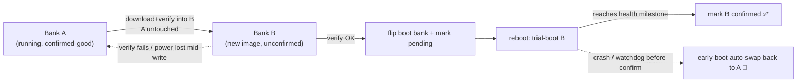
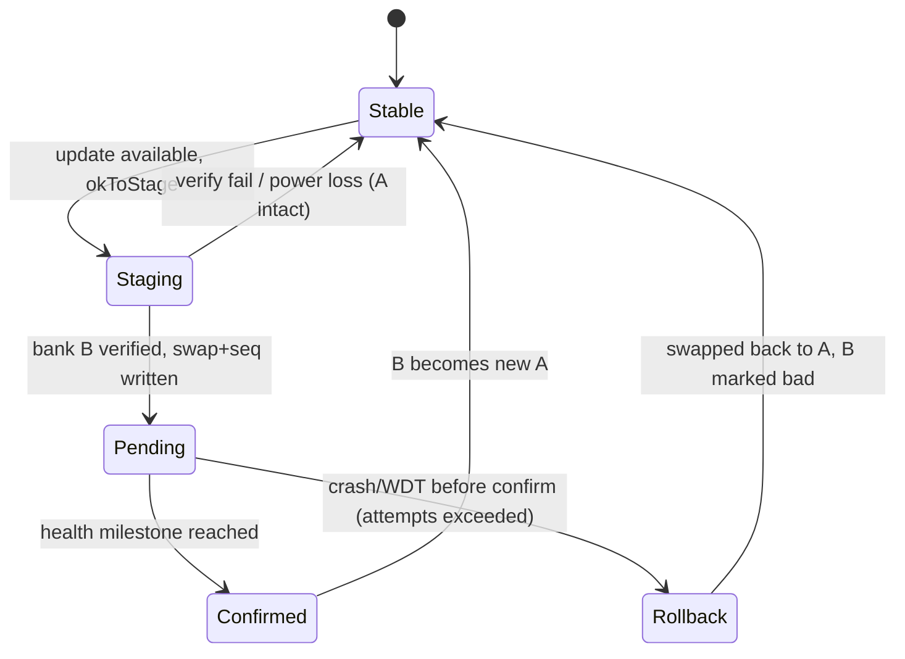

# Implementation Plan: Dual-Bank A/B Firmware Update with Boot-Confirmation Rollback
**Date:** June 9, 2026
**Status:** Proposed — pending hardware/flash-map bench validation (Phase 0 is a hard gate)
**Component:** `TankAlarm-112025-Common/src/TankAlarm_DFU.h` + Client/Server/Viewer sketches
**Target:** Arduino Opta (STM32H747XI) + Blues Wireless for Opta (IAP transport)
**Depends on / supersedes:** Builds on the IAP hardening already shipped in **v1.8.6** (watchdog-safe sector erase + Notecard-call kicks + per-version failure backoff). This is the structural follow-on (Phase 3 of `CODE_REVIEW_DFU_IAP_ANALYSIS_06092026.md`) plus its boot-confirmation companion.

---

## 1. Goal & Non-Goals

**Goal:** Make host firmware updates *brick-resistant on the existing hardware* by (a) never erasing the running image during a download, and (b) automatically reverting to the last-known-good image if a freshly-installed build fails to prove itself healthy after reboot.

**Why:** Remote, solar-powered, DIN-rail units. A brick = an expensive truck roll with a USB cable. True hardware ODFU is physically unavailable on the Wireless-for-Opta carrier (AUX is I2C-only; `BOOT0`/`NRST`/`USART1` are not routed — see `build-and-release-notes` hardware findings). Dual-bank A/B IAP is the software-only equivalent of brick resistance, and the dual-bank flash hardware (STM32H747, 2×1 MB) is already present and free.

**Non-Goals (explicitly out of scope here):**
- Hardware ODFU / carrier change (separate hardware project).
- SHA-256 authenticity (tracked separately as Phase 4 of the IAP analysis; can layer on top later).
- Relay safe-state-on-reset and `okToUpdateNow()` alarm gating (separate safety patch; independent of bank logic).

---

## 2. Current State (verified in repo, 2026-06-09)

| Fact | Value | Source |
|---|---|---|
| MCU | STM32H747XI, dual-bank 2×1 MB internal flash | Opta datasheet |
| Current app start | `flash.get_flash_start() + 0x40000` (256 KB bootloader region) | `TankAlarm_DFU.h` Step 3 |
| Current app size cap | `1536 KB` guard in `tankalarm_performIapUpdate()` | `TankAlarm_DFU.h` |
| Update model | **Destructive single-image**: erase running app → download chunks → CRC-32 → `NVIC_SystemReset()` | `TankAlarm_DFU.h` |
| Config / LittleFS storage | **QSPI external flash** via `BlockDevice::get_default_instance()` — *separate from internal banks* | client `initializeStorage()` |
| Watchdog | Mbed IWDG, `WATCHDOG_TIMEOUT_SECONDS 30` | `TankAlarm_Common.h` |
| Current image size | ~304 KB (client v1.8.6) | build output |

**Two favorable facts:** (1) config persistence is on QSPI, so a bank swap won't disturb it; (2) the live image is ~304 KB — comfortably within a single 1 MB bank even after the bootloader budget.

---

## 3. Concept Recap



Two independent protections:
- **Non-destructive write** defeats *interrupted-download* bricks (power sag, cellular stall, watchdog).
- **Boot-confirmation rollback** defeats *valid-but-crashing-image* bricks.

Both are required; either alone leaves a brick path open.

---

## 4. The Hard Unknowns (why Phase 0 gates everything)

The reviewers (§9.1–9.2 of the IAP analysis) are correct: the Arduino/Mbed boot chain on Opta was **not** designed around application-driven bank swapping. Before any production code is written, these must be answered **on the bench**, because a wrong assumption can brick a unit *during development*:

1. **Does the Arduino Opta bootloader/MCUboot honor the `SWAP_BANK` option bit**, or does it always jump to a fixed bank-1 address regardless? (If the bootloader hard-codes the bank-1 app offset, application-level `SWAP_BANK` may not produce a booted bank-2 image without also relocating the vector table / using `BFB2`.)
2. **Vector table / `SCB->VTOR`** placement after a swap — does the bootloader set `VTOR` from the swapped bank, or does the app need to?
3. **Usable per-bank image budget** once the 256 KB bootloader region and any reserved areas are accounted for. The current `1536 KB` cap assumes a *single* contiguous app region and is **not** automatically valid for an A/B split.
4. **Option-byte write reliability/latency under load** (option-byte programming triggers an internal reset; confirm it is atomic and survivable on the solar power profile).
5. **Whether QSPI LittleFS, the secure element, and Ethernet/Modbus init survive** a bank-swapped boot unchanged (expected yes, since they're not in internal banks — but confirm).

**Gate:** If Phase 0 shows the stock bootloader cannot boot bank 2 via option bytes, the architecture pivots to **Alternative B** (QSPI staging + verified in-place copy, §8) rather than true bank-swap. Either way, the v1.8.6 hardened single-image IAP remains the shipping fallback the entire time.

---

## 5. Persistent A/B State Record

A small, power-loss-durable, wear-aware record drives the state machine. Per reviewer §9.6: **not** Backup SRAM (not reliable across full power loss without VBAT) and **not** OTP (one-time, can't re-write counters).

**Storage:** a dedicated record on the existing **QSPI LittleFS** (`/fs/ab_state.bin`), written with a two-slot ping-pong + CRC + monotonically increasing sequence number so a torn write never loses the prior good record.

```cpp
struct AbBootRecord {
  uint32_t magic;            // 'TADB'
  uint32_t seq;              // monotonically increasing; higher = newer
  uint8_t  confirmed_bank;   // bank index currently known-good (0/1)
  uint8_t  pending_bank;     // bank we are trial-booting (0xFF = none)
  uint8_t  boot_attempts;    // trial-boot attempts for pending_bank
  uint8_t  last_reset_reason;// from RCC reset flags
  char     pending_version[24];
  char     confirmed_version[24];
  uint32_t crc32;            // over all preceding bytes
};
```

Rules:
- Written only at well-defined transitions (commit-to-pending, confirm, rollback). Not in a hot loop → wear is negligible.
- Reader takes the slot with valid CRC and the highest `seq`.

---

## 6. State Machine



- **Stable:** running `confirmed_bank`; `pending_bank = none`.
- **Staging:** writing/verifying the inactive bank; running image untouched.
- **Pending:** option bytes flipped to boot the new bank; `boot_attempts` counts trial boots.
- **Confirmed:** new firmware reached the health milestone; record updated, old bank now the spare.
- **Rollback:** trial boots exhausted without confirmation → early boot swaps back and marks the bad bank/version so it is not retried until a *new* version appears (ties into the v1.8.6 `gDfuVersionBlocked` latch).

**Health milestone (confirmation threshold)** — must be meaningful, not just `setup()` entry (per §9.1). For this product, confirm only after ALL of:
1. Relays initialized to the site-safe state.
2. Storage (QSPI LittleFS) mounted and config loaded.
3. Notecard reachable (`card.wireless`/`hub.get` OK).
4. At least one outbound health/update-status note successfully queued or synced.

**Trial budget:** `AB_MAX_BOOT_ATTEMPTS` (e.g. 2). Each unconfirmed boot increments `boot_attempts` in early boot; exceeding the budget triggers rollback *before* the suspect app runs again.

---

## 7. Phased Implementation

> Guiding principle: **every phase keeps the v1.8.6 hardened single-image IAP working as the fallback.** Dual-bank lands behind a build flag (`DFU_DUAL_BANK_EXPERIMENTAL`) until all bench gates pass.

```mermaid
gantt
    title Dual-Bank A/B Phases
    dateFormat YYYY-MM-DD
    section P0 Bench proof (GATE)
    Flash-map + bank-swap + VTOR proof :p0, 2026-06-10, 5d
    section P1 Persistence
    A/B record + early-boot hook       :after p0, p1, 3d
    section P2 Non-destructive write
    Stage+verify inactive bank         :after p1, p2, 4d
    section P3 Confirmation+rollback
    Trial boot, confirm, auto-revert   :after p2, p3, 5d
    section P4 Rollout
    Flag-gated field validation        :after p3, p4, 4d
```

### Phase 0 — Bench Proof (HARD GATE, no production code)
A throwaway sketch + logic analyzer / SWD, on a **sacrificial** Opta (expect to brick it a few times):
- **0.1** Dump `FlashIAP` geometry and the option-byte registers; confirm bank count, sector map, and current `SWAP_BANK`/`BFB2` state.
- **0.2** Write a trivially-different "blink-B" image into the inactive bank via `FlashIAP`, flip the option bytes, and confirm the board boots the bank-2 image (LED pattern proves it).
- **0.3** Confirm `SCB->VTOR` / interrupts work in the bank-2 image (timer + an ISR must fire).
- **0.4** Measure usable per-bank image budget; confirm ~304 KB current image fits with margin.
- **0.5** Pull power during the option-byte commit repeatedly; confirm the board always comes up on *some* valid bank (never a dead state).
- **Exit gate:** all of 0.1–0.5 pass → proceed to Phase 1. **Any failure → stop; pursue Alternative B (§8) instead of true bank-swap.**

### Phase 1 — Persistence + Early-Boot Hook
- **1.1** `TankAlarm_AbState.h/.cpp` in common: two-slot CRC'd `AbBootRecord` reader/writer on QSPI LittleFS.
- **1.2** `TankAlarm_FlashBank.h`: `currentBootBank()`, `inactiveBankStart()`, `commitBankSwap()` (option-byte program + reset), and `readResetReason()`.
- **1.3** Earliest-possible boot hook (top of `setup()`, before relays/Modbus/network): read the record; if `pending_bank != none` and unconfirmed, increment `boot_attempts`; if over budget → `commitBankSwap()` back to `confirmed_bank` + mark version blocked + reset. Gate all of this behind `DFU_DUAL_BANK_EXPERIMENTAL`.
- **Acceptance:** record survives power-cycle; early-boot hook correctly counts attempts and triggers rollback in a forced-crash test.

### Phase 2 — Non-Destructive Staged Write
- **2.1** In `tankalarm_performIapUpdate()` (behind the flag): target `inactiveBankStart()` instead of `flashStart + 0x40000`. Keep the running bank untouched.
- **2.2** Reuse the v1.8.6 watchdog-safe sector erase + per-chunk kicks, now operating on the inactive bank.
- **2.3** Read-back CRC-32 (later SHA-256) over the inactive bank *before* any swap. On failure: leave everything as-is, restore hub mode, return false — running image never touched, no brick.
- **Acceptance:** pull power mid-download → device reboots into the **old** working app, not a brick. Corrupt the staged image → swap declined, current firmware retained.

### Phase 3 — Commit, Confirm & Auto-Rollback
- **3.1** On verified stage: write record (`pending_bank = inactive`, `pending_version`, `seq++`), `commitBankSwap()` → reset.
- **3.2** New image trial-boots. On reaching the §6 health milestone, write record (`confirmed_bank = pending`, clear `pending`, `seq++`).
- **3.3** If it never confirms within the trial budget, Phase 1's early-boot hook rolls back automatically.
- **3.4** Emit a DFU terminal-state telemetry note (per §9.9): staged / committed / confirmed / rolled-back, with versions, reset reason, attempt count, battery/heap.
- **Acceptance (the headline test):** flash a deliberately crash-on-boot image as the update → device trial-boots it, fails to confirm, and **auto-reverts to the previous working firmware with no intervention.**

### Phase 4 — Flag-Gated Rollout
- **4.1** Bench soak across the §10 matrix; then a single field pilot unit with `DFU_DUAL_BANK_EXPERIMENTAL` on.
- **4.2** Confirm a real OTA cycle end-to-end on the pilot (version reported back changes, telemetry shows `confirmed`).
- **4.3** Promote the flag to default only after the pilot survives a deliberate bad-image push and self-recovers.
- **4.4** Apply the same flow to the Server GitHub-direct path (it already has SHA-256; only target address + commit step change) and Viewer.

---

## 8. Alternative B — QSPI Staging (fallback if Phase 0 fails)

If the stock Opta bootloader cannot boot the inactive bank via option bytes, do **not** force it. Instead:
1. Stream the new image to a staging file/region on **QSPI** (not internal flash).
2. CRC/SHA-verify the QSPI copy **fully** before touching internal flash.
3. Only then erase the internal app region (watchdog-safe) and fast-copy from QSPI.

This shrinks the destructive window from "minutes of cellular download" to "seconds of local copy" and keeps a verified recovery image on QSPI. It is **not** as strong as true A/B (the brief internal-erase window remains, and there's no automatic boot-confirmation rollback without a custom boot stub), but it is a large improvement and uses only proven mechanisms. A custom immutable boot stub that prefers QSPI recovery is a later option if full brick-proofing is required without a carrier change.

---

## 9. Risks & Mitigations

| Risk | Mitigation |
|---|---|
| Stock bootloader ignores `SWAP_BANK` | Phase 0 gate; fall back to Alternative B |
| Option-byte write bricks during dev | Sacrificial board in Phase 0; never on field/production units |
| "Zombie" valid-but-crashing image | Boot-confirmation milestone + trial budget + early-boot auto-rollback (Phase 3) |
| Confirmation threshold too strict → false rollback of a *good* image | Make the milestone reachable offline (don't require cloud sync if cell is down — queueing a note counts); tune on pilot; telemetry surfaces false rollbacks |
| Image grows past per-bank budget | Phase 0.4 measures budget; CI size-check fails the build if an image exceeds the A/B cap |
| Torn write of the A/B record | Two-slot ping-pong + CRC + seq |
| Interaction with QSPI LittleFS / secure element | Phase 0.5 confirms unaffected (they're outside internal banks) |
| Divergent behavior across Client/Server/Viewer | Land in shared `TankAlarm_DFU.h` + `TankAlarm_FlashBank.h`; per-sketch only supplies the health-milestone predicate |

---

## 10. Test Matrix (on hardware, per phase)

| Scenario | Expected |
|---|---|
| Power loss during inactive-bank erase/write | Reboots into old (confirmed) bank; no brick |
| Cellular stall outlasting retries mid-download | Old bank retained; update retried later |
| Staged image fails CRC/SHA | Swap declined; current firmware kept; telemetry flags it |
| Valid image that crashes on boot | Trial-boots, fails to confirm, **auto-rolls back to previous** |
| Good image, healthy boot | Confirms; becomes new A; telemetry `confirmed` |
| Power loss during option-byte commit | Comes up on a valid bank every time (Phase 0.5) |
| Older version advertised | No downgrade (reuse v1.8.6 backoff/version logic) |
| Image exceeds per-bank budget | CI build fails before release |

---

## 11. Deliverables

- `TankAlarm-112025-Common/src/TankAlarm_FlashBank.h` — bank topology + `commitBankSwap()` + reset-reason.
- `TankAlarm-112025-Common/src/TankAlarm_AbState.{h,cpp}` — durable two-slot A/B record on QSPI LittleFS.
- `TankAlarm_DFU.h` — staged-write variant (flag-gated) targeting the inactive bank; verify-then-commit.
- Client/Server/Viewer — early-boot rollback hook + health-milestone predicate + terminal-state telemetry.
- CI — per-bank image size guard.
- Bench report from Phase 0 (the gate evidence).

---

## 12. Recommendation

Treat **Phase 0 as a standalone spike** on a sacrificial Opta first — it is cheap, it is the single highest-information step, and it determines whether the rest is "true A/B" or "Alternative B." Do not schedule Phases 1–4 as firmware work until Phase 0 passes. Throughout, **v1.8.6 hardened single-image IAP stays the shipping path**, so the fleet is protected during the entire development effort and there is zero regression risk if dual-bank slips.

---

## 13. Peer Reviewer Analysis, Pitfalls & Strengthening Mitigations

I have conducted a security, structural, and hardware-specific review of this *Dual-Bank A/B Implementation Plan*. Below is a detailed analysis of the critical hardware constraints, severe pitfalls, and suggested optimizations to strengthen the fallback design before the bench tests ever run.

### 13.1 The Bootloader-Mapping Swap Trap (CRITICAL PITFALL)
On the STM32H747XI, modifying the `SWAP_BANK` option bit (within the `FLASH_OPTSR` user options) switches the physical mapping of the flash memory banks so Bank 2 is aliased to `0x08000000` and Bank 1 is aliased to `0x08100000`.

* **The Problem:** The standard Arduino Opta bootloader (approx. 256 KB) resides strictly at the beginning of *physical Bank 1* (address `0x08000000` initially). 
* **The Trap:** When the `SWAP_BANK` option bit is programmed and the chip reloads, the CPU boots directly from `0x08000000`—which is now *physical Bank 2*. Since physical Bank 2 has **no bootloader** at its offset, the vector table fetch returns empty flash values (`0xFFFFFFFF`), leading immediately to an **unrecoverable hardware crash/hang**. The block is permanently bricked and cannot even enter its bootloader state over USB without an external JTAG/SWD debug probe to force-reset the option registers.
* **Mitigation:**
  1. Do not use option-byte level `SWAP_BANK` unless both banks have a bootloader programmed at sector 0.
  2. Instead of physical bank-swapping, the dual-bank memory map should be managed by having a **custom bootloader** or a immutably-positioned **Bootloader Hook** in Bank 1 that checks the LittleFS `/fs/ab_state.bin` record and programmatically jumps directly to the active application start address (either `0x08040000` on Bank 1 or `0x08140000` on Bank 2).
  3. If this custom jump logic is too complex or not feasible because of stock bootloader constraints, **Alternative B (QSPI Staging)** should be declared the primary architectural path immediately.

### 13.2 Memory Allocation Constraints (HARD LIMIT)
* **The Current Schema:** The single-image update assumes a contiguous flash region up to `1536 KB` (1.5 MB).
* **The Constraint:** Since Bank 1 has a hard physical ceiling of 1 MB, and the bootloader occupies the first 256 KB, your application size limit **decreases from 1.5 MB to exactly 768 KB** (`1024 KB - 256 KB`) when locked to Bank 1.
* **Strengthening Optimizations:**
  1. Update your CI build pipeline size guards to fail the build if the compiled binary exceeds `786,432 bytes` (768 KB) instead of the 1.5 MB threshold when `DFU_DUAL_BANK_EXPERIMENTAL` is compiled.
  2. Implement an explicit static check inside `TankAlarm_DFU.h` to deny downloads if `firmwareLength > 786432UL`.

### 13.3 "Torn State Record" Protection
* **The Risk:** In solar clients, power sags or brownouts during write operations to LittleFS `/fs/ab_state.bin` can corrupt the file. If both slots of your ping-pong buffer become unreadable, the boot sequence cannot determine which bank is safe to execute.
* **Suggested Optimization:**
  * Define a hard-coded fallback pointing to Bank 1 (the stock location) if the A/B state file is missing or corrupted. 
  * Add a startup recovery step: if the `/fs/ab_state.bin` file is unparseable on boot, recreate it automatically indicating Bank 1 is the currently active, confirmed bank.

### 13.4 Power-Gating and Modbus Quiescing
During an IAP update, the Opta consumes continuous core current. If an update launches while batteries are marginal, the write performance degrades.
* **Optimized Check in `okToUpdateNow()`:**
  1. Disable and unmount any Modbus RTU transceivers (`RS485.end()`) to release external lines from high-impedance loads before writing flash.
  2. Ensure the voltage is above `12.8 V` AND showing a **positive (charging) slope** for at least 60 seconds (monitored via the SolarManager) before commencing the erase cycle. This guarantees the chip will not brown-out mid-erase.

### 13.5 Conclusion & Path Forward
Pursue the Phase 0 spike diligently. If you find the stock Arduino bootloader does not boot from Bank 2 cleanly, **pivot immediately to Alternative B (QSPI Staging)**. Alternative B is incredibly secure: it caches the full binary to the external QSPI flash first, verifies the SHA-256 signatures in peace, and only conducts a localized, high-speed copy (taking under 2 seconds) to internal memory, shrinking the destructive writing window to a safe, acceptable threshold.
