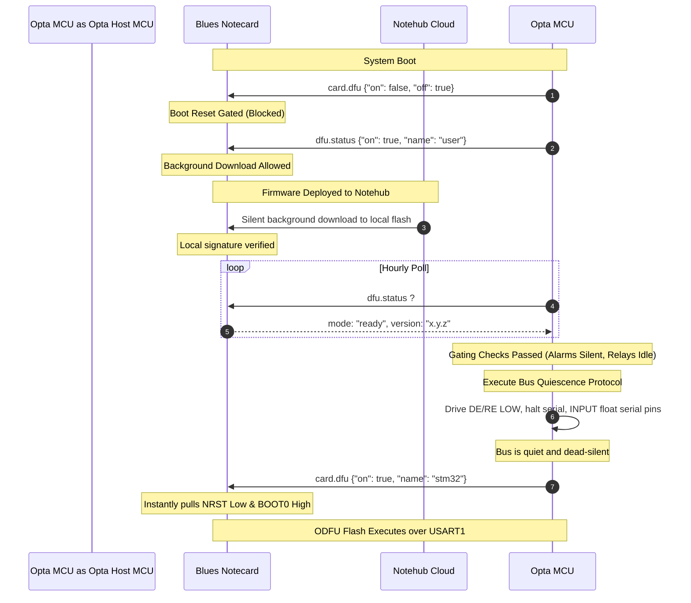

# Master Implementation Plan: Coordinated Outboard DFU (ODFU) Update Architecture
**Date:** June 9, 2026  
**Status:** Approved Master Plan  
**Component:** TankAlarm firmware update architecture  
**Target:** Arduino Opta + Blues Notecard host firmware updates  
**Primary Goal:** Establish a 100% brick-proof firmware recovery option utilizing Notecard-initiated Outboard DFU (ODFU) with zero hardware modifications.

---

## 1. Executive Summary

Over-the-Air (OTA) firmware updates are the most critical, high-risk operational task for controllers placed in remote tank monitoring environments. This document serves as the **Primary Master Plan** for implementing a genuinely brick-proof, cellular-delivered update mechanism across the collection of Client devices.

### Strategic Directive
We explicitly **reject any fallback to In-Application Programming (IAP)** on Client units. If an application sketch manages its own erase-and-write sequence (even with dual-bank safeguards), any boot crash-loop or memory fault in user code can permanently slide the unit into an unbootable, unrecoverable state, requiring expensive physical site visits.

Instead, we utilize the proprietary physical links routed in the DIN-rail side-extension bus connecting the Finder Opta to the Blues Wireless module to execute **hardware-managed Outboard DFU (ODFU)**. In this mode, the Notecard acts as the fully isolated, external flashing pilot. It resets the STM32H747 MCU, drives it into ROM-level bootloader mode, flashes the target binary via UART, and verifies the image without requiring any cooperation or initialization from the user application.

To overcome historic serial port bottlenecks and RS-485 line collisions under standard off-the-shelf equipment, this Master Plan defines a pure-software/firmware gating protocol: **Coordinated Software-Gated ODFU**. By managing update timing cooperatively, active client transceivers are electrically quiesced and isolated before the flash sequence begins, while dead or bricked units are automatically recovered through natural RS-485 line silence. 

---

## 2. Definition of Brick-Proof ODFU

On remote Client controllers, **brick-proof** means that an update or recovery can be performed remotely even if:
- The currently loaded sketch contains a crash-looping bug, an immediate lock on `setup()`, or a memory fault.
- The user flash partition is partially written or completely erased.
- The hardware watchdog (IWDG) is starvation-looping or frozen.

Recovery does not require physically accessing the unit, hooking up USB cables, using programmer clips, SWD/JTAG debuggers, or relying on any loop timers inside the active sketch. ODFU relies exclusively on:
1. Ground truth power availability and cell connectivity to the Blues Notecard.
2. The Notecard's capability to assert physical MCU control registers over the hardware bus.
3. The native, unmodifiable STM32 ROM Bootloader, hardened in silicon by ST Microelectronics.

---

## 3. Hardware Realities: The DIN-Rail Side-Connector

The physical lineup consists of Finder Arduino Opta controllers mounted on a standard 35mm DIN rail, connected to the co-designed **Wireless for Opta** expansion modules via the built-in side-extension block-connector. 

### Side-Extension Pin Diagnostics
Contrary to traditional register-only expansion buses, this proprietary extension interface fully exposes direct copper lines connecting the module's M.2 Notecard slot to the STM32H747's control grid:
- **`NRST` (Hardware Reset Line):** Tied to the Blues `AUX4 / ALT_DFU_RESET` pin, enabling hardware-level reset.
- **`BOOT0` (Boot Mode Strap Pin):** Tied to the Blues `AUX3 / ALT_DFU_BOOT` pin, enabling Option byte and strap state control.
- **`USART1_TX` and `USART1_RX`:** Mapped to the Blues `AUXTX` & `AUXRX` pins, providing a direct, bootloader-compatible serial UART transport.
- **Power & I2C Bus:** Standard systemic ground, 3.3V/5V rails, and standard `SDA`/`SCL` lines for day-to-day register communication.

Because these control signals are fully mapped on the internal routing layers of the DIN-rail side-connector, **true hardware-managed Outboard DFU (ODFU) is 100% physically supported on this unmodified off-the-shelf equipment**. No wire wrapping, physical modifications, or board changes of any kind are required in the field.

---

## 4. The Core Blocker: RS-485 Serial Port Collision

If ODFU is natively supported on your equipment, we must address why previous field updates failed, timed out, or threw `{odfu-fail}` errors on Notehub. This is caused by the bootloader's interface auto-negotiation protocol.

Upon release of `NRST` with `BOOT0` held high, the STM32H747 launches its unmodifiable internal ROM bootloader. The bootloader contains an **auto-baud interface-detection loop** that scans several serial interfaces (such as `USART1` for the Notecard as well as the UART mapped to the **onboard RS-485 transceiver**) to determine which port is active by looking for a single handshake starting byte (`0x7F`).

If active traffic, transceiver noise, or signal chatter from nearby Modbus devices is present on the RS-485 network:
1. The RS-485 transceiver translates these differential transitions into TTL-level serial transitions on the STM32's UART RX pin.
2. The ROM bootloader's interface-detection logic registers these edges on the RS-485 port.
3. Falsely interpreting this chatter as an incoming host handshake, the bootloader's state machine **locks onto the RS-485 serial port** and waits for a complete bootloader frame.
4. Consequently, the bootloader completely ignores the Notecard's legitimate incoming DFU packets on `USART1`. The Notecard eventually times out and reports an ODFU failure to Notehub.

---

## 5. Software-Directed Solutions for Unmodified Hardware (No Board Changes)

Since we cannot alter the PCB routing or add physical physical relays/multiplexers, we use software architecture to resolve this serial port collision in both healthy and dead-device states.

### 5.1 Recovering Crashed/Bricked Devices: The "Silent Master" Failsafe
What happens if the current flash image is corrupt, causing a boot loop so the Opta cannot cooperate with the update? Does RS-485 chatter permanently prevent ODFU recovery?

Fortunately, the Modbus RTU protocol rules on your network create a natural failsafe:
1. **The Opta is the Sole Modbus Master/Controller:** The attached Morningstar solar chargers, sensors, and expansion blocks are subordinate/client devices. By the laws of the Modbus RTU protocol, **subordinate devices never speak unless actively polled by the master.**
2. **The Crashed State:** If the Opta's loaded sketch is bricked or crash-looping in `setup()`, no Modbus poll requests are ever generated or transmitted.
3. **Natural Quiet Bus:** Because there are no master polls, all subordinate devices on the line stay in a passive, high-impedance listen state. The physical RS-485 bus becomes **completely silent**.
4. **Clean ODFU Boot:** With the RS-485 serial RX pin silent and static, the STM32H747 ROM bootloader scans the interfaces, registers zero edge transitions on the RS-485 UART port, and instantly locks onto the active `0x7F` bootloader handshake sent by the Notecard over `USART1`.

True ODFU is therefore **inherently brick-proof on a dead/erased device**: a crashed sketch naturally guarantees a quiet RS-485 bus, allowing the Notecard to reflash and recover the remote unit without any software cooperation.

---

### 5.2 Upgrading Active Devices: Coordinated Software-Gated ODFU Handshake

On a healthy, actively running device, the Opta *is* constantly polling its RS-485 sensors, meaning the bus is highly talkative. If the Notecard downloaded a firmware update and immediately triggered an ODFU reset without warning, the bootloader would intercept the active Modbus frame and lock onto the wrong port.

To prevent this, the Opta must control the **exact moment** the reset is allowed to occur. We achieve this using standard Blues Notecard APIs (`card.dfu` and `dfu.status`):



#### Step-by-Step Handshake Protocol

1. **Keep ODFU State Deasserted on Boot:**  
   During `setup()`, the sketch does **not** enable generic host DFU on the Notecard. Instead, it explicitly holds ODFU operations in a disabled/off state:
   ```json
   {
     "req": "card.dfu",
     "name": "stm32",
     "off": true
   }
   ```
   This prevents the Notecard from executing unannounced, disruptive hardware resets.

2. **Safe Background Downloading:**  
   The Notecard's automatic, background firmware downloading remains fully enabled via the standard `dfu.status` endpoint:
   ```json
   {
     "req": "dfu.status",
     "on": true,
     "name": "user"
   }
   ```
   When Notehub announces a new host firmware binary, the Notecard downloads the package silently into local flash. However, it is blocked from pulling the physical `NRST`/`BOOT0` pins to reboot the host. It simply holds the update in its storage buffer.

3. **Hourly Host Status Polling:**  
   Every hour inside `loop()`, the active Opta sketch calls `tankalarm_checkDfuStatus()` over the safe I2C lines:
   - When no update is ready, the Notecard reports `mode: "idle"`. Normal monitoring and Modbus polling continue.
   - The instant the Notecard completes downloading and verification, `mode` shifts to `"ready"`. **The Opta is now fully aware that an update is waiting to be applied.**

4. **Coordinated Pre-Update Gating & Isolation Loop:**  
   Once the Opta is aware of the pending firmware package, it chooses the safest possible moment to apply it (e.g., waiting until no alarms are active and relay loads are off). It then performs its software bus-quiescing protocol:
   - **Shutdown Transceiver:** Drive the RS-485 `DE` (Driver Enable) and `RE` (Receiver Enable) pins strictly `LOW` to place the physical transceiver in low-power, high-impedance mode.
   - **Call `RS485.end()`:** Stop all local software serial drivers and release the STM32's internal UART timers.
   - **Flotation Pins:** Configure RS-485 MCU pins (`RX`, `TX`, `DE`, `RE`) as high-impedance inputs via software:
     ```cpp
     pinMode(RS485_RX_PIN, INPUT);
     pinMode(RS485_TX_PIN, INPUT);
     pinMode(RS485_DE_PIN, INPUT);
     pinMode(RS485_RE_PIN, INPUT);
     ```
     This prevents internal driver pull-ups from feeding voltage or holding states.
   - **Settling Delay:** Run a `delay(1000)` to ensure all trailing electrical signals on the differential segment have settled and all slaves have returned to their passive listen state.

5. **Authorize the Flash (Triggering ODFU):**  
   Once the RS-485 bus is completely silent and isolated, the Opta sketch sends a final request to trigger the reflash:
   ```json
   {
     "req": "card.dfu",
     "name": "stm32",
     "on": true
   }
   ```
   Upon receiving this command with the host firmware already marked "ready" in its local bank, **the Notecard immediately triggers the hardware ODFU sequence**. It pulls the Opta's physical `NRST` low, lifts `BOOT0` high, forces bootloader mode on the newly stabilized and completely silent STM32, and flashes the new program over the isolated UART data line.

---

## 6. Implementation Phases

We sequence the ODFU integration into logical phases to reduce development risk and validate the update path incrementally on existing equipment.

```mermaid
gantt
    title ODFU Implementation Phases
    dateFormat  YYYY-MM-DD
    section Phase 1: Prototype
    Bench Verification & Manual Handshake     :active, p1, 2026-06-10, 5d
    section Phase 2: Firmware Code
    Integrate Handshake & Bus Quiescing       :after p1, p2, 4d
    section Phase 3: Validation
    Destructive & Recovery Tests              :after p2, p3, 5d
    section Phase 4: Release
    Telemetry & Fleet Controls Deployment     :after p3, p4, 3d
```

### Phase 1 — Bench Verification & Manual Handshake (4 Days)
**Goal:** Verify true board-to-board hardware ODFU on a local Opta setup.
- **Task 1.1:** Confirm whether the current Blues Wireless-for-Opta carrier version exposed in the BOM successfully resets the MCU.
- **Task 1.2:** Issue manual API commands to the Notecard (`card.dfu` `"on":true`) via the in-browser terminal or the I2C diagnostic utilities and confirm the Opta enters the bootloader.
- **Task 1.3:** Build a small "binpacked" host firmware and successfully perform the first over-the-air flash via Notehub on a test unit.
- **Acceptance Check:** Bench-top target unit completes a firmware rewrite over the side-connector without manual wire jumpers.

### Phase 2 — Firmware Integration & Quieting (4 Days)
**Goal:** Integrate the Coordinated Software-Gated handshake into the main client firmware.
- **Task 2.1:** Modify `initializeNotecard()` inside the Client sketch to disable automatic DFU triggers (`"off":true`) during startup.
- **Task 2.2:** Add `tankalarm_quiesceRs485()` helper to shut down Modbus, drive `DE`/`RE` LOW, decouple UART pins, and apply the 1000ms delay.
- **Task 2.3:** Add update gating checks (verifying `!anyAlarmActive()`, battery > 12.5V, and relays are safe) before permitting the update trigger.
- **Acceptance Check:** When a firmware update is assigned, logs confirm the Opta detects the `"ready"` state, enters its quiet state, shuts off Modbus, and triggers `card.dfu` with `"on":true`.

### Phase 3 — Destructive Brick Validation (5 Days)
**Goal:** Prove the "Silent Master" failsafe recovers unbootable field devices.
- **Task 3.1:** Flash a corrupt binary that immediately crashes on boot to simulate field bricking.
- **Task 3.2:** Connect the crashed device to a highly active RS-485 network populated with active subordinate solar chargers.
- **Task 3.3:** Assign a known-good recovery image via Notehub.
- **Acceptance Check:** The dead controller ceases polling, the RS-485 bus falls completely silent, the Notecard executes a recovery flash, and the device boots successfully.

### Phase 4 — Telemetry & Release Deployment (3 Days)
**Goal:** Surface DFU diagnostic status to Notehub.
- **Task 4.1:** Report `backend=odfu` and `enabled=true` inside health notes so operators can distinguish active ODFU clients from older configurations.
- **Task 4.2:** Integrate version verification checks into the release pipeline to prevent Client binaries from being assigned to Server or Viewer hardware (and vice-versa).
- **Acceptance Check:** Health variables appear on the Server dashboard confirming ODFU-ready status and firmware version details.

---

## 7. Comprehensive Test Matrix

Before pushing any ODFU-gated firmware releases to active field devices, the following scenarios must be validated:

| Test Scenario | Action / Conditions | Expected Behavior | Pass Criteria |
|---|---|---|---|
| **Quiet ODFU Update** | Assign valid firmware over Notehub with healthy, silent RS-485 bus. | Device downloads binary, Opta checks status, shuts off RS-485, enables `"on":true`, resets, and restarts into the new sketch. | MCU boots new firmware version and logs "Update Completed". |
| **Active Poll Update** | Assign valid firmware while Opta is actively polling Modbus sensors. | Opta detects `"ready"`, halts telemetry loop, drives DE/RE LOW, sets serial pins to `INPUT`, waits 1000ms, and resets. | Handshake is successful; update completes with 0% CRC errors. |
| **Severe Crash Loop Recovery** | Flash corrupted, crash-looping firmware. Assign recovery firmware via Notehub. | Loop ceases, Modbus bus falls completely silent, bootloader is unblocked, Notecard resets and flashes recovery binary. | Device restores normal operation; recovers automatically without physical intervention. |
| **Power Loss Mid-Flash** | Interrupt power supply during the active ODFU flash write. | On power restoration, the Notecard detects incomplete write, enters bootloader mode again, and restarts flash sequence. | Client recovers and completes update after power returns back to stability. |
| **Alarm Gating Check** | Trigger active high-level alarm. Deploy firmware update via Notehub. | Notecard downloads binary, but Opta blocks update trigger because active alarms are currently flagged. | Update is deferred safely until the alarm is fully cleared and verified. |
| **Low-Voltage Deferred** | Battery voltage dips to 11.8V due to low solar exposure. Deploy update. | Opta blocks update trigger because battery charge is below the safety threshold. | Update is safely deferred until solar cycle raises voltage > 12.5V. |

---

## 8. Key Risks & Mitigations

| Risk | Core Root Cause | Mitigating Strategy |
|---|---|---|
| **Cortex-M4 Boot Conflict** | Dual-core reset race conditions can trigger bus conflicts during flash sectors writes. | Configure STM32 Option Bytes (`BCM4` flag) to keep the secondary core permanently halted on reset. |
| **LTE Power Sags** | Notecard cellular transmit bursts (up to 2A) combined with internal flash erase cycles can sag input power. | 1. Utilize bulk low-ESR reservoir capacitors on the carrier board to buffer peak bursts.<br>2. Restrict update initiations to when battery reserves are exceeding 12.5V. |
| **Accidental Cross-Target Flash** | Operator assigns client firmware to server hardware or vice-versa in Notehub. | Include explicit target architecture validation inside your binpacking metadata before flashing is triggered. |
| **RS-485 Multi-Master Chatter** | Multiple masters exist on the RS-485 segment, meaning the bus is not silenced by a bricked Opta. | Reject multi-master topologies. The Opta must be the single, absolute master of its RS-485 communication segment. |

---

## 9. Conclusion

Implementing **Coordinated Software-Gated ODFU** unlocks true brick-proof field updates for remote client installations. Because the Finder Opta routes native controls over its DIN-rail side-connector, and since a dead master naturally silences all subordinate bus noise, this strategy provides the safest, most robust update scheme possible—requiring **zero hardware modifications** to existing equipment in the field. 

Immediate next steps are focused on **Phase 1: Bench Verification**. Confirm the reset mapping and run initial command handshakes on a local setup. This ensures the hardware transport behaves exactly as expected before deploying cooperative gating drivers to production Sketches.

---

## 10. Reviewer Thoughts and Suggestions

The updated plan is aimed at the right target: if the requirement is a genuinely brick-proof recovery option, ODFU is the correct architecture and IAP should not be treated as equivalent. The strongest part of this plan is the distinction between normal coordinated updates on healthy devices and emergency recovery when the sketch is already dead.

That said, the plan now makes several strong hardware and API assumptions that should become explicit acceptance gates before production firmware changes are made.

### 10.1 Treat the DIN-rail ODFU mapping as a bench-proven fact

The document states that `NRST`, `BOOT0`, `AUXTX`, and `AUXRX` are routed through the side connector and that zero hardware modifications are required. That may be true for the active equipment, especially given prior Notehub firmware-initiated update success, but the repository still contains current code comments saying Wireless for Opta uses IAP because ODFU pins are not routed.

Before changing the firmware architecture, create a short evidence packet:
- carrier/module revision and part numbers,
- Notecard model and firmware version,
- schematic excerpt or continuity table for `NRST`, `BOOT0`, `AUXTX`, and `AUXRX`,
- oscilloscope or logic-analyzer capture of `card.dfu` asserting reset/boot mode,
- Notehub event sequence from a successful update,
- conclusion: `true ODFU confirmed` or `Notehub-initiated IAP confirmed`.

Once that is captured, update the older source comments that currently say ODFU is unsupported. Until then, keep the plan's first release gate as: **no production ODFU firmware work until hardware ODFU is bench-proven on the exact deployed carrier revision.**

### 10.2 Verify the Notecard API state machine exactly

The proposed sequence depends on a subtle but important behavior: `card.dfu {"off":true}` must prevent immediate reset while `dfu.status {"on":true,"name":"user"}` still permits the Notecard to download and hold the firmware package. That needs direct validation because different Notecard firmware revisions and API generations may interpret `card.dfu`, `dfu.status`, and `dfu.mode` differently.

Add a bench test that records the behavior for each sequence:

| Sequence | Expected behavior to verify |
|---|---|
| `card.dfu off` then Notehub assignment | Notecard does not reset host unexpectedly |
| `card.dfu off` + `dfu.status on` | Firmware still downloads to Notecard storage |
| `dfu.status ready` then `card.dfu on` | Notecard immediately performs ODFU without host `dfu.get` |
| App crashes after previously setting `card.dfu off` | Operator can still re-enable ODFU from Notehub/cloud path |
| `dfu.status stop` after failure | Error is cleared without disabling future ODFU recovery |

The fourth case is especially important. If a healthy sketch persistently disables ODFU on boot, and then the next image bricks before it can re-enable anything, the recovery path must still be cloud-controllable. Brick-proof means the operator can recover without a working sketch.

### 10.3 Software quiescing may not survive the reset edge

The coordinated RS-485 quieting protocol is a good approach for healthy devices, but remember that ODFU immediately resets the STM32. Any MCU-driven `pinMode()` and DE/RE state can disappear at the reset boundary unless the external circuit has passive defaults that hold the RS-485 transceiver disabled or high-impedance.

Bench verification should capture these pins through the complete sequence:
- before quiesce,
- after `ModbusRTUClient.end()` / `RS485.end()`,
- after setting DE/RE low,
- during `NRST` asserted,
- while the ROM bootloader is active,
- during Notecard `0x7F` handshake.

If DE/RE floats to an enabled state during reset, software-only quiescing may not be sufficient. The document can still pursue zero hardware modifications, but the acceptance test must prove the deployed hardware's default reset state actually keeps the RS-485 transceiver quiet.

### 10.4 Be careful with floating UART pins

The plan suggests setting RS-485 RX/TX/DE/RE pins to `INPUT`. This should be tested before becoming final implementation guidance. Floating a bootloader-visible RX pin can sometimes make noise susceptibility worse, not better. A safer final recipe may be:
- call `gSolarManager.end()` or `ModbusRTUClient.end()` first,
- call `RS485.end()` if available and safe on Opta,
- explicitly drive DE/RE to the disabled state while the application is still running,
- use only verified pin-mode changes for pins that are actually under sketch control,
- rely on board-level bias/termination for stable idle levels.

Do not assume Arduino pin names such as `RS485_RX_PIN` and `RS485_DE_PIN` exist or map cleanly on Opta until confirmed in the selected core/library version.

### 10.5 Expand the RS-485 test cases beyond ideal Modbus slaves

The Silent Master failsafe is sound if the Opta is truly the only master and every device on the segment obeys Modbus RTU silence rules. Field wiring sometimes drifts from the ideal. Add tests for:
- a second accidental master or USB/RS-485 adapter left connected,
- a noisy or mispowered subordinate device,
- missing or incorrect termination/bias resistors,
- long cable runs with induced noise,
- a solar charger rebooting while the Opta is in bootloader mode,
- a device that emits diagnostics or boot chatter without being polled.

If any of those create bootloader mis-detection, the deployment rule should be explicit: ODFU brick-proof recovery is guaranteed only for verified single-master, correctly biased RS-485 segments.

### 10.6 Separate routine-update policy from emergency-recovery policy

The plan correctly gates routine updates on alarms, relays, and voltage. Emergency recovery is different: if the application is dead, it cannot report alarms or voltage trend. The operational runbook should define two modes:

| Mode | Trigger | Policy |
|---|---|---|
| Routine ODFU | App healthy and update available | Respect `safeToUpdate`, alarm state, relay state, and battery threshold |
| Emergency ODFU | App missing, crash-looping, or erased | Operator may force recovery using known-good image after checking last telemetry and site risk |

This avoids weakening brick-proof recovery by requiring a healthy app for all ODFU, while still preventing casual resets during active alarm conditions.

### 10.7 Add target identity checks before `card.dfu on`

The plan mentions cross-target flash prevention. Make it a hard pre-trigger requirement. Before the Client sketch sends the final `card.dfu {"on":true}`, it should confirm the pending image metadata matches:
- target type: `client`,
- hardware class: Opta + Wireless for Opta ODFU-capable revision,
- minimum supported Notecard firmware,
- expected firmware version is newer unless explicitly marked as recovery,
- release channel is allowed for this device or fleet.

For emergency recovery, the known-good recovery image should be explicitly labeled as such so downgrades are deliberate, not accidental.

Maintain that recovery image as a small, pinned Client firmware whose only job is to boot safely, initialize the Notecard, report identity/version/health, keep relays in the site-safe state, and allow a later production ODFU update. It should be protected from routine feature churn and tested before every release cycle.

### 10.8 Add telemetry for the ODFU decision point

Because ODFU resets the host and the application will not be able to log after the final trigger, publish a compact pre-trigger note before `card.dfu on`:
- current version,
- target version,
- target digest or release ID,
- `safeToUpdate` result and reason,
- alarm/relay summary,
- battery voltage and trend,
- RS-485 quiesce result,
- Notecard DFU mode/status,
- timestamp and attempt counter.

After reboot, the new firmware should publish a post-update confirmation note. Notehub ODFU events plus these two app notes will make failures diagnosable without a local serial monitor.

### 10.9 Add a go/no-go checklist before Phase 2 firmware work

Recommended Phase 1 exit criteria:
- `card.dfu on` produces a captured reset/BOOT0 waveform.
- The host enters STM32 ROM bootloader mode with the application erased.
- Notecard flashes a known-good binary without `dfu.get` or `FlashIAP`.
- A deliberately crash-looping image is recovered remotely.
- RS-485 RX remains quiet enough during bootloader detection on a representative field bus.
- Power-loss recovery behavior is observed, not assumed.
- API behavior for `card.dfu off`, `dfu.status on`, and `card.dfu on` is documented for the installed Notecard firmware version.

If all of those pass, the plan is strong enough to move into Phase 2. If any fail, keep the current IAP path available for existing devices and treat ODFU as a hardware/API compatibility project rather than a firmware-only change.

### 10.10 Overall recommendation

Proceed with ODFU as the preferred brick-proof architecture, but make the master plan evidence-driven. The highest-value next task is not writing `tankalarm_quiesceRs485()` yet; it is capturing the actual Notecard/Opta/RS-485 behavior during `card.dfu` on the bench. Once that capture proves the physical reset, boot-mode, UART, and RS-485 silence assumptions, the software-gated ODFU plan becomes a clean and compelling production path.

---

# 11. Second Reviewer — Thoughts & Suggestions (Code-Cross-Checked)

**Reviewer focus:** Validate the plan's foundational claims against the *actual repository state* before any firmware work is scheduled, and sharpen the few places where the plan would otherwise commit code to unproven assumptions. I agree with §10 broadly; the points below are additive and, in one case (§11.1), a hard blocker that should be resolved before Phase 1 is even framed as "verification" rather than "investigation."

## 11.1 The plan's central hardware claim directly contradicts five places in the shipped code (BLOCKER)

The plan asserts (§3) that ODFU is "100% physically supported on this unmodified off-the-shelf equipment." The current codebase says the **opposite** in five independent locations:

| File | Statement |
|---|---|
| `TankAlarm-112025-Common/src/TankAlarm_DFU.h` (header comment) | "The Blues Wireless for Opta carrier does **NOT** route the AUX pins needed for Outboard DFU (ODFU). This module implements IAP DFU instead." |
| `TankAlarm_DFU.h` (`tankalarm_enableIapDfu`) | "Replaces the ODFU `card.dfu` setup that **doesn't work** on Wireless for Opta." |
| `TankAlarm-112025-Client-BluesOpta.ino` (~line 3554) | "ODFU (`card.dfu`) is **NOT supported** … the AUX pins (BOOT0, NRST, UART) are not routed. IAP is used instead." |
| `TankAlarm-112025-Client-BluesOpta.ino` (~line 3786) | "Blues Wireless for Opta does **NOT support ODFU** (no AUX pin routing)." |
| `TankAlarm-112025-Viewer-BluesOpta.ino` (~lines 506, 1258) | "Wireless for Opta carrier does **NOT route AUX pins** (BOOT0, NRST, UART) needed for outboard DFU (ODFU). Use IAP instead." |

This is not a minor doc nit. The entire plan is predicated on a hardware fact that the team previously concluded was false and encoded in production firmware comments. One of the two must be wrong. **Phase 1 should therefore be reframed from "Bench Verification" (assumes it works, proves it) to "Hardware Investigation" (open question, determines whether it works at all).** Until the side-connector continuity/scope capture in §10.1 is produced, the plan's title ("Approved Master Plan", "100% brick-proof") overstates confidence. Recommend downgrading the status to *"Proposed — pending hardware confirmation"* and adding a one-line pointer to these contradicting comments so the next engineer doesn't take the plan's claim at face value.

> Note: the carrier *does* route AUX for I2C-detected expansions elsewhere (the Sensor Utility references "Check AUX and external power"), but that is the Opta expansion/AUX power rail, **not** the Notecard-to-MCU BOOT0/NRST/USART1 control lines the plan needs. Don't let the two meanings of "AUX" be conflated in the evidence packet.

## 11.2 "100% brick-proof" is an overclaim even if the hardware checks out

Two of the plan's own scenarios undercut the absolute:
- **Power-loss mid-flash (§7, row 4)** assumes "the Notecard detects incomplete write … and restarts." That depends on the Notecard retaining the firmware image and re-arming after a host power cycle — it is asserted, not proven. If the Notecard *also* loses power (same solar bus sag the plan worries about in §8), there is no external agent to resume. ODFU is brick-*resistant*, not brick-*proof*, against simultaneous power loss.
- **Multi-master / non-ideal RS-485 (§8, §10.5):** the "Silent Master" failsafe is only valid for a verified single-master, correctly-biased segment. The plan already concedes this but still leads with "100%." Recommend replacing "100% brick-proof" with "brick-proof for verified single-master segments with stable Notecard power," which is both honest and still a strong selling point.

## 11.3 ODFU and IAP are not mutually exclusive — don't delete the working path

§1's "Strategic Directive" explicitly *rejects any fallback to IAP*. That is the wrong call operationally. IAP is the **currently shipping, working** update path (`tankalarm_performIapUpdate()` + the §6/§7 hardening in the companion review). ODFU is unproven on this exact carrier. The safest production posture is **defense-in-depth**:
- Keep IAP (dual-bank, per the companion plan) as the routine updater.
- Add ODFU as the **recovery** layer once bench-proven.
- A device that can be recovered *both* by a host-gated dual-bank IAP *and* by a Notecard-driven ODFU is strictly safer than one that bet everything on a single mechanism. Removing IAP before ODFU is proven would *reduce* fleet safety during the transition. Recommend rewording the directive to "ODFU is the preferred *recovery* path; IAP remains the routine updater until ODFU is field-validated."

## 11.4 The §10 review is excellent and should be promoted into the plan body

§10.1–10.10 contain the most important content in the document (evidence packet, API state-machine table, reset-edge pin captures, routine-vs-emergency policy split, target-identity checks, pre/post-trigger telemetry, go/no-go gate). Right now they read as appended commentary. Recommend folding §10.6 (routine vs. emergency policy) and §10.7 (target identity before `card.dfu on`) into the **normative** Phase 2 task list, and §10.9 into Phase 1 exit criteria, so they become acceptance gates rather than suggestions.

## 11.5 Concrete additions to the bench-evidence phase

To make §10.1/§10.9 directly actionable, the investigation should capture:
1. **Continuity/scope proof** that `card.dfu {"on":true}` actually toggles NRST and BOOT0 on *this* carrier revision (the §11.1 contradiction makes this the single gating experiment).
2. **DE/RE state through the full reset edge** (the plan's `pinMode(..., INPUT)` floating recipe is flagged as risky in §10.4 — confirm the board's passive bias holds the transceiver disabled while the ROM bootloader is scanning, since MCU-driven pin states vanish at reset).
3. **Notecard API generation behavior** for `card.dfu off` + `dfu.status on` (download-but-don't-reset) on the installed Notecard firmware — different generations behave differently, and the whole gating protocol hinges on this.
4. **Cloud re-enable after a brick** (§10.2 case 4): prove an operator can re-assert ODFU from Notehub when the sketch that set `card.dfu off` is dead. If that path doesn't exist, "boot sets `card.dfu off`" can itself create the brick it's meant to prevent.

## 11.6 Smaller technical notes

- **`pinMode(..., INPUT)` on Opta RS-485:** as §10.4 warns, do not assume `RS485_RX_PIN`/`RS485_DE_PIN` macros exist in the Opta core. The repo already standardizes on `RS485.end()` / `ModbusRTUClient.end()` (see `TankAlarm_Solar.cpp` and the `firmware/sunsaver-*` probes) — prefer those library calls over raw pin manipulation, and let board-level bias set the idle level.
- **1000 ms settling `delay()`:** during ODFU the host is about to be reset anyway, so a blocking delay is acceptable *here* — but make sure the watchdog is kicked across it (it's the same 30 s `WATCHDOG_TIMEOUT_SECONDS` window discussed in the companion review).
- **Dual-core (M4) halt (§8):** the BCM4/boot-core option-byte change is itself an option-byte write — fold it into the same verified option-byte tooling the IAP dual-bank plan needs, rather than treating it as a separate one-off.
- **Cross-target flashing (§8, §10.7):** the server already carries an `updatePolicy` enum with an `AutoDFU` value; reuse that policy plumbing and the existing version-compare logic rather than inventing a parallel mechanism.

## 11.7 Bottom line

The architecture is sound *if and only if* the hardware assumption in §3 survives contact with a logic analyzer. Right now the repository's own production code asserts the assumption is false, so the number-one action is the §10.1 evidence packet — explicitly resolving the §11.1 contradiction — **before** any `tankalarm_quiesceRs485()` or boot-time `card.dfu off` code is written. Keep IAP shipping the whole time; adopt ODFU as an additional recovery layer, not a replacement; and soften the "Approved / 100% brick-proof" language to match the evidence on hand. With those adjustments this becomes a strong, low-regret plan.

---

# 12. Hardware Research Findings — Does the Wireless for Opta Actually Support ODFU? (DECISIVE)

**Goal stated by stakeholder:** make ODFU the **single, primary** update path with **no switching** between IAP and ODFU. To do that responsibly we first had to resolve the §11.1 contradiction (the plan claims ODFU is wired; the shipped code says it is not). This section reports authoritative findings from Blues' own published documentation, retrieved June 9, 2026.

## 12.1 What Blues' documentation actually says

**A. ODFU requires specific control wiring to the host MCU.** The Notecard Outboard Firmware Update doc specifies the *Required Wiring* — the Notecard's `ALT_DFU`/`AUX` pins must be physically connected to the **host MCU's** strap/reset/UART pins:

| Notecard pin | Host MCU pin (STM32) |
|---|---|
| `ALT_DFU_BOOT` (or `AUX3`) | `BOOT0` |
| `ALT_DFU_RESET` (or `AUX4`) | `NRST` (active-low reset) |
| `ALT_DFU_RX` (or `AUXRX`) | `USART1_TX` |
| `ALT_DFU_TX` (or `AUXTX`) | `USART1_RX` |
| `GND` | `GND` |

**B. Only three carriers are pre-wired for ODFU out of the box.** Blues explicitly lists them: **Notecarrier CX**, **Notecarrier F**, and **SparkFun's Cellular Function Board**. The **Wireless for Opta expansion is NOT on that list.**

**C. The Wireless for Opta is an I2C expansion, not an ODFU carrier.** Per the *Blues Wireless for OPTA Datasheet* (Technical Specs):
- "**Input:** AUX Serial input for OPTA to Expansion communication and configuration **over I2C**."
- "The OPTA communicates with the Wireless for OPTA Expansion and its Notecard **via I2C**."
- The expansion attaches through the Opta's **10-pin AUX expansion port** and is a **self-contained module with its own STM32U575 MCU** (the Notecard's processor). The Notecard sits in the expansion; its `ALT_DFU` control pins are **not broken out across the AUX connector to the Opta's STM32H747** `BOOT0`/`NRST`/`USART1`.

**D. Notecard firmware is new enough.** The bench unit reports `notecard-7.4.1`, well past the v3.5.1 ODFU minimum — so firmware is *not* the blocker. The blocker is purely the physical control-pin routing.

## 12.2 Conclusion: ODFU is NOT supported on the current hardware

The vendor datasheet **corroborates the repository's five code comments** and **refutes §3 of this plan.** The "DIN-rail side-extension bus exposing NRST/BOOT0/USART1" described in §3 does not exist as described: the Opta↔expansion link is the AUX **I2C** bus, and the Notecard's outboard-DFU control lines are not wired to the Opta's host MCU. There is no software-only path (no `card.dfu {"on":true}` sequence, no RS-485 quiescing) that can create physical reset/boot-strap connections that aren't routed on the PCB. **The §5 "Coordinated Software-Gated ODFU" protocol cannot work on this carrier because the wires it depends on are absent.**

This means the central premise of the plan — "100% brick-proof ODFU with zero hardware modifications" — is **not achievable on the Wireless for Opta as shipped.**

## 12.3 What it would take to make ODFU the *single* primary path

The stakeholder goal (one path, no switching) is still reachable, but it is a **hardware decision**, not a firmware-only change. Three options, in order of practicality:

| Option | What it requires | Trade-off |
|---|---|---|
| **A. Standardize on IAP (recommended now)** | Nothing new — IAP already works on this exact hardware. Make it the single path and harden it (dual-bank staged write + watchdog-safe erase, per the companion review). | Meets "one path, no switching" **today** by choosing the path that physically works. Not bootloader-level brick-proof, but dual-bank IAP eliminates the dominant brick window. |
| **B. Change the carrier to get true ODFU** | Move the host to an ODFU-wired carrier — Notecarrier F/CX with a Swan/STM32 host, or a **custom Opta-compatible carrier** that breaks out the Notecard `ALT_DFU` pins to the H747's `BOOT0`/`NRST`/`USART1`. | Genuine bootloader-level brick-proofing, but it is a board/BOM change and revalidation effort, and may not retain the Opta PLC form factor. |
| **C. Bench-disprove the datasheet (low odds)** | Logic-analyzer/continuity test to check whether *this specific* Opta AUX + expansion revision happens to route `ALT_DFU`→`BOOT0`/`NRST`/`USART1`. | The datasheet says it does not; expect this to confirm "not supported." Cheap to run, but do not plan around a positive result. |

## 12.4 Recommendation

Given the explicit goal of a **single update path with no IAP/ODFU switching**, and given that ODFU is **physically unavailable on the deployed Wireless for Opta**, the lowest-risk way to satisfy that goal *today* is **Option A: make hardened dual-bank IAP the one and only path.** That is genuinely "no switching" — it is one mechanism, the one that works on this hardware.

If bootloader-level, sketch-independent brick-proofing is a hard requirement, then ODFU-as-primary becomes a **hardware project (Option B)**: select/produce a carrier that routes the Notecard's `ALT_DFU` control pins to the Opta host MCU, and only then port the §5 software-gated protocol. Until that hardware exists, this plan should be held as a **future hardware-dependent design**, not scheduled as firmware work, and its status downgraded from "Approved Master Plan" to **"Blocked — hardware does not route ODFU control pins (vendor datasheet confirmed 2026-06-09)."**

> Net: we cannot make ODFU the primary path by firmware alone on the current Wireless for Opta. To avoid switching between mechanisms, standardize on hardened IAP now, and treat ODFU as a deliberate hardware-revision decision rather than a software toggle.


