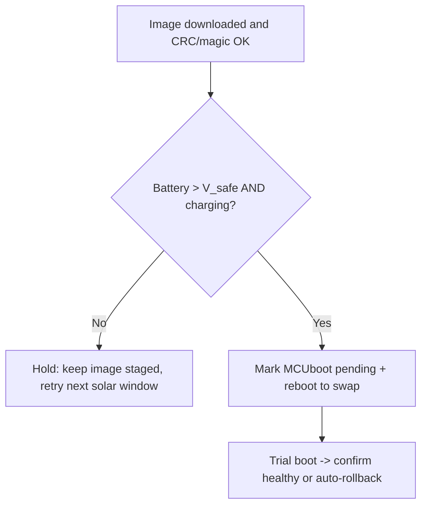

# MCUboot Bootloader Options & Decision Guide

**Date:** June 10, 2026
**Context:** Provisioning the test **Client** Opta (`COM5`) for MCUboot OTA.
**Companion docs:** [MCUBOOT_PROVISIONING_AND_TESTING_GUIDE.md](MCUBOOT_PROVISIONING_AND_TESTING_GUIDE.md), [CODE_REVIEW_06092026_UPDATE_SYSTEM_v1.9.0_PROPOSED_FIXES.md](CODE_REVIEW_06092026_UPDATE_SYSTEM_v1.9.0_PROPOSED_FIXES.md)

---

## 1. Why this decision exists

The Arduino Opta ships with two possible bootloaders. Only one of them can perform the
A/B image swap and rollback that the v1.9.x update system depends on.

| Bootloader identifier | MCUboot OTA support | Notes |
|---|---|---|
| `Arduino loader` (legacy) | ❌ No | Default factory loader. No image swap, no rollback. |
| `MCUboot Arduino` | ✅ Yes | Required for `tankalarm_performMcubootUpdate()` + rollback. |

MCUboot OTA **cannot** work until the board is running the `MCUboot Arduino` bootloader.
This is a **one-time, per-device** preparation done over USB before field deployment.

---

## 2. What we found on this board (verified 2026-06-10)

Read with the core example `STM32H747_getBootloaderInfo` flashed to `COM5`
(FQBN `arduino:mbed_opta:opta`), serial @ 115200:

```
Arduino loader
Magic Number (validation): ff
Bootloader version: 255
Secure info version: 1
Has Ethernet: Yes
Has WiFi module: Yes
Has RS485: Yes
QSPI size: 16 MB
Secure board revision: 0.1
Secure vid: 0x2341
Secure pid: 0x264
Secure mac: a8:61:0a:50:e9:d2
```

**Interpretation:**
- Identifier is `Arduino loader`, **not** `MCUboot Arduino`.
- Magic `0xFF` and version `255` (`0xFF`) mean the MCUboot info block is **absent**.
- The board hardware itself is healthy (OTP secure info read cleanly: Opta with
  Ethernet/WiFi/RS485, 16 MB QSPI, MAC `a8:61:0a:50:e9:d2`).

**Conclusion:** The bootloader update (provisioning Step 1) is **required** on this unit.
It cannot be skipped.

> **Prompt wording caveat (important):** Because the current version reads `255`
> (the `0xFF` uninitialized value), `STM32H747_manageBootloader` compares
> `available (real) > current (255)` as **false** and frames the operation as a
> **downgrade**, e.g. *"A newer bootloader version is already installed: v255 … Do you
> want to downgrade the bootloader to v`XX`? Y/[n]"*. This is expected — the bundled
> image **is** the correct `MCUboot Arduino` loader. **Answer `Y`.** Do not be alarmed by
> the word "downgrade."

---

## 3. The boot options

### Option A — Update the bootloader via `arduino-cli` (agent-driven)
The assistant compiles and uploads `STM32H747_manageBootloader` to the M7 core, reads the
serial prompt, and sends the `Y` confirmation over the serial port.

- **Pros:** Fast; no IDE needed; keeps the whole flow in one place.
- **Cons:** The bootloader rewrite is the **only step with real brick risk**. If it is
  interrupted (power loss, cable knock, unattended hiccup), the board can be left
  unbootable with **no remote recovery**. Driving the interactive `Y` prompt over a raw
  serial port is also more fragile than a Serial Monitor.

### Option B — Update the bootloader in the Arduino IDE (human-driven) — **recommended**
You run the update yourself with the IDE Serial Monitor open.

- **Pros:** Safest. You are physically present for the one irreversible write; the IDE
  Serial Monitor handles the prompt cleanly; easiest to see progress and confirm success.
- **Cons:** Requires the Arduino IDE and a manual step.

**Recommendation:** Use **Option B for the bootloader write specifically**, because of the
brick risk, then hand back to the agent for the remaining (low-risk, recoverable) steps.

---

## 4. Option B — exact steps (recommended)

1. **Open the example:** Arduino IDE → `File ▸ Examples ▸ STM32H747_System ▸ STM32H747_manageBootloader`.
2. **Select the board/port:** Tools ▸ Board → **Arduino Opta**; Tools ▸ Port → **COM5**.
   Confirm you are targeting the **M7 core** (the sketch refuses to run on M4).
3. **Upload** the sketch.
4. **Open Serial Monitor** @ **115200 baud**.
5. When prompted to update the bootloader, **confirm with `Y`** and let it finish.
   On this board the prompt will read **"downgrade … to v`XX`? Y/[n]"** (see §2 caveat) —
   that is expected; answer `Y`. *Do not disconnect power or USB during the write.*
6. **Verify** (see §6). You want identifier **`MCUboot Arduino`** and **version > 24**.

---

## 5. Option A — exact steps (only if you explicitly choose agent-driven)

> Use only with the board on a stable power/USB connection and someone able to react.

1. Agent compiles `STM32H747_manageBootloader` (`arduino:mbed_opta:opta`).
2. Agent uploads to `COM5` via dfu-util.
3. Agent opens `COM5` @ 115200, reads the prompt (expect the **"downgrade … to v`XX`? Y/[n]"**
   wording from §2), and sends `Y`.
4. Agent watches for `Flashed 100%` then **`Bootloader update complete.`** — the success
   marker. The write erases/programs internal flash at `0x08000000`; **do not interrupt.**
5. Agent re-flashes `getBootloaderInfo` to verify identifier `MCUboot Arduino`, version > 24 (§6).

**Recovery note:** If the bootloader write is interrupted and the board won't enumerate
normally, it can usually still be recovered through the STM32 system/ROM DFU
(BOOT0-triggered) — but treat that as a last resort, not a routine path.

---

## 6. Verifying success (either option)

Re-flash `STM32H747_getBootloaderInfo` and read serial @ 115200. Success looks like:

```
MCUboot Arduino
Magic Number (validation): <non-FF>
Bootloader version: <some value > 24>
...
```

- Identifier **must** read `MCUboot Arduino`.
- Version **must** be **> 24** (the KeyProvisioning sketch enforces this).

---

## 7. What happens after the bootloader is correct

The remaining provisioning steps are **low-risk and recoverable** (a bad app can simply be
re-flashed over USB), so the agent can drive them:

1. **KeyProvisioning** — flash [TankAlarm-112025-KeyProvisioning.ino](../TankAlarm-112025-KeyProvisioning/TankAlarm-112025-KeyProvisioning.ino),
   open serial @ 115200, answer **`Y`** to load default keys and format/partition QSPI
   (`fs_ota`, `update.bin` + `scratch.bin`). *This erases QSPI config — do it before field setup.*
2. **Flash the Client application** — the MCUboot-enabled build with the product UID
   `com.senaxinc.james:field` baked in
   ([firmware/112025/client/TankAlarm-112025-Client-BluesOpta.ino.bin](../firmware/112025/client/TankAlarm-112025-Client-BluesOpta.ino.bin)).
3. **Upload the Client `.slot.bin`** to its Notehub product/fleet so OTA has something to serve.
4. **Run the bench-test matrix** in
   [MCUBOOT_PROVISIONING_AND_TESTING_GUIDE.md](MCUBOOT_PROVISIONING_AND_TESTING_GUIDE.md) §2.

---

## 8. Risk & recovery summary

| Step | Reversible over USB? | Brick risk if interrupted | Who should drive |
|---|---|---|---|
| Read bootloader info | n/a (read-only) | None | Agent (done) |
| **Bootloader update** | Hard to recover | **Yes** | **Human (Option B)** |
| KeyProvisioning (keys + QSPI format) | Yes (re-flash) | Low | Agent |
| Flash application | Yes (re-flash) | Low | Agent |
| Notehub `.slot.bin` upload | Yes | None | Either |

**Bottom line:** Hold the human-in-the-loop boundary at the bootloader write. Everything
before it is read-only; everything after it is re-flashable.

---

## 9. Board reference (this unit)

| Field | Value |
|---|---|
| Role | Client |
| Port | `COM5` |
| FQBN | `arduino:mbed_opta:opta` |
| USB VID:PID | `0x2341:0x0264` (app) / `0x2341:0x0364` (DFU) |
| Hardware ID | `002B002C3033511533333437` |
| MAC | `a8:61:0a:50:e9:d2` |
| QSPI | 16 MB |
| Product UID | `com.senaxinc.james:field` |
| Notecard Device ID | `dev:860322068056545` |
| Current bootloader | `Arduino loader` (needs update) |

---

## 10. Review update: improved proceeding path

After reviewing the Arduino Opta core recipes and the current local artifacts, the main
bootloader recommendation remains unchanged, but the post-provisioning application flash
path needs one important correction.

### 10.1 Bootloader write boundary still holds

There is no OTA-side shortcut around the first step: this board must be changed from
`Arduino loader` to `MCUboot Arduino` before MCUboot staging, swap, and rollback can work.

The best options are now:

| Option | When to use | Notes |
|---|---|---|
| Arduino IDE `STM32H747_manageBootloader` | **Recommended for this bench unit** | Safest practical path over USB because the human is present for the irreversible flash write. |
| SWD/ST-Link/OpenOCD factory jig | Best technical/factory path if available | Gives recovery leverage and removes some USB/serial fragility, but requires hardware setup. |
| Agent-driven CLI + serial `Y` | Only if explicitly chosen | Convenient, but not safer than the IDE for the bootloader rewrite. |

**Do not treat `.with_bootloader.bin` as a replacement for the bootloader-management sketch.**
The current Client `*.with_bootloader.bin` was verified as a 256 KB bootloader prefix plus
the raw app image. It is a recovery/factory-style combined binary, not the interactive
Arduino bootloader update flow and not the OTA slot image.

### 10.2 Important correction after KeyProvisioning

Once `TankAlarm-112025-KeyProvisioning` loads the default MCUboot signing/encryption keys,
future application sketches must be uploaded in Arduino's **Signing + Encryption** mode.
Arduino's own `enableSecurity` example states that sketches uploaded with Security
Settings → `None` will not execute after keys are loaded.

Therefore, after KeyProvisioning, do **not** flash the current raw application binary:

```text
firmware/112025/client/TankAlarm-112025-Client-BluesOpta.ino.bin
```

Also do **not** use this as the normal post-key app path:

```text
firmware/112025/client/TankAlarm-112025-Client-BluesOpta.ino.with_bootloader.bin
```

Use one of these instead:

1. **For initial USB application flash:** compile/upload the Client with
   `security=sien` so Arduino signs and encrypts the image before upload.
2. **For OTA testing:** upload the role-matched signed/encrypted `.slot.bin` to Notehub.

### 10.3 Recommended secure USB Client flash command

After the bootloader reads `MCUboot Arduino`, after KeyProvisioning succeeds, and with the
Client still on `COM5`, the corrected local USB application-flash path is:

```powershell
.\arduino-cli.exe compile --fqbn arduino:mbed_opta:opta:security=sien --build-property "build.extra_flags=-DTANKALARM_DFU_MCUBOOT" --build-property "build.version=1.9.1+191" --libraries "C:\GITHUB\SenaxTankAlarm\build\arduino-sketchbook-v184\libraries" --output-dir "build\secure-client" "TankAlarm-112025-Client-BluesOpta\TankAlarm-112025-Client-BluesOpta.ino"
.\arduino-cli.exe upload --fqbn arduino:mbed_opta:opta:security=sien -p COM5 -i "build\secure-client\TankAlarm-112025-Client-BluesOpta.ino.bin"
```

This secure FQBN path was checked against the local `arduino:mbed_opta` core. It uses:

- Arduino default MCUboot signing/encryption keys.
- MCUboot header size `0x20000`.
- MCUboot slot size `0x1E0000`.
- Upload address `0xA0000000`.
- DFU interface `2`.
- Explicit MCUboot image version `1.9.1+191` instead of Arduino's default `1.2.3+4`.

### 10.4 Updated practical sequence

1. Human runs `STM32H747_manageBootloader` in Arduino IDE and confirms `Y`.
2. Agent or human verifies `STM32H747_getBootloaderInfo` reports `MCUboot Arduino`, version `> 24`.
3. Agent flashes `TankAlarm-112025-KeyProvisioning`, opens serial, and answers `Y`.
4. Agent flashes the signed/encrypted Client app with `security=sien`.
5. Agent uploads the matching Client `.slot.bin` to the developer Notehub product/fleet.
6. Run the bench matrix before enabling field OTA policy.

---

## 11. Research Ideas for Improving the Bootloader Situation

To scale up deployment, reduce human-in-the-loop complexity, and minimize brick risk, several technical and process enhancements should be explored. These ideas address the core friction points of the current manual provisioning workflow.

### 11.1 Non-Interactive Custom Provisioning Sketch (Bypassing Serial Prompts)
* **Goal:** Eliminate the dependency on the manual Serial Monitor `Y/n` prompt during the bootloader upgrade.
* **Concept:** Create a dedicated, non-interactive bootloader update utility sketch (e.g., `TankAlarm-BootloaderUpdater-NonInteractive`).
* **Implementation:**
  - Inside `setup()`, the sketch checks the current bootloader identification signature reading from flash. If the board already runs `MCUboot Arduino` >= correct-version, it prints a success message and terminates safely.
  - It checks and verifies baseline power stability.
  - If safety parameters pass, it executes the direct flash blocks write (utilizing the internal BSP APIs) without waiting for developer input.
  - Upon success, it fires up an onboard LED error/success status flash pattern and triggers a hardware reset.
* **Benefit:** Enables automated scripting via `arduino-cli` to provision units continuously on a staging bench with zero manual intervention.

### 11.2 SWD/JTAG Factory Programming Fixture (ST-Link / OpenOCD)
* **Goal:** Completely eliminate the bricking hazards and COM port state-machine fragility of USB-based DFU.
* **Concept:** Use physical debugging interfaces on the bench/production floor instead of virtual USB serial interfaces.
* **Implementation:**
  - Build a simple bench programming jig using pogo-pins targeting the hardware SWD/JTAG pads on the underside of the Opta board.
  - Create a lightweight CLI automation script leveraging STM32CubeProgrammer or OpenOCD commands (e.g., `STM32_Programmer_CLI.exe -c port=SWD -w combined_image.bin 0x08000000 -v -rst`).
  - Flash a pre-combined block containing the `MCUboot Arduino` bootloader, the keys, and the application firmware in a single, high-speed connection.
* **Benefit:** Near-instantaneous flashing speed, 100% resilience to interrupted bootloader updates, and a guaranteed physical hardware recovery pathway should a chip ever get corrupted.

### 11.3 Vaulting Private Keys in CI & Custom Staging Keys
* **Goal:** Upgrade the security posture while maintaining mechanical A/B integrity, avoiding plain private keys stored in the source repository.
* **Concept:** Keep private signing keys as secret values and move away from standard public Arduino defaults for production devices.
* **Implementation:**
  - Generate a unique product-line signing keypair using `imgtool`.
  - Store the private signing file inside a secure Git Actions repository variable/secret instead of keeping plain PEM keys under [mcuboot_keys](mcuboot_keys).
  - Only commit the public key counterpart inside [TankAlarm-112025-KeyProvisioning/TankAlarm-112025-KeyProvisioning.ino](TankAlarm-112025-KeyProvisioning/TankAlarm-112025-KeyProvisioning.ino) or write it to the OTP/Flash sectors defined during staging.
* **Benefit:** Prevents external third-parties from signing unauthorized binaries and guarantees that only official builds compiled from the secure pipeline can execute on field units.

### 11.4 In-Application Bootloader Field Upgrades (OTA Bootloader Update)
* **Goal:** Allow remote recovery and upgrades to the bootloader layer without requiring physical USB/SWD site visits.
* **Concept:** Create a temporary "Bootloader Updater Bridge" application.
* **Implementation:**
  - Build a slim, single-purpose application binary that contains the new `MCUboot Arduino` bootloader payload.
  - Deliver this application to the field using the standard Notehub OTA channel (staged in `/fs_ota/update.bin`).
  - Upon booting this bridge application, it:
    1. Quiesces active Modbus or RS-485 transactions.
    2. Runs diagnostic checks to ensure there is stable, non-critical power.
    3. Leverages the internal `FlashIAP` APIs to rewrite the bootloader region at `0x08000000`.
    4. Triggers an `NVIC_SystemReset()`.
* **Benefit:** Resolves the "permanent legacy" bootloader problem in remote solar installations when future core vulnerabilities are patched.

### 11.5 Streamlined CLI Developer Tooling
* **Goal:** Reduce friction and avoid syntax-mismatch compile/upload errors for developer machines.
* **Concept:** Wrap complex FQBN variables into a simple script.
* **Implementation:**
  - Create a developer helper in the repository, such as `build/flash-secure-client.ps1`.
  - The script scans active COM ports, automatically matches board attributes, and wraps the complex compilation requirements (e.g., `security=sien`, watchdog definitions, and compiler definitions) into a single-action command.
* **Benefit:** Minimizes developer documentation overhead and simplifies local bench-testing setups.

### 11.6 M4 Co-Processor As Failsafe Bootloader Monitor
* **Goal:** Mitigate brick risk during M7 bootloader updates by utilizing the idle M4 core.
* **Concept:** Deploy a self-contained watchdog/recovery monitor on the Opta's M4 core prior to running any M7 bootloader updates.
* **Implementation:**
  - Flash a small, high-reliability recovery binary to the M4 that has direct access to the flash interface.
  - The M4 monitors the M7's update progress via shared memory (SRAM4) or hardware semaphores.
  - If the M7 halts, browns out, or times out during the critical bootloader flash erasure/write cycle, the M4 core takes over, reads a known-good bootloader backup from a protected QSPI sector, and restores the M7 bootloader partition (`0x08000000`).
* **Benefit:** Eliminates the single point of failure during USB bootloader rewrites. If the USB cable is yanked mid-update, the M4 automatically un-bricks the board in milliseconds.

### 11.7 USB Mass Storage (MSC) Drag-and-Drop Provisioning
* **Goal:** Completely bypass the Arduino IDE and command-line serial prompts for field technicians and factory line workers.
* **Concept:** Create a "Provisioning Host" sketch that enumerates the Arduino Opta as a USB flash drive to the host PC.
* **Implementation:**
  - Flash a PluggableUSB MSC (Mass Storage Class) sketch that maps a FAT partition on the root QSPI to a virtual thumb drive.
  - The technician mounts the drive and drags a `provision.bin` (containing the bootloader, keys, and base firmware) onto it.
  - The firmware detects the file closure, validates its internal signatures, disables USB interrupts, flashes the correct targets, and reboots.
* **Benefit:** Zero software installation needed on the host PC. Works identically on Windows, Mac, and Linux. No serial monitor `Y/n` prompts or baud-rate mismatches.

### 11.8 Supply-Chain Pre-Provisioning (Distributor Flashing)
* **Goal:** Remove all manual board preparation steps from the Senax assembly facility.
* **Concept:** Shift the burden of burning the `MCUboot Arduino` bootloader and custom Senax encryption keys to the hardware supplier before the boards ship.
* **Implementation:**
  - Distribute a secure master "bootloader + keys" binary array to established distributors (e.g., DigiKey, Mouser) that offer custom programming services.
  - Or, negotiate directly with Arduino Pro for a custom SKU that rolls off their manufacturing line with the MCUboot loader and QSPI partition table pre-configured.
* **Benefit:** The Optas arrive at the Senax bench completely OTA-ready out of the box. Technicians immediately flash the Client/Server application and deploy, saving valuable time and eliminating factory bricking risks entirely.

---

## 12. Advanced Hardware-Level Suggestions and Out-of-the-Box Architectural Paths

The transition from a raw monolithic flash layout to a partition-aware MCUboot swap structure exposes several technical and operational risks. To make the system completely robust, bulletproof, and efficient, several advanced, outside-the-box hardware-level and software-safety optimizations can be introduced.

### 12.1 Visual Status and Swap Diagnostic Signaling using Opta LEDs
* **Goal:** Provide instant field diagnostics during A/B image swaps without requiring a serial connection or computer.
* **Concept:** Since MCUboot runs bare-metal without the Arduino runtime library active, it does not initialize high-level USB-to-serial communication. Consequently, an active update swap (which can take 10 to 30 seconds as blocks are erased and re-written between QSPI and internal flash) provides zero console feedback. If an update hangs, it can look indistinguishable from a bricked board.
* **Implementation:**
  - Customize the MCUboot bootloader source to directly toggle the STMicroelectronics STM32H747 GPIO hardware registers corresponding to the Opta board's four user-facing LEDs (LED1 to LED4) and Status LED.
  - While an update is actively swapping sectors, light up a distinctive breathing, pulsing, or running LED sequence.
  - If the swap succeeds, solid-flash all LEDs once before restarting.
  - If a verification, decryption, or CRC check fails, blink a specific binary code (e.g., LED1 and LED3 cycling) to represent the exact MCUboot error code, giving a physical diagnostic indicator directly to the field installer or technician.

### 12.2 Bootloader Write Protection via STM32 hardware Option Bytes (WRP)
* **Goal:** Reduce the bootloader bricking hazard to absolute zero both on the developer bench and during remote field upgrades.
* **Concept:** The primary risk with bootloader modifications is corruption; an interrupted write or wild pointer write to sector 0 leaves the board unbootable, forcing SWD recovery.
* **Implementation:**
  - Leverage the STM32H7's internal Flash Memory Write Protection (WRP) peripheral.
  - After copying the correct `MCUboot Arduino` bootloader to the internal flash starting at address `0x08000000`, configure the STM32 Flash Option Bytes to flag the bootloader sectors (e.g., `0x08000000` through `0x081FFFF`) as hardware-level read-only.
  - Program this configuration during initial bench provisioning (within KeyProvisioning or a dedicated script).
  - Even if the application crashes, overflows, or executes a malicious flash erasure loop, the hardware block controller itself will reject any erase or program cycle hitting those addresses, guaranteeing the bootloader stays intact.

### 12.3 Partition Table MBR Protection Assertion Guard in Application Startup
* **Goal:** Completely prevent any current or future application build from accidentally erasing the MBR layout.
* **Concept:** If storage initialization fails to mount the LittleFileSystem on partition 4, its default recovery mechanism has historically been to reformat the underlying device. If the underlying device is mapped to the raw root QSPI, this step immediately vaporizes the MBR partition table and partition 2 updates.
* **Implementation:**
  - Before calling any initialization routines in [TankAlarm-112025-Client-BluesOpta/TankAlarm-112025-Client-BluesOpta.ino](TankAlarm-112025-Client-BluesOpta/TankAlarm-112025-Client-BluesOpta.ino) or [TankAlarm-112025-Server-BluesOpta/TankAlarm-112025-Server-BluesOpta.ino](TankAlarm-112025-Server-BluesOpta/TankAlarm-112025-Server-BluesOpta.ino), perform a raw read of QSPI block 0.
  - Check for the standard Master Boot Record (MBR) boot signature (`0x55AA` at the end of the block).
  - If the MBR signature exists, verify the boundaries of Partition 2 (OTA) and Partition 4 (App data) inside block 0.
  - If the application code attempts to initialize on `BlockDevice::get_default_instance()`, or if the signature checks fail to map cleanly, trigger an software assert that halts execution, locks up, and flashes a warning LED sequence rather than allowing the application to format the entire chip.

### 12.4 Golden Factory Recovery Partition on QSPI for Off-Grid Resets
* **Goal:** Enable a 100% stable, offline, and computer-free full restore of a field unit in remote solar locations.
* **Concept:** If an update installs successfully but fails inside the application logic because of a configuration mismatch or corrupt history state, standard MCUboot will keep trying to boot it if it was marked as confirmed. Technicians on-site should have a physical way to revert the Opta to a known gold-standard build without needing ST-Link, openocd, or USB virtual COM setups.
* **Implementation:**
  - Create a custom MBR partition layout allocating a fifth partition (Partition 5, size 1.8 MB) at the tail end of the QSPI chip.
  - During factory preparation, flash a certified, gold-standard stable Client or Server application binary directly into this Partition 5.
  - Configure the application or M4 core setup to check the physical Opta user button or RS485 terminal jumpers during power-on.
  - If the button is held continuously for 10 seconds, the software initiates a local block transfer: copying the raw gold binary from Partition 5 into the Partition 2 OTA staging region (`update.bin`), flags the update as a manual forced override inside `pending_ota.json`, and triggers a hardware reset.
  - The bootloader treats this as a verified upgrade, swaps the gold-standard binary into place, and restores normal telemetry.

### 12.5 Large SRAM-Buffered Writes for Minimizing QSPI Wear and Current Peaks
* **Goal:** Maximize QSPI flash memory lifespan, reduce write latency, and prevent high power spikes on battery-constrained solar rigs.
* **Concept:** Writing and erasing small blocks continuously on flash memory generates high current consumption and quickly degrades flash silicon.
* **Implementation:**
  - The dual-core STM32H747 features 1 Megabyte of contiguous internal RAM (AXI SRAM and SRAM1–SRAM4).
  - When download chunk routines receive small telemetry packets or file fragments from the cellular Notecard payload, do not write them directly to QSPI in tiny blocks.
  - Instead, accumulate streamed chunks in a large RAM circular buffer.
  - Once the buffer holds a size matching the physical QSPI sector erase size (typically 64KB or 128KB sub-sections), perform a single, continuous, fast mass-write cycle.
  - This significantly improves staging speed, minimizes peak current times on solar supplies, and reduces overall write wear by several orders of magnitude.

---

## 13. Independent Review, Hardware Research & Additional Ideas (2026-06-10, Claude Opus 4.8)

This section is a fresh pass over the whole situation: a restatement of where the real
blocker now sits, the hardware facts I verified to keep the ideas grounded, candid commentary
on the existing §10–§12 recommendations, and several new "outside-the-box" options that lean on
this specific hardware and on the system's own solar/cellular context.

### 13.1 Situation review (what actually matters now)

The bootloader question this document was created to answer is **resolved**: the bench Client is
running `MCUboot Arduino` v25 (magic `0xA0`), keys are programmed, and the human-in-the-loop
boundary held. That was the right call and the right outcome.

The blocker has **moved**. The thing standing between us and a working OTA is no longer the
bootloader — it is the **QSPI storage-ownership conflict** documented in
[MCUBOOT_QSPI_STORAGE_CONFLICT_06102026.md](MCUBOOT_QSPI_STORAGE_CONFLICT_06102026.md): the
Client/Server applications reformat the **entire** raw QSPI as one LittleFS volume, which would
destroy the MBR and the partition-2 OTA staging that MCUboot depends on. So the most important
framing for everything below is:

> **The bootloader work is done. The next gate is making the application stop owning the whole
> flash chip — and making provisioning create the layout the runbook only *claims* it creates.**

Two corollaries shape my recommendations:

- The **Viewer has no local LittleFS**, so it can prove the end-to-end MCUboot swap/rollback path
  *today* without waiting on the Client/Server storage redesign. De-risk there first.
- The KeyProvisioning "System provisioned" banner prints **unconditionally** even when partition
  creation failed (see [TankAlarm-112025-KeyProvisioning.ino](../TankAlarm-112025-KeyProvisioning/TankAlarm-112025-KeyProvisioning.ino) `setupMCUBootOTAData()` returning early after the reformat error). That misleading success signal is itself a latent field hazard and should be fixed before any fleet rollout.

### 13.2 Hardware facts I verified (and why each one matters here)

| Verified fact (STM32H747XI / Opta) | Source | Why it matters to OTA |
|---|---|---|
| **2 MB internal flash, dual-bank, with read-while-write** | ST product page | Enables a *native* internal A/B scheme (execute bank 1 while writing bank 2) that sidesteps QSPI entirely — see §13.4.1. |
| 1 MB RAM (192 KB TCM + 864 KB user SRAM + 4 KB backup) | ST product page | Plenty of headroom for the §12.5 SRAM-buffered staging *and* for app-layer image verification. |
| **BOR (programmable Brown-Out Reset)** + POR/PDR/PVD | ST product page | A single option-byte raise of `BOR_LEV` makes the MCU reset *cleanly* before VDD sags into the flash-corruption zone — see §13.4.3. |
| **ROP / PC-ROP** read-out protection, option bytes | ST product page | Same option-byte machinery that §12.2's WRP idea relies on — the hardware genuinely supports write-protecting the bootloader sectors. |
| SWD & JTAG, embedded trace | ST product page | Confirms §11.2's factory/recovery jig is physically real; SWD is the only true un-brick path. |
| 4× watchdogs (independent + window) | ST product page | The OTA engine already kicks the WDT; a window-watchdog can also bound a hung swap. |
| 96-bit unique ID + TRNG | ST product page | Per-device identity/entropy available for any future authenticity scheme (§13.4.4). |
| **Onboard secure element** ("ensures OTA…") | Arduino Opta page | A hardware ECDSA engine exists for *real* image authenticity without forking the bootloader — see §13.4.4. (Verify exact part; Portenta-lineage uses an SE050-class element.) |
| 16 MB QSPI @ up to 133 MHz, dual-mode | ST + core | Ample for app data on partition 4 *and* a cached known-good image (§13.4.6); XIP execution is possible but fragile (§13.5). |

### 13.3 Commentary on the existing §10–§12 recommendations

Overall the list is strong and the instinct to over-prepare a remote, solar, cellular fleet is
correct. My candid verdicts:

| Item | Verdict | Note |
|---|---|---|
| §10 secure `security=sien` flash path | ✅ **Correct & important** | The single most consequential correction in the doc — after keys, a `None`-signed app *won't boot*. Keep this front and center. |
| §11.1 Non-interactive provisioning sketch | ✅ **Endorse** | Best folded into one self-contained provisioner (§13.4.8). The "verify power stability" step is hand-wavy on USB power; drop it there. |
| §11.2 SWD/JTAG factory fixture | ✅ **Strongly endorse** | This is the *real* answer to brick risk and scale. Caveat: Opta is enclosed — confirm SWD access (expansion/SWD pads) before committing to a pogo jig. |
| §11.3 Vault custom keys | ⚠️ **Contradiction to flag** | This reverses the project's *explicit, documented* scope ("…provide no firmware authenticity… out of scope" — header of [KeyProvisioning.ino](../TankAlarm-112025-KeyProvisioning/TankAlarm-112025-KeyProvisioning.ino)). More importantly, the **stock Arduino MCUboot trusts a compiled-in public key** — custom keys do *nothing* unless you also build/flash a custom bootloader with the new key embedded. As written it gives a false sense of authenticity. If real authenticity is wanted, do §13.4.4 instead. |
| §11.4 OTA bootloader rewrite from the field app | 🛑 **Caution — highest brick risk in the document** | Rewriting `0x08000000` over cellular at a remote solar site, with no SWD recovery, is the worst-case failure mode. Only ever consider this with the WRP-lift + dual-bank + power-gating trifecta, and even then I'd accept a "permanent legacy bootloader" over this risk. |
| §11.5 Streamlined CLI tooling | ✅ **Cheapest win** | Do it. Eliminates the FQBN/`security=sien` footguns that already cost this project time. |
| §11.6 M4 failsafe monitor | ⚠️ **Optimistic** | During an M7 bank erase/program the flash controller stalls competing accesses, and a real brownout takes the M4 down too — so "un-brick in milliseconds" overstates it. WRP (§12.2) + SWD (§11.2) solve the same risk more reliably. Interesting research, low ROI. |
| §11.7 USB MSC drag-and-drop | ✅ **Endorse for field techs** | The core supports `PluggableUSBMSD`. Great zero-install path; still needs the signed-image handling baked in. |
| §11.8 Supply-chain pre-provisioning | ✅ **Endorse at volume** | Realistic for scale; ties to the key decision in §11.3/§13.4.4 (whose key gets pre-burned?). |
| §12.1 LED swap diagnostics | ✅ Good, ⚠️ **cost** | Requires forking the Arduino MCUboot bootloader (a custom build the project otherwise avoids). Pair it with the *remote* equivalent in §13.4.5, which needs no fork. |
| §12.2 WRP option bytes | ✅ **Strongly endorse** | Best single brick-mitigation; hardware-confirmed. Caveat: WRP must be *liftable* for legitimate bootloader updates, so document the unlock step. |
| §12.3 MBR protection guard | ✅✅ **Do this first, unconditionally** | Cheapest, highest-value safety change in the whole document. It directly prevents the catastrophic "reformat whole chip" that is *the current blocker*. Should ship even if every other idea is rejected. |
| §12.4 Golden recovery partition | ✅ Good, ⚠️ **sizing** | The standard map leaves only ~2 MB (14–16 MB) unallocated and a ~1.9 MB image won't sit there cleanly alongside the memory-mapped FW region — you'd need to resize p4. Reusing `update.bin` + the normal swap path is the right mechanism. |
| §12.5 SRAM-buffered writes | ⚠️ **Right idea, wrong target** | OTA staging happens *rarely* (a firmware update), so its wear is negligible. The write-wear that actually matters is the **Server's frequent history/config writes** on partition 4. Re-aim this optimization there. |

### 13.4 New ideas worth trying

#### 13.4.1 Use the STM32H747's *internal* dual-bank flash for A/B on Client & Viewer

The chip has **2 × 1 MB banks with read-while-write**. That is exactly the hardware primitive a
classic A/B updater wants: run from bank 1, stage into bank 2, flip the `SWAP_BANK` option bit,
reset. For roles whose signed image fits in one bank, this **removes the QSPI conflict entirely** —
the application can keep whatever QSPI layout it likes because OTA never touches QSPI.

- **Fits:** Client (~354 KB) and Viewer (~334 KB) sit comfortably under the ~896 KB usable in
  bank 1 after the 128 KB bootloader.
- **Does *not* fit:** Server (~954 KB signed) exceeds a single bank once the 128 KB MCUboot header
  is added — so the Server stays on QSPI partition-2 staging. Be honest that this splits the fleet
  into two OTA mechanisms.
- **Cost:** needs a custom MCUboot flash map / linker layout (diverges from the stock Arduino core),
  which is real maintenance. Worth prototyping on the Viewer because the payoff — *Client OTA with
  zero QSPI entanglement* — is large.

#### 13.4.2 Power-aware swap gating using the existing SunSaver solar telemetry (my top pick)

This system already reads battery/solar state over RS-485 (SunSaver). The irreversible part of an
MCUboot update is the **swap on the next boot**, not the download. So:

> Stage the image any time, but **refuse to set the MCUboot "pending" flag / trigger the swap-reboot
> unless** battery voltage is above a safe threshold **and** the panel is in/near peak charge — i.e.
> the moment a brownout mid-swap is least likely.



It is a few lines in the DFU engine ([TankAlarm_DFU.h](../TankAlarm-112025-Common/src/TankAlarm_DFU.h)),
needs no new hardware, and directly attacks the remote-brick risk that §11.4/§12 worry about. This is
the highest-value *new* idea because it's specific to this product's hardware and failure mode.

#### 13.4.3 Raise `BOR_LEV` (and lean on input hold-up capacitance) during the swap window

The H747 has a programmable Brown-Out Reset. Setting a higher `BOR_LEV` makes the MCU reset
*cleanly* before VDD droops into the range where flash programming corrupts — turning a brownout
into a recoverable reset instead of a half-written bank. One option-byte change, zero recurring cost,
and a natural companion to §13.4.2 and §12.2's WRP.

#### 13.4.4 App-layer image authenticity via the onboard secure element

This is the *correct* way to get what §11.3 reaches for, without the contradiction. Rather than
swapping the bootloader's trusted key, have the **application** verify a Senax ECDSA-P256 signature
over the downloaded image **before** it writes `update.bin`, using the Opta's onboard secure
element to hold the public key and perform the verify. MCUboot still provides the mechanical
integrity/rollback; the secure element adds *authenticity* as a clean, additive layer that never
touches the bootloader or the brick-risk path.

- **Honest scope note:** the project currently declares firmware authenticity out of scope. This
  idea is the low-risk migration path *if/when* that decision changes — log it as the recommended
  route and don't half-implement custom keys before then.
- Confirm the exact secure-element part on the Opta and that the Arduino secure-element library
  exposes ECDSA verify on it.

#### 13.4.5 Make Notehub the OTA policy + observability plane (remote analog of §12.1's LEDs)

The fleet is cellular via Notecard, so we already have a back-channel — use it:

- **Policy / kill-switch:** drive the allowed-version list and a hard "halt OTA" flag from Notehub
  **environment variables** per fleet, instead of only baking policy into firmware.
- **Observability:** emit a Notehub event at each `pending_ota.json` transition
  (downloaded → staged → swap-pending → trial → confirmed/rolled-back). A field unit's update state
  becomes visible from a desk — the §12.1 LED benefit, but remote.
- **Automatic rollback-storm guard:** wire the *existing* `tankalarm_isVersionBlacklisted()` to a
  server-side rule — if N devices roll back from version X, auto-blacklist X for the rest of the
  fleet. This turns rollback telemetry into an automatic fleet brake.

#### 13.4.6 Cache the previous known-good signed image in QSPI ("known-good vault")

MCUboot can revert one step, but once the secondary slot is overwritten by a newer download the old
image is gone. Given 16 MB of QSPI, keep the last *confirmed-healthy* signed image as a third file
(e.g. `/fs_ota/known_good.bin`). A forced recovery can then re-stage a proven build with **no
download** — useful precisely when connectivity is the problem. Cheap insurance; complements §12.4's
gold partition (this one tracks the *field-proven* image, not just the factory image).

#### 13.4.7 Make MCUboot non-negotiable in the build (close the macro footgun)

The recent history of this effort includes shipping artifacts with `TANKALARM_DFU_MCUBOOT` **off** in
both [build/release-build.ps1](../build/release-build.ps1) and the release workflow. Convert that
class of bug into a **compile-time failure**: a field/role build that doesn't define the macro (and
doesn't have a consistent `FIRMWARE_VERSION` / `FIRMWARE_BUILD_SEQ`) should *not build*. A footgun
that can't fire beats a checklist item that can be forgotten.

#### 13.4.8 One self-contained provisioning state machine (fold in §11.1 + the §4 defects)

Replace the current multi-sketch, partially-misleading flow with a single provisioner that runs an
explicit, **fail-closed** sequence and only prints success when *every* stage passed:

1. Verify bootloader == `MCUboot Arduino`, version > 24 (already present).
2. **Create the full Arduino MBR** (partitions 1–4, mirroring `QSPIFormat`) — the step the runbook
   *claims* happens but doesn't.
3. Format partition 2 (FAT) and pre-create `update.bin` + `scratch.bin`.
4. Format partition 4 (LittleFS) for app data.
5. Program keys.
6. Emit a single, **conditional** "PROVISIONED OK" only if 1–5 all succeeded; otherwise print the
   precise failed stage. (Today's unconditional "System provisioned" banner is a field trap.)

This simultaneously fixes the proximate KeyProvisioning bug, the documentation defect, and the
storage-architecture prerequisite in one tool.

### 13.5 On "should we move the whole system to QSPI?" — agree: no

The companion [MCUBOOT_QSPI_ARCHITECTURE_OPTIONS_06102026.md](MCUBOOT_QSPI_ARCHITECTURE_OPTIONS_06102026.md)
already answers this correctly. Adding the hardware reason: QSPI execute-in-place on the H7 is
*possible* via memory-mapped QUADSPI, but it brings cache-coherency, interrupt-latency, and
swap-semantics fragility for no capacity benefit — the images fit internal flash comfortably. The
lever worth pulling from that idea is the **internal dual-bank flash** (§13.4.1), **not** QSPI XIP.

### 13.6 If I had to pick — prioritized shortlist

1. **§12.3 MBR guard + a hard "never `reformat()` root QSPI" rule.** Ship now, regardless of path —
   it neutralizes the current blocker's worst outcome.
2. **§13.4.8 self-contained provisioner + fix the misleading banner.** Unblocks the bench and the runbook.
3. **Validate MCUboot end-to-end on the Viewer first** (no storage redesign needed) — proves
   bootloader + keys + staging + swap + rollback in isolation.
4. **§13.4.2 power-aware swap gating + §13.4.3 BOR raise.** The real, product-specific remote-brick mitigation.
5. **§13.4.7 CI macro hard-gate** + **§11.5 CLI helper.** Cheap, prevent regressions.
6. **§12.2 WRP** once provisioning is stable; **§13.4.1 internal dual-bank A/B** as a Client/Viewer prototype.

**Defer / avoid:** §11.4 remote bootloader rewrite, §11.6 M4 failsafe, QSPI XIP, and custom signing
keys (§11.3) — unless the authenticity scope formally changes, in which case do §13.4.4 instead.
