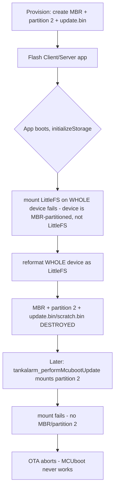

# MCUboot QSPI Storage Architecture Conflict — Situation Report

**Date:** June 10, 2026
**Author:** GitHub Copilot (Claude Opus 4.8)
**Status:** 🛑 **BLOCKER** — MCUboot OTA not viable with current application storage architecture
**Hardware:** Test Client Opta on `COM5` (Device ID `dev:860322068056545`, MAC `a8:61:0a:50:e9:d2`)
**Companion docs:** [MCUBOOT_BOOTLOADER_OPTIONS.md](MCUBOOT_BOOTLOADER_OPTIONS.md), [MCUBOOT_PROVISIONING_AND_TESTING_GUIDE.md](MCUBOOT_PROVISIONING_AND_TESTING_GUIDE.md), [CODE_REVIEW_06092026_UPDATE_SYSTEM_v1.9.0_PROPOSED_FIXES.md](CODE_REVIEW_06092026_UPDATE_SYSTEM_v1.9.0_PROPOSED_FIXES.md)

---

## 1. Executive summary

During bench provisioning of the first Client unit, the `KeyProvisioning` sketch loaded the
MCUboot keys successfully but **failed to create the QSPI OTA partition**, printing:

> `Error creating MCUboot FAT partition! Please partition QSPI manually first.`

Investigating that error surfaced a deeper, design-level problem:

> **The TankAlarm Client and Server firmware mount their LittleFS configuration store on the
> _entire_ raw QSPI device, while Arduino's MCUboot requires an _MBR-partitioned_ QSPI with the
> update image staged in _partition 2_. These two layouts are mutually exclusive on the same
> 16 MB flash chip.** As written, whenever the Client/Server application boots it will reformat
> the whole QSPI as LittleFS, destroying the MBR partition table and the MCUboot staging files —
> so MCUboot OTA can never succeed on those two roles.

This is not a bricked board and not a wiring fault. It is an architectural incompatibility that
**must be resolved in firmware before MCUboot OTA can be validated** on Client or Server.

**Nuance:** the **Viewer** does *not* use local QSPI storage, so it does not have this conflict
and could be used to validate the MCUboot swap mechanism independently (see §6).

---

## 2. Where we are in the provisioning runbook

| Step | Action | Result |
|---|---|---|
| 1 | Update bootloader to `MCUboot Arduino` v25 | ✅ **Done & verified** (see [MCUBOOT_BOOTLOADER_OPTIONS.md](MCUBOOT_BOOTLOADER_OPTIONS.md)) |
| 2 | `KeyProvisioning` — load keys + format/partition QSPI | ⚠️ **Keys loaded; QSPI partition FAILED** |
| 3 | Flash MCUboot-enabled Client app | 🛑 **Not done** (would worsen the conflict) |
| 4 | Upload `.slot.bin` to Notehub | ⛔ Blocked |
| 5 | Bench-test matrix | ⛔ Blocked |

The board currently holds: MCUboot bootloader (v25) + provisioned default keys + the
`KeyProvisioning` sketch. The QSPI has **no valid MBR partition 2** and therefore **no**
`update.bin` / `scratch.bin`.

---

## 3. What we observed (raw serial)

After uploading `KeyProvisioning` and answering `Y` to *"Do you want to proceed and load the
default keys?"*:

```
Keys will be loaded, and QSPI will be formatted to FAT/MBR2 for OTA updates...
Error creating MCUboot FAT partition! Please partition QSPI manually first.
Default Security Keys provisioned successfully.
System provisioned. It's now safe to reboot or disconnect your board.
```

Note that **"System provisioned"** is misleading: `setupMCUBootOTAData()` returned early after the
reformat error, so the keys were written but the OTA staging files were **not** created. The final
success banner prints unconditionally after key programming.

---

## 4. Root cause analysis

There are **two** distinct problems. The first is what threw the error; the second is the real blocker.

### 4.1 Problem A — `KeyProvisioning` never creates the MBR partition (proximate cause)

[TankAlarm-112025-KeyProvisioning.ino](../TankAlarm-112025-KeyProvisioning/TankAlarm-112025-KeyProvisioning.ino) `setupMCUBootOTAData()`:

```cpp
mbed::MBRBlockDevice ota_data(&root, 2);     // assumes partition 2 ALREADY EXISTS
mbed::FATFileSystem  ota_data_fs("fs_ota");
int mount_err = ota_data_fs.mount(&ota_data);
...
int err = ota_data_fs.reformat(&ota_data);   // fails if there is no MBR/partition 2
if (err) {
  Serial.println("Error creating MCUboot FAT partition! Please partition QSPI manually first.");
  return;                                      // <-- update.bin/scratch.bin never created
}
```

It constructs an `MBRBlockDevice` on **partition 2** but never calls `MBRBlockDevice::partition(...)`
to actually *create* the partition table. It relies on a pre-existing MBR. On a chip with no MBR
(or one formatted as a whole-device LittleFS), `reformat()` fails.

The canonical Arduino example this was adapted from
(`MCUboot/examples/enableSecurity/enableSecurity.ino`) has the **same** limitation and explicitly
tells the user to *"Run QSPIformat.ino sketch to format the QSPI flash"* first. That prerequisite
was never carried into our runbook.

> **Documentation defect:** [MCUBOOT_PROVISIONING_AND_TESTING_GUIDE.md](MCUBOOT_PROVISIONING_AND_TESTING_GUIDE.md)
> §1 Step 3 claims KeyProvisioning *"partitions and formats MBR block 2."* It does **not** — it only
> reformats an already-existing partition 2.

### 4.2 Problem B — Application owns the whole QSPI; MCUboot needs a partition (root blocker)

This is the fundamental conflict.

**MCUboot's fixed requirement** — the bootloader and the Arduino OTA reference code expect the
update image in **MBR partition 2**, FAT-formatted:

- `MCUboot/examples/secureOTA/secureOTA.ino`:
  ```cpp
  mbed::BlockDevice  *raw = mbed::BlockDevice::get_default_instance();
  mbed::MBRBlockDevice *mbr = new mbed::MBRBlockDevice(raw, 2);   // partition 2
  mbed::FATFileSystem  *fs  = new mbed::FATFileSystem("ota");
  fs->mount(mbr);
  WiFi.download(..., "/ota/update.bin", true);                    // staged image
  ```
- Our updater matches this exactly — [TankAlarm_DFU.h](../TankAlarm-112025-Common/src/TankAlarm_DFU.h)
  `tankalarm_performMcubootUpdate()`:
  ```cpp
  static QSPIFBlockDevice qspi_root(...);
  static mbed::MBRBlockDevice ota_data(&qspi_root, 2);    // partition 2
  static mbed::FATFileSystem  ota_data_fs("fs_ota");
  ota_data_fs.mount(&ota_data);
  fp = fopen("/fs_ota/update.bin", "r+b");
  ```

**The Opta's standard MBR layout** (`STM32H747_System/examples/QSPIFormat/QSPIFormat.ino`):

```cpp
BlockDevice* root = BlockDevice::get_default_instance();   // the WHOLE 16 MB chip
MBRBlockDevice::partition(root, 1, 0x0B, 0,        1*1024*1024);  // p1 WiFi    1 MB
MBRBlockDevice::partition(root, 2, 0x0B, 1*1024*1024, 6*1024*1024);// p2 OTA     5 MB
MBRBlockDevice::partition(root, 3, 0x0B, 6*1024*1024, 7*1024*1024);// p3 KVStore 1 MB
MBRBlockDevice::partition(root, 4, 0x0B, 7*1024*1024,14*1024*1024);// p4 user    7 MB
```

So `get_default_instance()` is the **entire raw device**, and the OTA region is **partition 2**.

**What the TankAlarm app actually does** — it formats the **whole device** as one LittleFS volume
with **no MBR at all**:

- Client [initializeStorage()](../TankAlarm-112025-Client-BluesOpta/TankAlarm-112025-Client-BluesOpta.ino#L2230):
  ```cpp
  mbedBD = BlockDevice::get_default_instance();   // WHOLE 16 MB chip
  mbedFS = new LittleFileSystem("fs");
  int err = mbedFS->mount(mbedBD);
  if (err) { err = mbedFS->reformat(mbedBD); }     // reformats ENTIRE chip as LittleFS
  ```
- Server [initializeStorage()](../TankAlarm-112025-Server-BluesOpta/TankAlarm-112025-Server-BluesOpta.ino#L4621):
  identical pattern (`get_default_instance()` → `new LittleFileSystem("fs")` → `reformat(mbedBD)`).

### 4.3 Why this is fatal (sequence of events)



The application and the bootloader cannot both own the same flash chip under these two schemes.
This also explains **why the reformat failed *now***: the previously-installed (non-MCUboot)
application had already claimed the whole QSPI as a raw LittleFS volume, so there was no MBR for
`KeyProvisioning` to find.

---

## 5. QSPI geometry reference

| Constant ([TankAlarm_MCUbootConfig.h](../TankAlarm-112025-Common/src/TankAlarm_MCUbootConfig.h)) | Value | Bytes |
|---|---|---|
| `TANKALARM_MCUBOOT_HEADER_SIZE`  | `0x20000`  | 131,072 (128 KB) |
| `TANKALARM_MCUBOOT_APP_SIZE`     | `0x1C0000` | 1,835,008 (1.75 MB) |
| `TANKALARM_MCUBOOT_SLOT_SIZE`    | `0x1E0000` | 1,966,080 (1.875 MB) |
| `TANKALARM_MCUBOOT_SCRATCH_SIZE` | `0x20000`  | 131,072 (128 KB) |

KeyProvisioning pre-allocates `update.bin` = `15 × 128 KB` = **1,966,080 B** (= slot size ✓) and
`scratch.bin` = **131,072 B** (= scratch size ✓).

Standard MBR partition map (16 MB chip, 14 MB allocated; 14–16 MB left for memory-mapped fw):

| Partition | Purpose | Offset | Size |
|---|---|---|---|
| 1 | WiFi firmware + certs | 0 MB | 1 MB |
| **2** | **OTA staging (`update.bin` + `scratch.bin`)** | **1 MB** | **5 MB** |
| 3 | Provisioning KVStore | 6 MB | 1 MB |
| 4 | User data / PLC runtime | 7 MB | 7 MB |

OTA needs ~2 MB; partition 2's 5 MB is ample. App config/history would live in partition 4 (7 MB)
under the recommended fix — **server history sizing must be verified against this 7 MB** (see §8).

---

## 6. Per-role impact

| Role | Local QSPI storage today | Conflicts with MCUboot? | Notes |
|---|---|---|---|
| **Client** | Whole-device LittleFS (`"fs"`) for config | 🛑 **Yes** | Reformats whole chip on boot → destroys partition 2 |
| **Server** | Whole-device LittleFS (`"fs"`) for config + 3-month history tiers | 🛑 **Yes** | Same pattern; also the largest storage footprint |
| **Viewer** | **None** — `gConfig` is a RAM/compile-time struct; no LittleFS | ✅ **No** | Only *reads* partition 2 via `tankalarm_resolvePendingOta()`; never reformats |

**Implication:** The Viewer can validate the end-to-end MCUboot swap/rollback mechanism *today*
(once its partition 2 is created), decoupling "does MCUboot work at all on our hardware/keys" from
"redesign Client/Server storage." This is a useful way to de-risk in parallel.

---

## 7. Resolution options

### Option 1 — Move app storage to an MBR partition *(recommended)*
Change all roles that persist data to mount LittleFS on a **dedicated MBR partition** (e.g.
partition 4, 7 MB) instead of the whole device, and reserve **partition 2** for OTA. Provision the
full MBR during the (already-required) USB visit.

- **Firmware changes:** in `initializeStorage()` for Client and Server, replace
  `get_default_instance()` with `MBRBlockDevice(get_default_instance(), 4)` and mount LittleFS on
  that. **Never** reformat the whole device — only the app partition.
- **Provisioning changes:** enhance `KeyProvisioning` to create the full MBR
  (`MBRBlockDevice::partition` ×4, mirroring `QSPIFormat`) before formatting partition 2 — so the
  runbook becomes truly self-contained and matches what the guide already claims.
- **Pros:** Canonical Arduino layout; OTA + persistence coexist cleanly; one-time provisioning;
  Viewer unaffected.
- **Cons:** Touches storage init in two firmwares; existing field units lose their whole-device
  LittleFS contents on migration (mitigated — see §8); must confirm 7 MB ≥ server's worst-case
  history footprint.

### Option 2 — App config on internal flash (`FlashIAPBlockDevice`)
Keep QSPI exclusively for OTA; move app config to a small internal-flash LittleFS/TDBStore.

- **Pros:** Clean separation; no MBR juggling for config.
- **Cons:** Internal flash is small; **does not work for the Server's multi-MB history tiers**, so
  the fleet would use inconsistent storage strategies. Partial at best.

### Option 3 — Abandon MCUboot QSPI staging
Revert to the prior in-place update path (no rollback) or no OTA.

- **Pros:** No storage redesign.
- **Cons:** Loses the entire benefit of the v1.9.x MCUboot effort (atomic swap + rollback). Not desired.

### Recommendation
**Option 1**, sequenced to de-risk:
1. Create partition 2 on the **Viewer** and validate the full MCUboot swap/rollback matrix
   (proves bootloader + keys + staging end-to-end, independent of the storage redesign).
2. Implement the partition-based `initializeStorage()` for **Client** and **Server** + the
   full-MBR `KeyProvisioning`, then validate those.

---

## 8. Migration considerations (existing field units)

- MCUboot already requires a **one-time USB provisioning visit** per device, so repartitioning adds
  no *extra* field trips.
- Repartitioning **erases** the current whole-device LittleFS:
  - **Client config** can be re-pushed from the Server's Config Generator after provisioning
    (the mechanism already exists).
  - **Server history** (hot/warm tiers, up to 3 months) would be **lost once** at migration and
    rebuild over time; cold-tier data on FTP is unaffected. Confirm this is acceptable.
- Recommend a documented per-unit checklist: provision MBR → keys → flash app → re-push config →
  confirm telemetry.

---

## 9. Open questions / decisions needed

1. **Approve Option 1?** (partition-based app storage + full-MBR provisioning)
2. **Server history sizing:** does the worst-case hot+warm footprint fit in a 7 MB partition 4?
   If not, adjust the partition map (e.g. shrink p1/p3, grow p4).
3. **Migration sign-off:** is a one-time loss of on-device server history acceptable?
4. **Validate-on-Viewer first?** (recommended, parallelizes the work)
5. **KeyProvisioning scope:** enhance it to create the full MBR, or keep using the core's
   `QSPIFormat` as a separate provisioning step?

---

## 10. Current hardware state (test Client, `COM5`)

| Item | State |
|---|---|
| Bootloader | ✅ `MCUboot Arduino` v25 (magic `0xA0`) |
| MCUboot keys | ✅ Provisioned (default public signing + private encrypt) |
| QSPI MBR / partition 2 | ❌ Not present |
| `update.bin` / `scratch.bin` | ❌ Not created |
| Current sketch | `KeyProvisioning` |
| Client app | ⛔ **Not flashed** (intentionally — would reformat QSPI and entrench the conflict) |
| Bricked? | **No** — fully recoverable over USB |

**Hold point:** Do not flash the Client/Server application or continue the bench matrix until the
storage architecture (§7) is decided, because booting the current app would reformat the QSPI and
erase any partition work.

---

## 11. File / line reference map

| Concern | Location |
|---|---|
| MCUboot updater mounts partition 2 | [TankAlarm_DFU.h](../TankAlarm-112025-Common/src/TankAlarm_DFU.h) `tankalarm_performMcubootUpdate()` (Step 3 mount) |
| Pending-OTA resolver mounts partition 2 | [TankAlarm_DFU.h](../TankAlarm-112025-Common/src/TankAlarm_DFU.h) `tankalarm_resolvePendingOta()` |
| Slot/scratch geometry | [TankAlarm_MCUbootConfig.h](../TankAlarm-112025-Common/src/TankAlarm_MCUbootConfig.h) |
| KeyProvisioning partition/format | [TankAlarm-112025-KeyProvisioning.ino](../TankAlarm-112025-KeyProvisioning/TankAlarm-112025-KeyProvisioning.ino) `setupMCUBootOTAData()` |
| Client whole-device LittleFS | [TankAlarm-112025-Client-BluesOpta.ino](../TankAlarm-112025-Client-BluesOpta/TankAlarm-112025-Client-BluesOpta.ino#L2230) `initializeStorage()` |
| Server whole-device LittleFS | [TankAlarm-112025-Server-BluesOpta.ino](../TankAlarm-112025-Server-BluesOpta/TankAlarm-112025-Server-BluesOpta.ino#L4621) `initializeStorage()` |
| Viewer (no local FS) | [TankAlarm-112025-Viewer-BluesOpta.ino](../TankAlarm-112025-Viewer-BluesOpta/TankAlarm-112025-Viewer-BluesOpta.ino#L163) `gConfig` |
| Canonical OTA reference | core `MCUboot/examples/secureOTA/secureOTA.ino` |
| Canonical partition layout | core `STM32H747_System/examples/QSPIFormat/QSPIFormat.ino` |

---

*End of situation report. No firmware was changed and the board was not re-flashed while producing this document.*
